# .NET下的动态解密与反动态解密

## 前言

de4dot已经很久没有更新了，脱一些壳没有现成的工具。想要脱掉它们，几乎只能自己写工具。

.NET下解密一般有2种方式，静态解密和动态解密，静态解密速度更快，但是写静态解密工具难度是非常大的，而且兼容性不一定很好（比如de4dot的大部分解密都是静态解密，壳一更新，de4dot就必需更新）。

所以我们需要使用动态解密。动态解密也不是没有缺点的，比如最大的缺点就是要求被解密的程序集必需可以正常运行。但是相较于易开发，易维护，兼容性好等优点，这点缺点算不上什么。本文将介绍一些简单的动态解密与反动态解密。

## Agile.NET的字符串加密

### 分析

我们从最简单的开始，先尝试一下Agile.NET的字符串加密。我之前发了一个UnpackMe，不知是否有人搞定了。我们先看看Agile.NET的字符串加密，这个算是比较简单的动态解密。

我们用dnSpy打开UnpackMe，看看字符串被加密成什么样了。

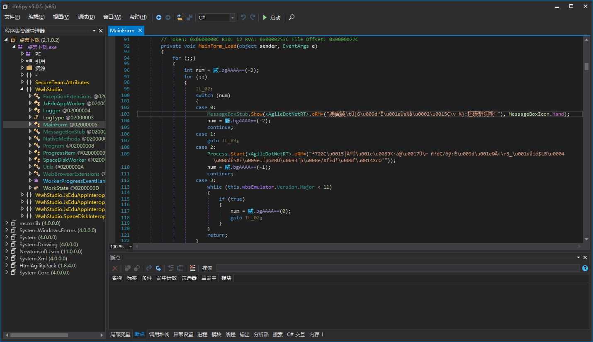

可以看到，所有字符串变成了一串乱码，然后传给了一个特殊的方法，这个特殊的方法会把乱码的字符串转化成正常的字符串，也就是解密。

我们点击一下这个方法，看看这个方法内部是怎么解密字符串的。

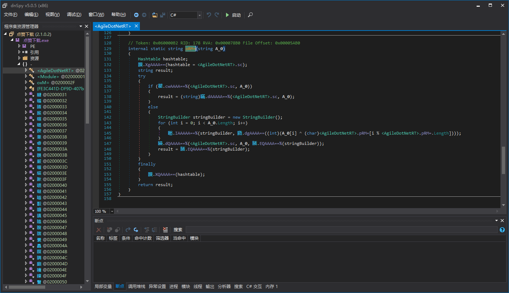

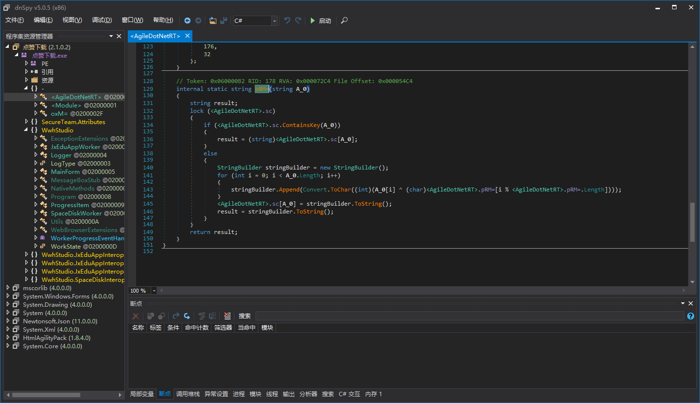

可以看到，这个解密很简单，主要是Xor。为了方便讲解，我把代理调用先去掉了，不然看不太出这个字符串解密器方法是什么样的。（等下会讲解Agile.NET的代理调用，这里不用着急。）

如此简单的解密，我们写一个静态解密当然可以，而且也不复杂，效率还更高，但是本文讲解的是动态解密。所以接下来我们讲解如何自己写一个动态解密。

### 编写解密工具

在之前的图中，我们可以看到Agile.NET的字符串加密非常简单，只是把字符串本身加密了，然后传递给字符串解密器。在C#层面至少是这样，但是IL层面也是这样吗，没有其它混淆吗？我们将dnSpy的反编译模式从C#切换到IL看看。

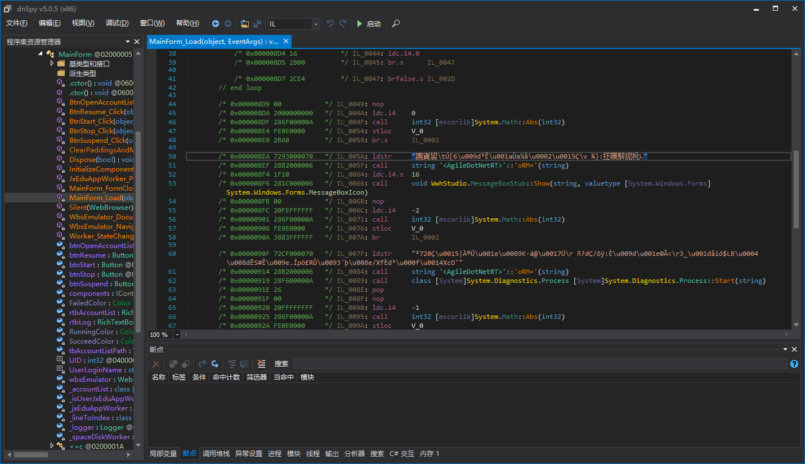

可以看到，这个真的就是C#显示的那样，把字符串压入栈，然后调用字符串解密器方法。（Agile.NET的是这样，但是不代表别的壳也这样，这个要具体分析的。）这样我们编写解密工具就又更容易了。

这里顺便提一下，还是为了讲解方便，我们写最简单的那种解密工具，不能像de4dot那样自动识别目标程序运行时版本的，即自动适应.NET 2.0 4.0的程序。如果要写成可以自适应的，可以自行阅读de4dot代码。de4dot的代码其实挺复杂，设计模式太多了，所以我也没用de4dot那样使用子进程来实现。我是使用了Loader，让Loader来加载我们的解密工具，而我们手动选择Loader。看不懂这段文字也没关系，解密工具写多了就明白这段文字在说什么了。我们继续。

我们新建一个项目，项目的目标运行时选择和要解密的程序一样的版本。比如我们这个UnpackMe是.NET 4.5，我们选4.5就行了。（其实4.0也可以，因为clr版本一样就行，具体的不过多细说，可以自行研究.NET的一些技术细节。）

添加下面这样的代码，做好框架，初始化字段，接下来代码写在ExecuteImpl()里面。

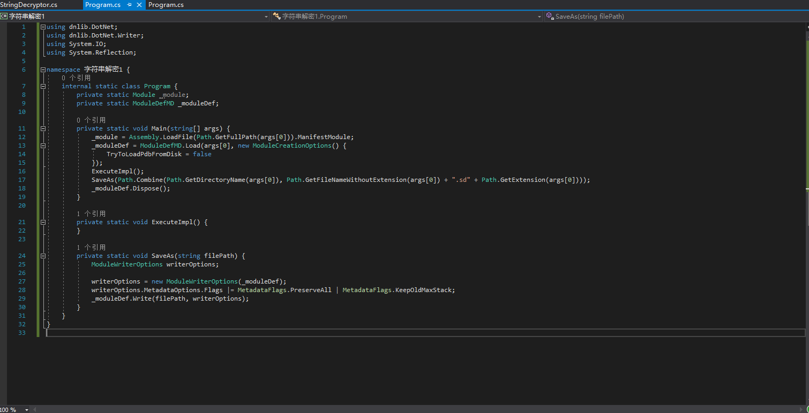

我们再用dnSpy看看，Agile.NET的字符串解密器方法有什么特征，我们先定位到这个方法。

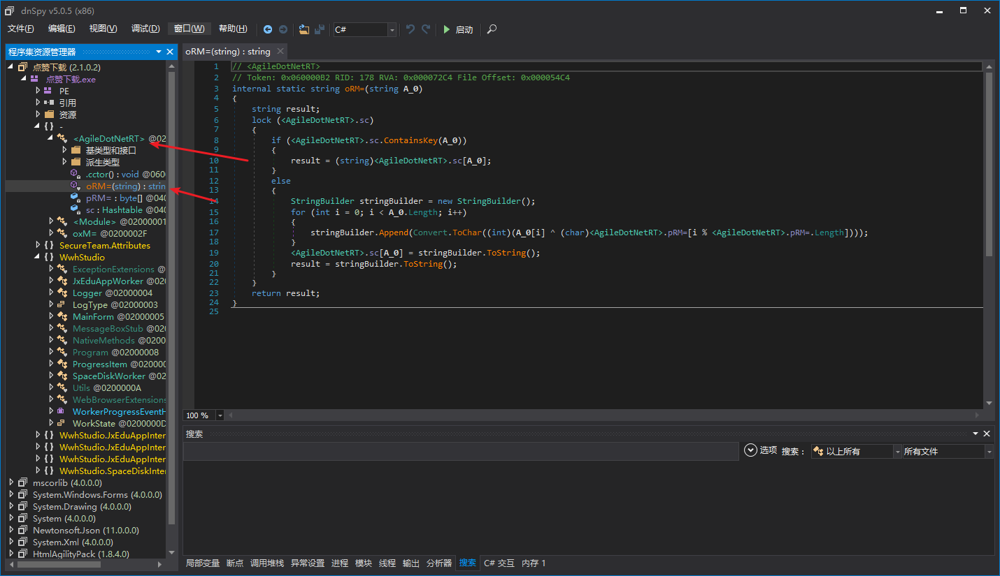

可以看到，字符串解密器方法在命名空间为空的&lt;AgileDotNetRT&gt;类，字符串解密器本身的方法签名应该是string (string)。意思就是字符串解密器只有一个参数并且为string类型，返回值也为string，这样我们就可以使用特征定位到字符串解密器了。

我们这样写定位代码。（当然，和我的不一样也没问题，只要能准确定位到就行。）这些代码都是添加到ExecuteImpl()方法内的。

``` csharp
TypeDef agileDotNetRT;
MethodDef decryptorDef;
MethodBase decryptor;

agileDotNetRT = _moduleDef.Types.First(t => t.Namespace == string.Empty && t.Name == "<AgileDotNetRT>");
// 寻找命名空间为空，类名为"<AgileDotNetRT>"的类
decryptorDef = agileDotNetRT.Methods.First(m => m.Parameters.Count == 1 && m.Parameters[0].Type.TypeName == "String" && m.ReturnType.TypeName == "String");
// 在类中寻找只有一个参数且参数类型为String，返回值类型也为String的方法
decryptor = _module.ResolveMethod(decryptorDef.MDToken.ToInt32());
// 把dnlib的MethodDef转换成.NET反射中的MethodBase
```

为了更快速的遍历ModuleDefMD中的所有方法，我们需要一个扩展方法。我们这样写。

``` csharp
internal static class ModuleDefExtensions {
	public static IEnumerable<MethodDef> EnumerateAllMethodDefs(this ModuleDefMD moduleDef) {
		uint methodTableLength;

		methodTableLength = moduleDef.TablesStream.MethodTable.Rows;
		// 获取Method表的长度 
		for (uint rid = 1; rid <= methodTableLength; rid++)
			yield return moduleDef.ResolveMethod(rid);
	}
}
```

上面代码中提到的Method表是.NET元数据表流中的一个表，储存了一个程序集中所有方法的信息，非常重要。Method表中每个元素都是连续的，不要问我为什么，这个是元数据的知识，一时半会也是解释不清的，需要读者自己研究，当然，我们写个字符串解密工具不需要了解那么底层的知识。

也许读者还有疑问，我们为什么要这样写，难道不能这样遍历每一个方法么？

``` csharp
foreach (TypeDef typeDef in _moduleDef.Types)
	foreach (MethodDef methodDef in typeDef.Methods) {
		...
		...
	}
```

看着应该是没问题的，但是，这样会遍历不到嵌套类型中的方法。比如这样就是一个嵌套类型，在一个类里面又声明了一个类B，B就是嵌套类型。

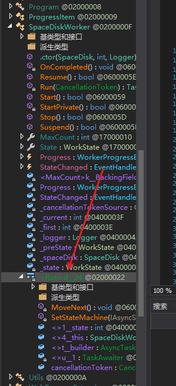
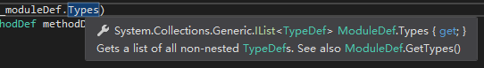

所以这样是不行的，ModuleDef.Types不会返回嵌套类型，我们需要使用ModuleDef.GetTypes()。每次遍历方法我们都需要写2个foreach，所以不如直接用一个扩展方法代替。

``` csharp
foreach (MethodDef methodDef in _moduleDef.EnumerateAllMethodDefs()) {
	IList<Instruction> instructionList;

	if (!methodDef.HasBody)
		continue;
	instructionList = methodDef.Body.Instructions;
	for (int i = 0; i < instructionList.Count; i++) {
	}
}
```

这样我们就可以遍历所有有CliBody的方法的Instruction了。我们再切换到dnSpy，看看Agile.NET是怎么调用字符串解密器方法的。


所以，我们这样定位到要解密的字符串的位置，并且解密字符串，再替换回去。

``` csharp
if (instructionList[i].OpCode.Code == Code.Call && instructionList[i].Operand == decryptorDef && instructionList[i - 1].OpCode.Code == Code.Ldstr) {
	// 这里判断特征
	instructionList[i].OpCode = OpCodes.Nop;
	instructionList[i].Operand = null;
	// i对应的指令是Call XXXX，我们把这一条指令nop掉
	instructionList[i - 1].Operand = decryptor.Invoke(null, new object[] { instructionList[i - 1].Operand });
	// i-1对应的指令是ldstr，我们调用字符串解密器方法，然后把解密后的字符串替换回去
}
```

这样，我们的字符串解密工具就写完了。

## Agile.NET的代理调用

这个代理调用的解密是这次讲解中最难的一个，如果读者没看懂上面的字符串解密，强烈建议跳过这一节。

### 分析

我们还是先用dnSpy打开那个UnpackMe。


可以看到部分调用外部方法被混淆了，调用当前程序集的方法不会被混淆。我们再调试看看，这些委托是什么。

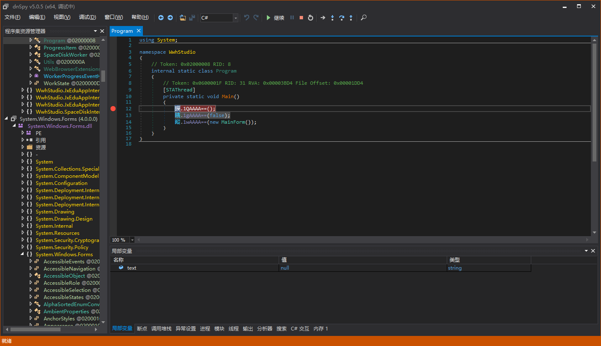

按F11，直接进入了这里，没有什么收获。

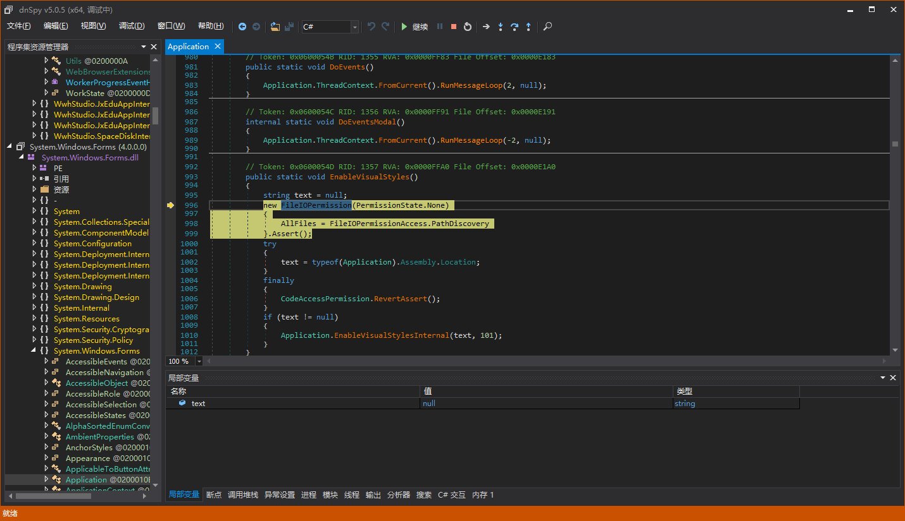

我们看看哪里初始化了这个委托字段，我们可以发现点什么东西。

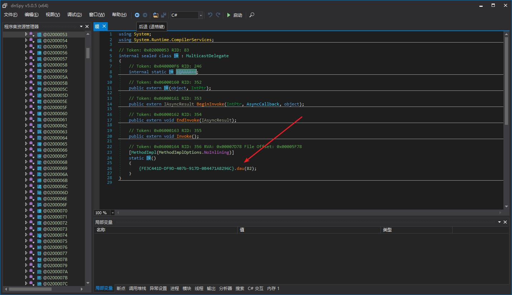

我们进入dau方法，dnSpy反编译结果如下。

``` csharp
using System;
using System.Reflection;
using System.Reflection.Emit;

// Token: 0x02000030 RID: 48
public class {FE3C441D-DF9D-407b-917D-0B4471A8296C}
{
	// Token: 0x040000C2 RID: 194
	private static ModuleHandle Fzw=;

	// Token: 0x040000C3 RID: 195
	public static string Cho= = "{FE3C441D-DF9D-407b-917D-0B4471A8296C}";

	// Token: 0x060000B3 RID: 179 RVA: 0x00007984 File Offset: 0x00005B84
	static {FE3C441D-DF9D-407b-917D-0B4471A8296C}()
	{
		{FE3C441D-DF9D-407b-917D-0B4471A8296C}.Fzw= = Assembly.GetExecutingAssembly().GetModules()[0].ModuleHandle;
	}

	// Token: 0x060000B4 RID: 180 RVA: 0x000079A8 File Offset: 0x00005BA8
	[Obfuscation]
	public static void dau(int proxyDelegateTypeToken)
	{
		Type typeFromHandle;
		try
		{
			typeFromHandle = Type.GetTypeFromHandle({FE3C441D-DF9D-407b-917D-0B4471A8296C}.Fzw=.ResolveTypeHandle(33554433 + proxyDelegateTypeToken));
		}
		catch
		{
			return;
		}
		FieldInfo[] fields = typeFromHandle.GetFields(BindingFlags.Static | BindingFlags.NonPublic | BindingFlags.GetField);
		int i = 0;
		while (i < fields.Length)
		{
			FieldInfo fieldInfo = fields[i];
			string text = fieldInfo.Name;
			bool flag = false;
			if (text.EndsWith("%"))
			{
				flag = true;
				text = text.TrimEnd(new char[]
				{
					'%'
				});
			}
			byte[] value = Convert.FromBase64String(text);
			uint num = BitConverter.ToUInt32(value, 0);
			MethodInfo methodInfo;
			try
			{
				methodInfo = (MethodInfo)MethodBase.GetMethodFromHandle({FE3C441D-DF9D-407b-917D-0B4471A8296C}.Fzw=.ResolveMethodHandle((int)(num + 167772161u)));
			}
			catch
			{
				goto IL_1D1;
			}
			goto IL_A7;
			IL_1D1:
			i++;
			continue;
			IL_A7:
			Delegate value2;
			if (methodInfo.IsStatic)
			{
				try
				{
					value2 = Delegate.CreateDelegate(fieldInfo.FieldType, methodInfo);
					goto IL_1C4;
				}
				catch (Exception)
				{
					goto IL_1D1;
				}
			}
			ParameterInfo[] parameters = methodInfo.GetParameters();
			int num2 = parameters.Length + 1;
			Type[] array = new Type[num2];
			array[0] = typeof(object);
			for (int j = 1; j < num2; j++)
			{
				array[j] = parameters[j - 1].ParameterType;
			}
			DynamicMethod dynamicMethod = new DynamicMethod(string.Empty, methodInfo.ReturnType, array, typeFromHandle, true);
			ILGenerator ilgenerator = dynamicMethod.GetILGenerator();
			ilgenerator.Emit(OpCodes.Ldarg_0);
			if (num2 > 1)
			{
				ilgenerator.Emit(OpCodes.Ldarg_1);
			}
			if (num2 > 2)
			{
				ilgenerator.Emit(OpCodes.Ldarg_2);
			}
			if (num2 > 3)
			{
				ilgenerator.Emit(OpCodes.Ldarg_3);
			}
			if (num2 > 4)
			{
				for (int k = 4; k < num2; k++)
				{
					ilgenerator.Emit(OpCodes.Ldarg_S, k);
				}
			}
			ilgenerator.Emit(flag ? OpCodes.Callvirt : OpCodes.Call, methodInfo);
			ilgenerator.Emit(OpCodes.Ret);
			try
			{
				value2 = dynamicMethod.CreateDelegate(typeFromHandle);
			}
			catch (Exception)
			{
				goto IL_1D1;
			}
			try
			{
				IL_1C4:
				fieldInfo.SetValue(null, value2);
			}
			catch
			{
			}
			goto IL_1D1;
		}
	}

	// Token: 0x060000B5 RID: 181 RVA: 0x00007BD8 File Offset: 0x00005DD8
	public {FE3C441D-DF9D-407b-917D-0B4471A8296C}()
	{
	}
}
```

这段代码还是比较简单的，传入代理类型的token，然后遍历类型中每个字段，通过字段名字获取代理方法的MemberRef Token，然后ReolveMethod。如果是静态方法，直接创建delegate，如果是实例方法，使用DynamicMethod创建一个方法来调用。静态解密可能还会比动态解密简单。

### 编写解密工具

我们依然这样写一个框架。然后把代码添加到ExecuteImpl()中。

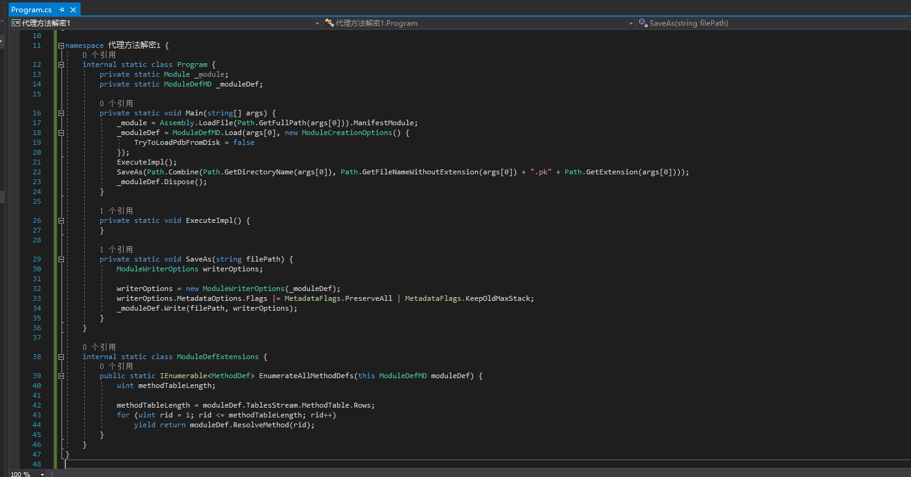

我们按特征，找到代理字段初始化的地方。

``` csharp
TypeDef[] globalTypes;
MethodDef decryptor;

globalTypes = _moduleDef.Types.Where(t => t.Namespace == string.Empty).ToArray();
// 查找所有命名空间为空的类型
decryptor = globalTypes.Where(t => t.Name.StartsWith("{", StringComparison.Ordinal) && t.Name.EndsWith("}", StringComparison.Ordinal)).Single().Methods.Single(m => !m.IsInstanceConstructor && m.Parameters.Count == 1);
// 查找代理解密方法
```

由于所有代理类的静态构造器都会自动解密出真实的方法，我们不需要手动调用代理方法解密器。我们只需要遍历这些代理类的字段，找出字段对应的MemberRef。

``` csharp
foreach (TypeDef typeDef in globalTypes) {
	MethodDef cctor;

	cctor = typeDef.FindStaticConstructor();
	if (cctor == null || !cctor.Body.Instructions.Any(i => i.OpCode == OpCodes.Call && i.Operand == decryptor))
		continue;
	// 查找出静态构造器调用了代理解密方法的类型
}
```

只要一个类的静态构造器调用了decryptor，就说明这个类是代理类。我们对代理类的字段进行遍历。

``` csharp
foreach (FieldInfo fieldInfo in _module.ResolveType(typeDef.MDToken.ToInt32()).GetFields(BindingFlags.NonPublic | BindingFlags.Static)) {
	int proxyFieldToken;
	FieldDef proxyFieldDef;
	MethodBase realMethod;

	proxyFieldToken = fieldInfo.MetadataToken;
	proxyFieldDef = _moduleDef.ResolveField((uint)proxyFieldToken - 0x04000000);
	realMethod = ((Delegate)fieldInfo.GetValue(null)).Method;
}
```

这里的realMethod还有可能是Agile.NET运行时创建的动态方法，因为要支持callvirt指令。我们写一个方法来判断是不是动态方法。

``` csharp
private static bool IsDynamicMethod(MethodBase methodBase) {
	if (methodBase == null)
		throw new ArgumentNullException(nameof(methodBase));

	try {
		int token;

		token = methodBase.MetadataToken;
		// 获取动态方法的Token会抛出InvalidOperationException异常
	}
	catch (InvalidOperationException) {
		return true;
	}
	return false;
}
```

我们先判断是否为动态方法，然后再进行替换。

``` csharp
if (IsDynamicMethod(realMethod)) {
	DynamicMethodBodyReader dynamicMethodBodyReader;
	IList<Instruction> instructionList;

	dynamicMethodBodyReader = new DynamicMethodBodyReader(_moduleDef, realMethod);
	dynamicMethodBodyReader.Read();
	instructionList = dynamicMethodBodyReader.GetMethod().Body.Instructions;
	ReplaceAllOperand(proxyFieldDef, instructionList[instructionList.Count - 2].OpCode, (MemberRef)instructionList[instructionList.Count - 2].Operand);
}
else
	ReplaceAllOperand(proxyFieldDef, realMethod.IsVirtual ? OpCodes.Callvirt : OpCodes.Call, (MemberRef)_moduleDef.Import(realMethod));
```

ReplaceAllOperand的实现如下。

``` csharp
private void ReplaceAllOperand(FieldDef proxyFieldDef, OpCode callOrCallvirt, MemberRef realMethod) {
	if (proxyFieldDef == null)
		throw new ArgumentNullException(nameof(proxyFieldDef));
	if (realMethod == null)
		throw new ArgumentNullException(nameof(realMethod));

	foreach (MethodDef methodDef in _moduleDef.EnumerateAllMethodDefs()) {
		IList<Instruction> instructionList;

		if (!methodDef.HasBody)
			continue;
		// 只遍历有CilBody的方法
		instructionList = methodDef.Body.Instructions;
		for (int i = 0; i < instructionList.Count; i++) {
			// ldsfld    class xxx xxx::'xxx'
			// ...
			// call      instance void xxx::Invoke()
			if (instructionList[i].OpCode != OpCodes.Ldsfld || instructionList[i].Operand != proxyFieldDef)
				continue;
			for (int j = i; j < instructionList.Count; j++) {
				// 从i开始寻找最近的call
				if (instructionList[j].OpCode.Code != Code.Call || !(instructionList[j].Operand is MethodDef) || ((MethodDef)instructionList[j].Operand).DeclaringType != ((TypeDefOrRefSig)proxyFieldDef.FieldType).TypeDefOrRef)
					continue;
				instructionList[i].OpCode = OpCodes.Nop;
				instructionList[i].Operand = null;
				// 清除 ldsfld    class xxx xxx::'xxx'
				instructionList[j].OpCode = callOrCallvirt;
				instructionList[j].Operand = realMethod;
				// 替换 call      instance void xxx::Invoke()
				break;
			}
		}
	}
}
```

## ConfuserEx的AntiTamper

### 分析

在好早之前，我也发过一个关于AntiTamper帖子。那个帖子讲的是静态解密，似乎兼容性还是有点问题，这次我们来试试动态解密。我们先打开ConfuserEx这个项目。

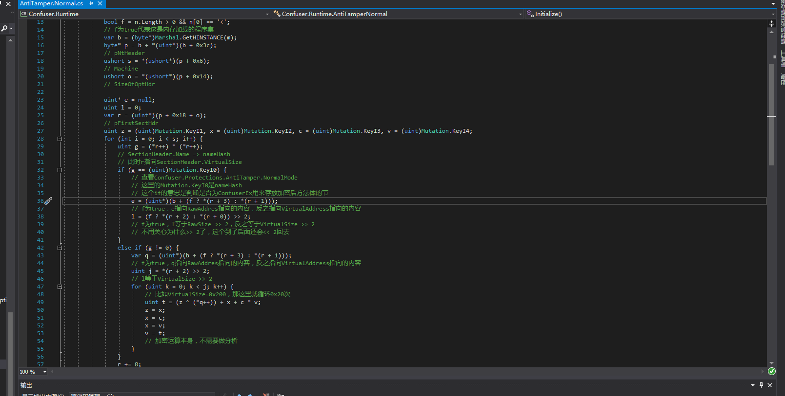
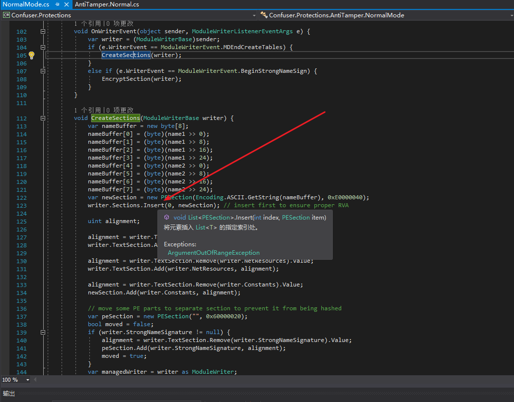

这个是我以前注释的，AntiTamper的原理是把所有方法体单独放到一个Section中，然后利用其它Section的Hash进行解密。所以如果文件本身被篡改了，运行时解密Section肯定会失败。这个Section永远被ConfuserEx插入在其它Section之前，而且算是整体加密，所以动态解密会非常容易。

### 编写解密工具

还是和以前一样，写个框架，代码放ExecuteImpl()里面。

我们添加个PEInfo类

``` csharp
[StructLayout(LayoutKind.Sequential, Pack = 1)]
internal unsafe struct IMAGE_SECTION_HEADER {
	public static uint UnmanagedSize = (uint)sizeof(IMAGE_SECTION_HEADER);

	public fixed byte Name[8];
	public uint VirtualSize;
	public uint VirtualAddress;
	public uint SizeOfRawData;
	public uint PointerToRawData;
	public uint PointerToRelocations;
	public uint PointerToLinenumbers;
	public ushort NumberOfRelocations;
	public ushort NumberOfLinenumbers;
	public uint Characteristics;
}

internal sealed unsafe class PEInfo {
	private readonly void* _pPEImage;
	private readonly uint _sectionsCount;
	private readonly IMAGE_SECTION_HEADER* pSectionHeaders;

	public void* PEImage => _pPEImage;

	public uint SectionsCount => _sectionsCount;

	public IMAGE_SECTION_HEADER* SectionHeaders => pSectionHeaders;

	public PEInfo(void* pPEImage) {
		byte* p;
		ushort optionalHeaderSize;

		_pPEImage = pPEImage;
		p = (byte*)pPEImage;
		p += *(uint*)(p + 0x3C);
		// NtHeader
		p += 4 + 2;
		// 跳过 Signature + Machine
		_sectionsCount = *(ushort*)p;
		p += 2 + 4 + 4 + 4;
		// 跳过 NumberOfSections + TimeDateStamp + PointerToSymbolTable + NumberOfSymbols
		optionalHeaderSize = *(ushort*)p;
		p += 2 + 2;
		// 跳过 SizeOfOptionalHeader + Characteristics
		p += optionalHeaderSize;
		// 跳过 OptionalHeader
		pSectionHeaders = (IMAGE_SECTION_HEADER*)p;
	}
}
```

然后，我们读取第一个Section的RVA和Size。调用模块静态构造器，最后还原回去。

``` csharp
PEInfo peInfo;
IMAGE_SECTION_HEADER sectionHeader;
byte[] section;

peInfo = new PEInfo((void*)Marshal.GetHINSTANCE(_module));
sectionHeader = peInfo.SectionHeaders[0];
section = new byte[sectionHeader.SizeOfRawData];
RuntimeHelpers.RunModuleConstructor(_module.ModuleHandle);
Marshal.Copy((IntPtr)((byte*)peInfo.PEImage + sectionHeader.VirtualAddress), _peImage, (int)sectionHeader.PointerToRawData, (int)sectionHeader.SizeOfRawData);
```

这里的_peImage是一个字节数组，表示要解密的程序集的字节数组形式。动态解密AntiTamper连dnlib都不需要使用，比静态解密方便很多。解密之后，手动Patch掉AntiTamper的运行时就行。

## 反动态解密

动态解密也有自己的缺点，比如容易被检测。文章写了3个动态解密，其实原理都差不多，最核心的还是反射API。我们可以利用这一点，写出一些反动态解密的代码。

- 最简单的，我们可以像ILProtector一样，检测调用来源，如果当前方法的调用方是最底层的Invoke方法，那就说明被非法调用了。
- 我们还可以做得更极端，检测整个调用堆栈，比如调用堆栈里面是否有de4dot的字样。
- 通过AppDomain.CurrentDomain.GetAssemblies()获取所有已加载程序集，判断里面是否有非法程序集。
- 如果一个程序是可执行文件，并且不会被其它程序集引用，那么可以使用Assembly.GetEntryAssembly()检测入口程序集是不是本身，如果不是，那说明当前程序集被其它程序集用反射API加载了。
