# .NET下的终极反调试

## 前言

0xd4d大神写过一个反调试器+反分析器的项目，叫做[antinet](https://github.com/0xd4d/antinet)，代码在github上。这个反调试的原理不是检测，而是主动攻击。如果识别成功，CLR中与调试有关的一些字段将直接被破坏，让调试线程退出，其它调试器也不能附加。理论上这个反调试是几乎无解的，除非让这个反调试内部的识别机制失效。

**所以我对这个代码做了一些改进，增加了Win32函数检测调试器，增加了CLR内部函数的Hook检测，顺便移除了反分析器的代码，因为那段代码对反调试没什么用，看起来也不是特别稳定。改进好的代码：[https://github.com/wwh1004/antinet](https://github.com/wwh1004/antinet)。**

这里先贴一下sscli20的下载地址，因为文章分析时会用到sscli20，如果没有的可以从我这里下载。

[百度云](https://pan.baidu.com/s/1WEORyUlymp1f-RLmHSeotQ)（提取码：v1w2）

[OneDrive](https://1drv.ms/u/s!ApAHkNMXPkQYhvx1nouD-JwwBpRCaw)

在看文章之前，请一定在vs中打开我修改过的antinet（上文有下载地址），否则可能会不清楚文章在写什么！！！

## 0xd4d的AntiManagedDebugger

### 大致流程

这个是0xd4d的antinet的反调试类，我没做修改，直接保留下来了，然后加了注释。

我们先看看0xd4d是怎么解释AntiManagedDebugger的原理。

打开[https://github.com/0xd4d/antinet](https://github.com/0xd4d/antinet)，找到“Anti-managed debugger”，下面的“Technical details”（技术细节）就是实现原理。我的翻译如下（非机翻）：

> 在CLR启动的时候，CLR会创建一个调试器类的实例（类名为Debugger）。这个调试器类会创建一个DebuggerRCThread类的实例，这个实例表示.NET调试器线程。正常情况下，这个线程只会在CLR退出（对一般.NET程序来说就是进程结束）时候结束。为了让这个线程提前退出，我们要将DebuggerRCThread类的实例的“keep-looping”字段设置为0并且对它进行发送信号。
> 
> 这两个实例都保存在CLR的.data节。
> 
> 为了找到有趣的DebuggerRCThread实例，我们必须扫描.data节来获取Debugger实例的指针。我先寻找Debugger的实例是因为这个类包含了当前进程的ID，这样更易于寻找。当我们发现可能是Debugger的实例的地方出现了一些Debugger类的特征，并且这个可能的实例在指定偏移上保存了当前进程的ID，我们获取这个类中的DebuggerRCThread实例。
> 
> DebuggerRCThread类中有一个字段为指回Debugger实例的指针。如果这个指针和先前找到的Debugger实例一样，那么我们可以非常肯定我们已经找到了需要的2个实例。
> 
> 一旦我们有了DebuggerRCThread实例，将keep-looping字段设置为0并且发出信号让线程退出是没有什么价值的。
> 
> 为防止调试器附加到当前进程，我们可以清除调试器IPC块的大小字段。如果这个大小字段的值被设置为其它数字了，mscordbi.dll中的CordbProcess::VerifyControlBlock()将返回一个错误代码，并且此时没有调试器能够附加当前进程了。

看不懂也没关系，大概有个印象就行。我们到vs里面看看AntiManagedDebugger类的代码。

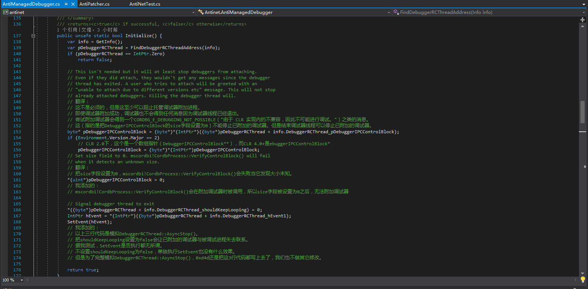
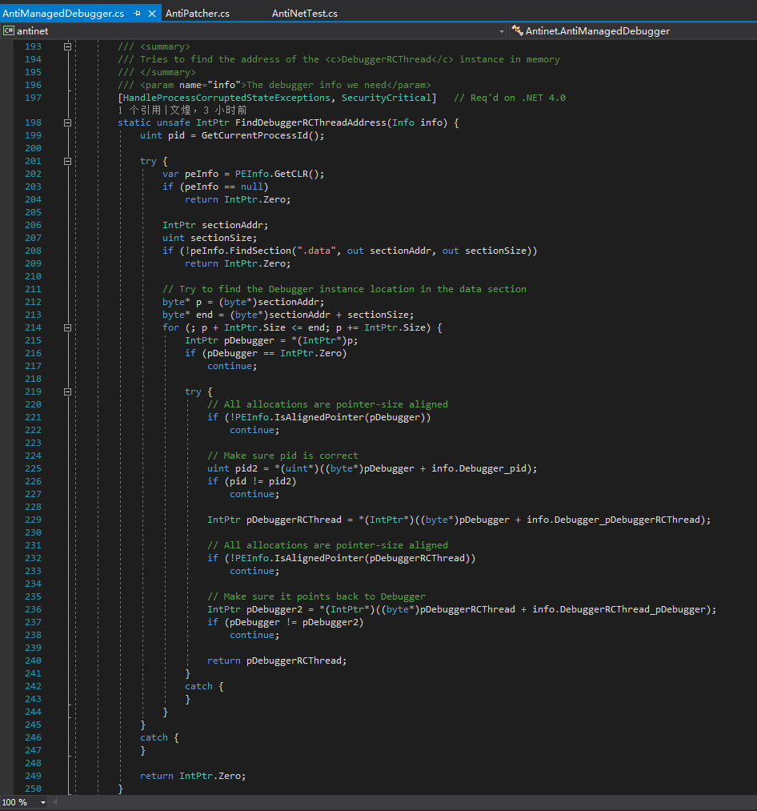

代码的意思和0xd4d自己解释的是完全一样的，可以相互对着看，这里就不说结束调试器线程的原理和思路了，我们来看看0xd4d操作的那些字段到底是什么。

### 在CLR源码中了解更多

如果我没记错，CoreCLR是在CLR v4.6分支上开源的。所以CLR v4.5及之后的CLR，CoreCLR都和它们相似，看CoreCLR的源码比IDA反编译好得多。但是CLR v4.0是介于CLR v2.0和CLR v4.5之间的，可以算是一个四不像，我们暂时不管，因为现在除了XP不能装.NET 4.5，其它系统都可以装，也几乎都装了最新的.NET Framework。

SSCLI20对应了CLR v2.0，也就是.NET 2.0~3.5。有些时候，看CLR v2.0的IDA反编译代码不如看SSCLI20的代码。

0xd4d不是提到了“keep-looping”字段么，我们在CoreCLR中找找，你会发现，其实找不到。

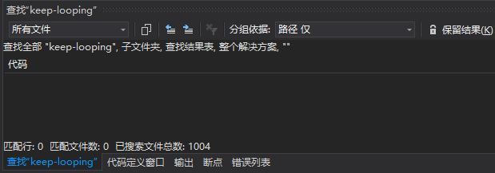

是不是0xd4d说错了呢？或者CoreCLR不一样呢？当然不是，CLR这么大型的项目，很多地方不是想改就能改的。我们仔细在DebuggerRCThread类的声明中找找，可以看到有个字段叫做“m_run”，这个字段就是0xd4d所说的“keep-looping”字段。

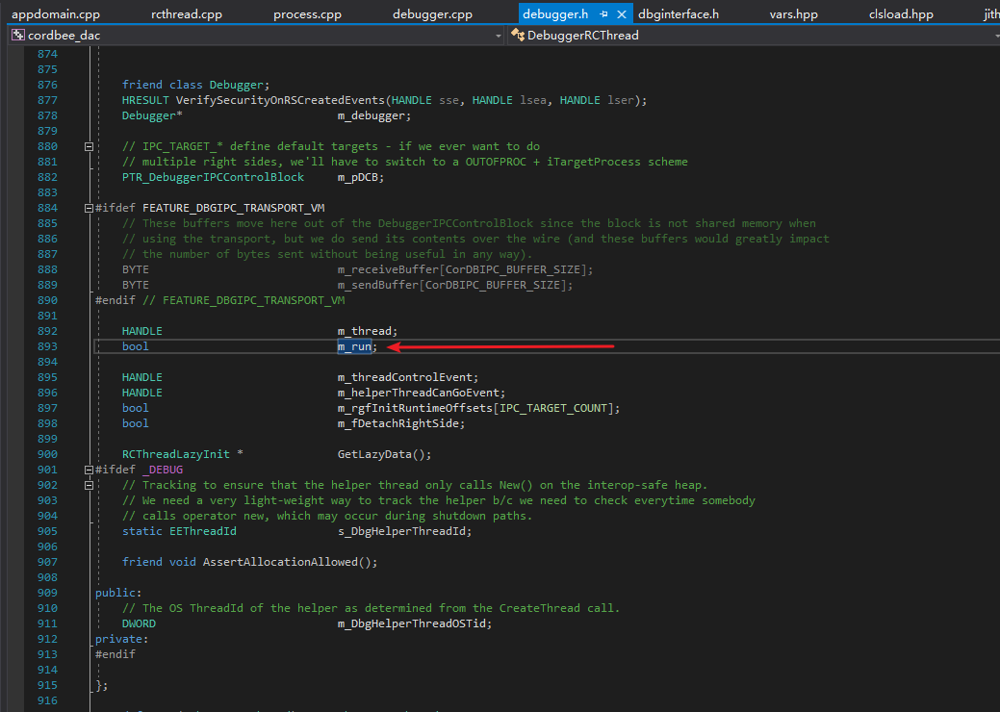

既然已经找到“m_run”字段了，那我们再看看AntiManagedDebugger.Initialize()的注释“Signal debugger thread to exit”对应的语句是干嘛的。

``` csharp
// Signal debugger thread to exit
*((byte*)pDebuggerRCThread + info.DebuggerRCThread_shouldKeepLooping) = 0;
IntPtr hEvent = *(IntPtr*)((byte*)pDebuggerRCThread + info.DebuggerRCThread_hEvent1);
SetEvent(hEvent);
// 我添加的：
// 以上三行代码是模拟DebuggerRCThread::AsyncStop()。
// 把shouldKeepLooping设置为false会让已附加的调试器与被调试进程失去联系。
// 据我测试，SetEvent是否执行都无所谓。
// 不设置shouldKeepLooping为false，单独执行SetEvent也没有什么效果。
// 但是为了完整模拟DebuggerRCThread::AsyncStop()，0xd4d还是把这3行代码都写上去了，我们也不做其它修改。
```

我们在CoreCLR中选择m_run字段，点“查找所有引用”，可以很快找到“HRESULT DebuggerRCThread::AsyncStop(void)”这个函数。

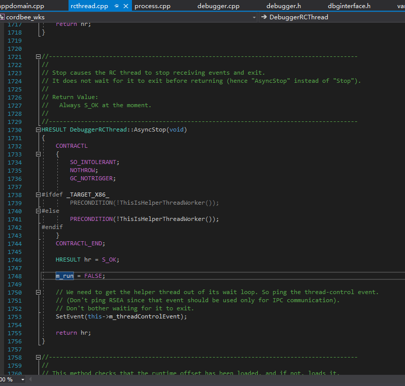

这样就弄明白了，这段代码是在模拟DebuggerRCThread::AsyncStop()，这个函数会被Debugger::StopDebugger()调用，所以可以达到结束已存在的调试器的目的。

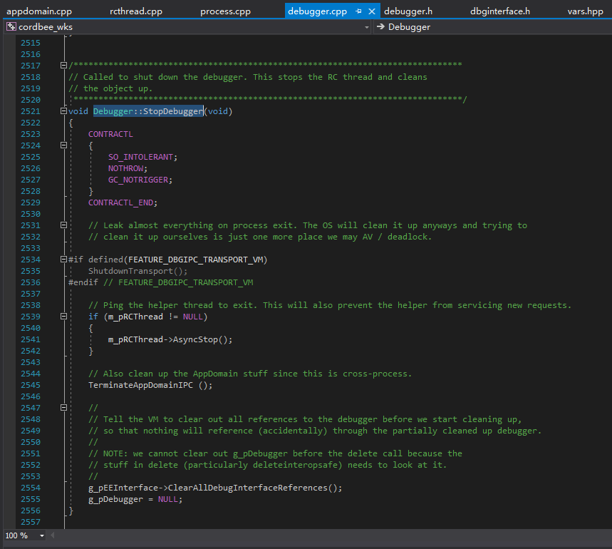

当然了，这不能阻止托管调试器重新附加到当前进程，所以我们要在这之前，先让托管调试器不能附加当前进程。这就是以下代码的意义了：

``` csharp
// This isn't needed but it will at least stop debuggers from attaching.
// Even if they did attach, they wouldn't get any messages since the debugger
// thread has exited. A user who tries to attach will be greeted with an
// "unable to attach due to different versions etc" message. This will not stop
// already attached debuggers. Killing the debugger thread will.
// 翻译：
// 这不是必须的，但是这至少可以阻止托管调试器附加进程。
// 即使调试器附加成功，调试器也不会得到任何消息因为调试器线程已经退出。
// 尝试附加调试器会得到一个CORDBG_E_DEBUGGING_NOT_POSSIBLE（"由于 CLR 实现内的不兼容，因此不可能进行调试。"）之类的消息。
// 这（指的是把DebuggerIPCControlBlock的size字段设置为0）不能停止已附加的调试器。但是结束调试器线程可以停止已附加的调试器。
byte* pDebuggerIPCControlBlock = (byte*)*(IntPtr*)((byte*)pDebuggerRCThread + info.DebuggerRCThread_pDebuggerIPCControlBlock);
if (Environment.Version.Major == 2)
	// CLR 2.0下，这个是一个数组指针（DebuggerIPCControlBlock**），而CLR 4.0+是ebuggerIPCControlBlock*
	pDebuggerIPCControlBlock = (byte*)*(IntPtr*)pDebuggerIPCControlBlock;
// Set size field to 0. mscordbi!CordbProcess::VerifyControlBlock() will fail
// when it detects an unknown size.
// 翻译：
// 把size字段设置为0，mscordbi!CordbProcess::VerifyControlBlock()会失败当它发现大小未知。
*(uint*)pDebuggerIPCControlBlock = 0;
// 我添加的：
// mscordbi!CordbProcess::VerifyControlBlock()会在附加调试器时被调用，所以size字段被设置为0之后，无法附加调试器
```

我们在CoreCLR中直接转到CordbProcess::VerifyControlBlock()，看看到底有什么样的验证。

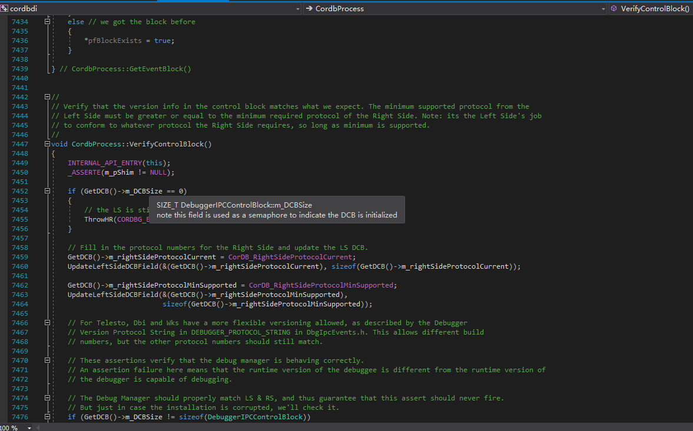
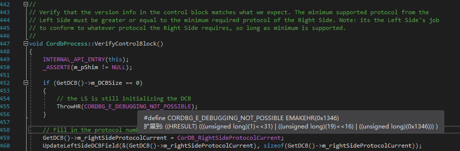
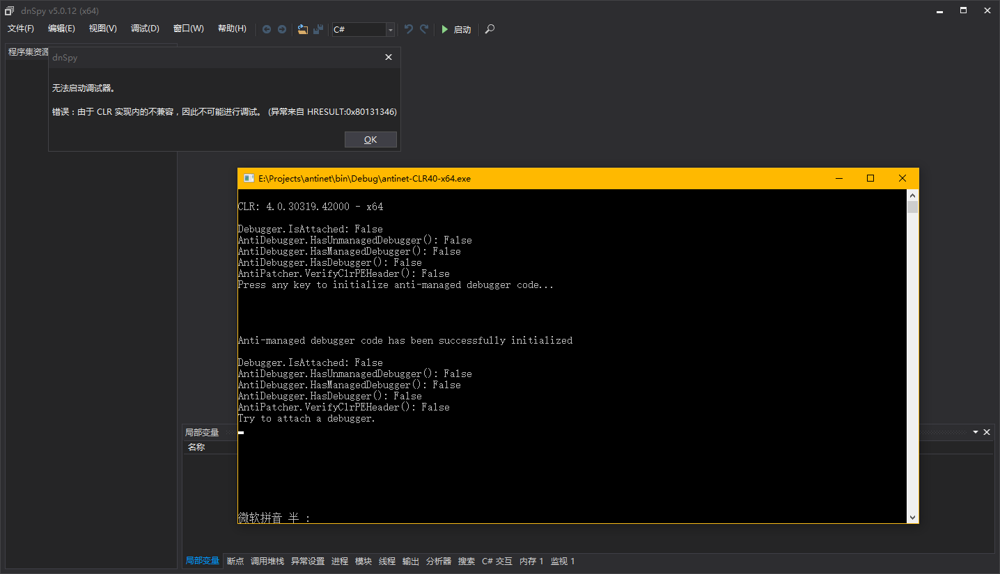

我们再看看m_DCBSize到底被定义在了哪里，如何获取。

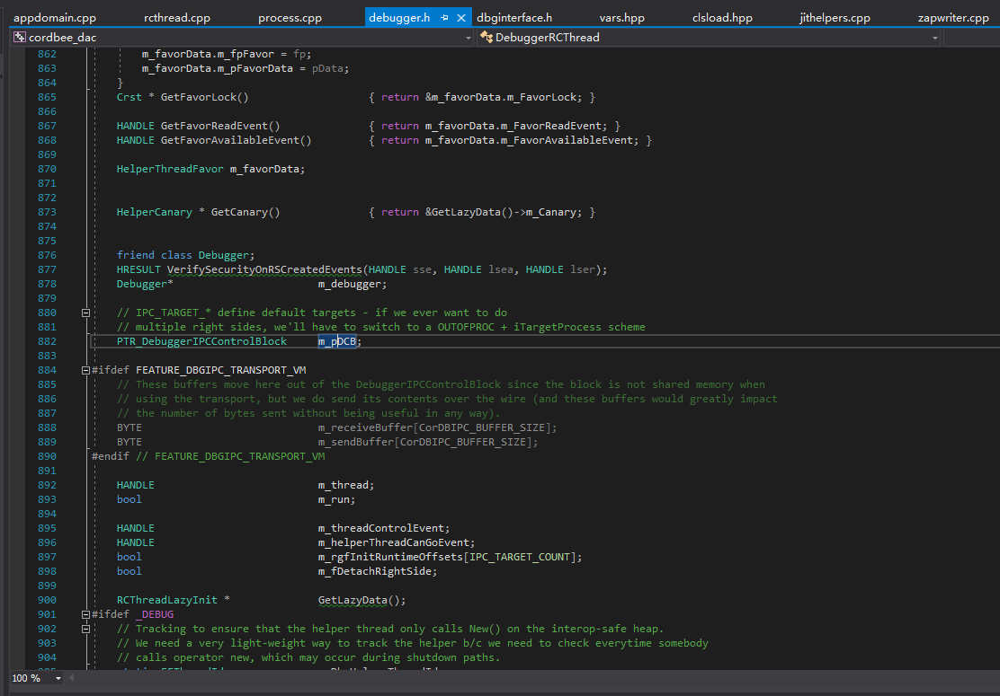
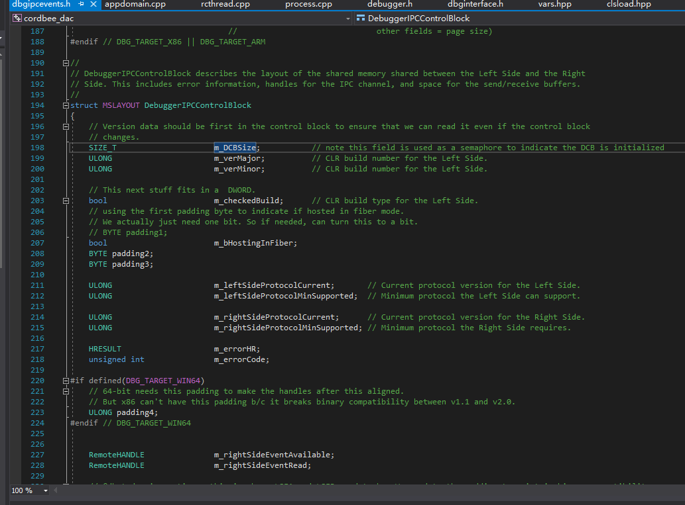

0xd4d的这段代码会判断当前是不是.NET 2.0~3.5，经过研究，我们可以通过SSCLI20发现一些原因。

我们先打开SSCLI20的源码。到类视图中搜索DebuggerRCThread，找到字段m\_rgDCB，这个字段对应了之前的m\_pDCB，只不过多了一级指针。

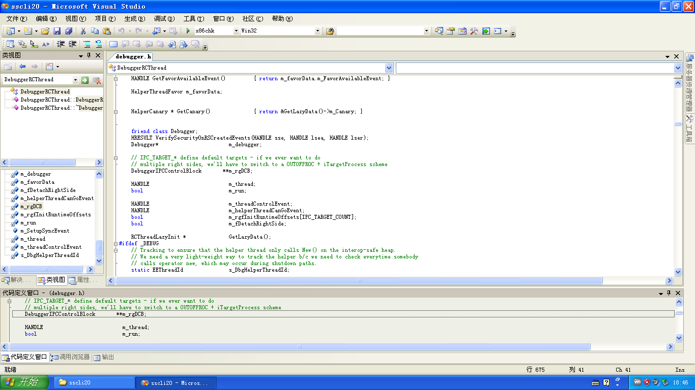

### 反反调试

0xd4d的代码是通过内存来获取.data节的地址的，我们可以直接修改节头来达到反反调试的目的。

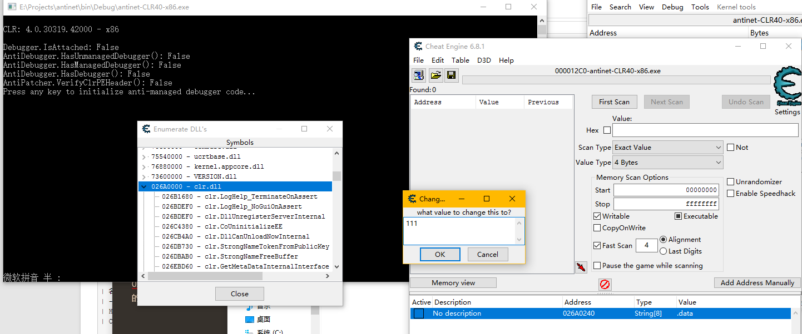
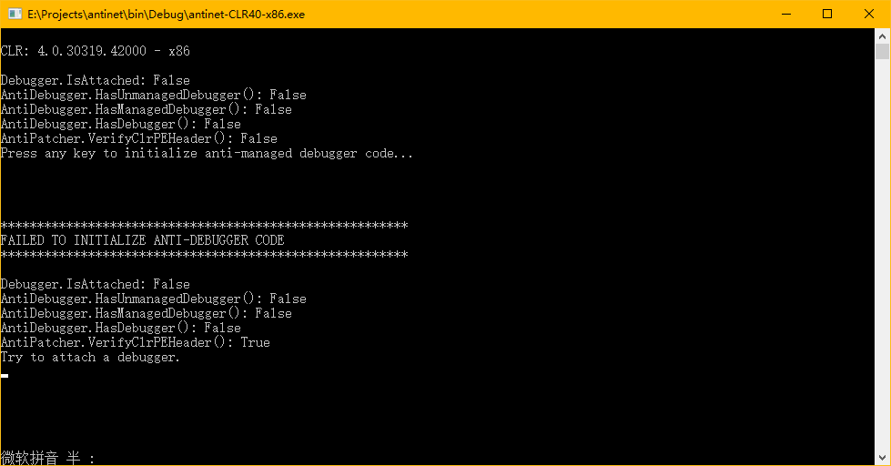

所以我们有很多方法过掉这种反反调试，比如：
- 如果.data节不存在，直接退出进程，因为理论上来说.data节是一定存在的。
- 直接从文件中读取.data节的RVA和Size，然后再到内存中扫描对应的位置。
- 校验PE头有没有被修改，如果被修改了，直接退出进程。
- ...

其中校验PE头这个方法，是最有效的，为什么呢？既然我们不能直接删掉.data这个特征，那么我们可以伪造特征，伪造出一个假的节头，让AntiManagedDebugger修改到其它地方，而不是真正的DebuggerRCThread实例。如果我们确保PE头和文件中一致，那么我们就可以断定我们通过.data节找到DebuggerRCThread实例是真正的，有效的。

这种反反调试的方法非常容易被再次检测到，所以我们可以直接修改所有引用了这个全局变量的地方么？答案是不行。我做过各种测试，比如直接复制对象，DllMain之前或者之后修改，都会导致调试器直接出问题。

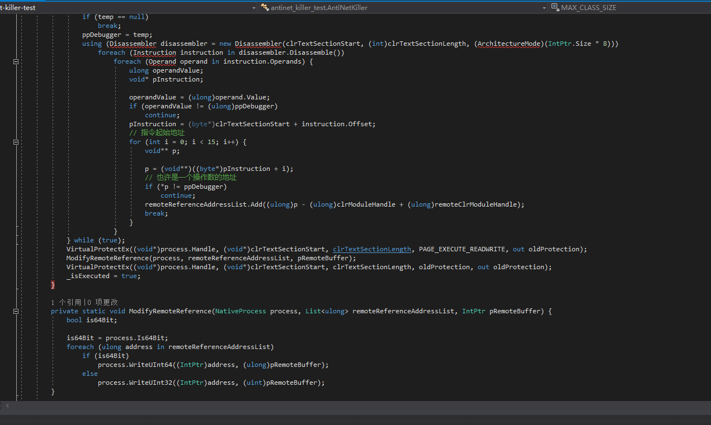
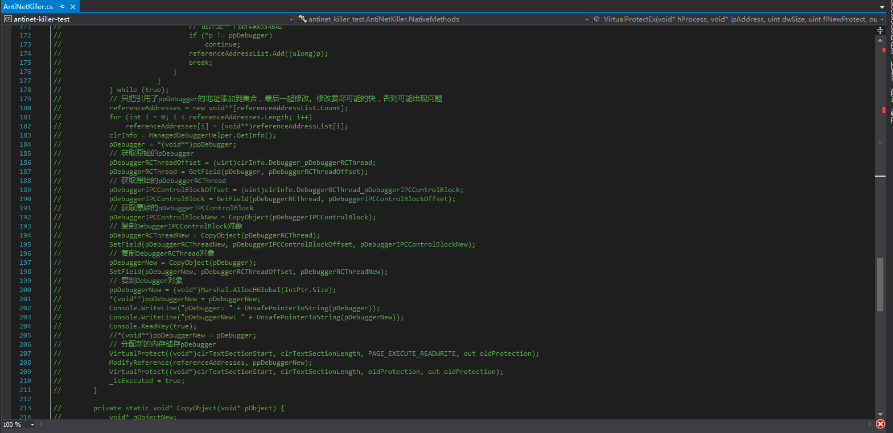

这些代码是好早之前写的，也不想再去测试了，这种方法极其麻烦，还不如直接找到反调试的地方，把它Patch掉。

## 改进后的Antinet

### AntiPatcher

既然0xd4d写的AntiManagedDebugger有一些小漏洞什么的，我们可以添加一个AntiPatcher类进行修复。

这个AntiPatcher类要可以校验CLR模块的PE头有没有被修改。

``` csharp
private static void* _clrModuleHandle;
private static uint _clrPEHeaderCrc32Original;
private static bool _isInitialized;

private static void Initialize() {
	StringBuilder stringBuilder;
	byte[] clrFile;

	if (_isInitialized)
		return;
	switch (Environment.Version.Major) {
	case 2:
		_clrModuleHandle = GetModuleHandle("mscorwks.dll");
		break;
	case 4:
		_clrModuleHandle = GetModuleHandle("clr.dll");
		break;
	default:
		throw new NotSupportedException();
	}
	if (_clrModuleHandle == null)
		throw new InvalidOperationException();
	stringBuilder = new StringBuilder((int)MAX_PATH);
	if (!GetModuleFileName(_clrModuleHandle, stringBuilder, MAX_PATH))
		throw new InvalidOperationException();
	clrFile = File.ReadAllBytes(stringBuilder.ToString());
	fixed (byte* pPEImage = clrFile)
		_clrPEHeaderCrc32Original = DynamicCrc32.Compute(CopyPEHeader(pPEImage));
	_isInitialized = true;
}

private static byte[] CopyPEHeader(void* pPEImage) {
	uint imageBaseOffset;
	uint length;
	byte[] peHeader;

	GetPEInfo(pPEImage, out imageBaseOffset, out length);
	peHeader = new byte[length];
	fixed (byte* pPEHeader = peHeader) {
		for (uint i = 0; i < length; i++)
			pPEHeader[i] = ((byte*)pPEImage)[i];
		// 复制PE头
		*(void**)(pPEHeader + imageBaseOffset) = null;
		// 清除可选头的ImageBase字段，这个字段会变化，不能用于校验
	}
	return peHeader;
}

private static void GetPEInfo(void* pPEImage, out uint imageBaseOffset, out uint length) {
	byte* p;
	ushort optionalHeaderSize;
	bool isPE32;
	uint sectionsCount;
	void* pSectionHeaders;

	p = (byte*)pPEImage;
	p += *(uint*)(p + 0x3C);
	// NtHeader
	p += 4 + 2;
	// 跳过 Signature + Machine
	sectionsCount = *(ushort*)p;
	p += 2 + 4 + 4 + 4;
	// 跳过 NumberOfSections + TimeDateStamp + PointerToSymbolTable + NumberOfSymbols
	optionalHeaderSize = *(ushort*)p;
	p += 2 + 2;
	// 跳过 SizeOfOptionalHeader + Characteristics
	isPE32 = *(ushort*)p == 0x010B;
	imageBaseOffset = isPE32 ? (uint)(p + 0x1C - (byte*)pPEImage) : (uint)(p + 0x18 - (byte*)pPEImage);
	p += optionalHeaderSize;
	// 跳过 OptionalHeader
	pSectionHeaders = (void*)p;
	length = (uint)((byte*)pSectionHeaders + 0x28 * sectionsCount - (byte*)pPEImage);
}
```

调用Initialize()，就可以从文件中获取CRC32。

我们再写一个方法来验证内存中是不是这样的PE头。

``` csharp
/// <summary>
/// 检查CLR模块的PE头是否被修改
/// </summary>
/// <returns>如果被修改，返回 <see langword="true"/></returns>
public static bool VerifyClrPEHeader() {
	return DynamicCrc32.Compute(CopyPEHeader(_clrModuleHandle)) != _clrPEHeaderCrc32Original;
}
```

### AntiDebugger

首先，这个类要有原来的AntiManagedDebugger的功能，所以我们不删除AntiManagedDebugger类，直接对这个类做一个包装。

``` csharp
private static bool _isManagedDebuggerPrevented;

/// <summary>
/// 阻止托管调试器调试当前进程。
/// </summary>
/// <returns></returns>
public static bool PreventManagedDebugger() {
	if (_isManagedDebuggerPrevented)
		return true;
	_isManagedDebuggerPrevented = AntiManagedDebugger.Initialize();
	return _isManagedDebuggerPrevented;
}
```

然后我们添加一个检测非托管与托管调试器的方法。

``` csharp
/// <summary>
/// 检查是否存在任意类型调试器。
/// </summary>
/// <returns></returns>
public static bool HasDebugger() {
	return HasUnmanagedDebugger() || HasManagedDebugger();
	// 检查是否存在非托管调试器的速度更快，效率更高，在CLR40下也能检测到托管调试器。
}
```

HasUnmanagedDebugger的实现很简单，我们把xjun的XAntiDebug的syscall部分删掉就行。syscall利用漏洞的那部分改成C#代码要些时间，暂时没弄，以后有时间了再弄。毕竟非托管调试器调试.NET程序是极其痛苦的，我们的Anti目标应该主要是dnSpy等托管调试器。

``` csharp
/// <summary>
/// 检查是否存在非托管调试器。
/// 在CLR20下，使用托管调试器调试进程，此方法返回 <see langword="false"/>，因为CLR20没有使用正常调试流程，Win32函数检测不到调试器。
/// 在CLR40下，使用托管调试器调试进程，此方法返回 <see langword="true"/>。
/// </summary>
/// <returns></returns>
public static bool HasUnmanagedDebugger() {
	bool isDebugged;

	if (IsDebuggerPresent())
		return true;
	if (!CheckRemoteDebuggerPresent(GetCurrentProcess(), &isDebugged))
		return true;
	if (isDebugged)
		return true;
	try {
		CloseHandle((void*)0xDEADC0DE);
	}
	catch {
		return true;
	}
	return false;
}
```

接下来是HasManagedDebugger()的实现了，这个才是重头戏。检测托管调试器最有效方便的手段是调用Debugger.IsAttached，可惜这个太容易被修改了，我们检测是否被修改就行。一个好消息是Debugger.IsAttached的实现其实在CLR内部，而且还是一个[MethodImpl(MethodImplOptions.InternalCall)]，意思是这个方法的本机代码地址就是CLR模块中某个函数的地址。至于为什么是这样，不是本文重点，这里不做解释，可以自己研究CoreCLR。

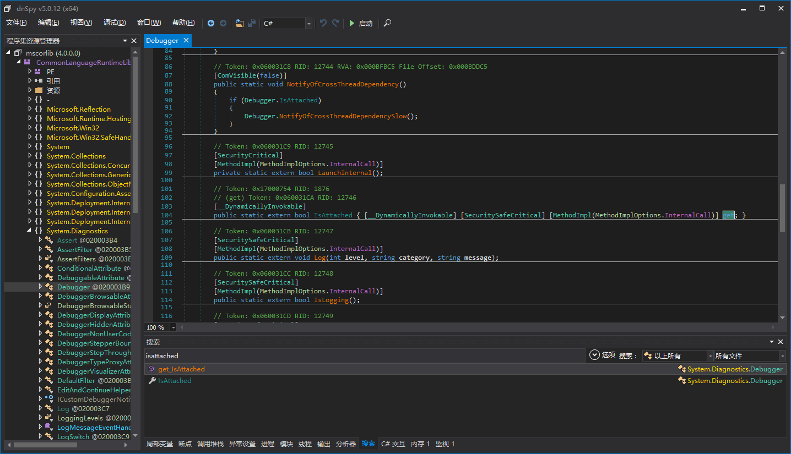
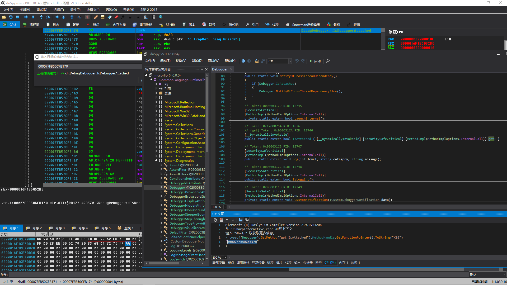

我们添加初始化代码，直接从clr.dll/mscorwks.dll读取原始的代码，并且计算出CRC32。

``` csharp
private delegate bool IsDebuggerAttachedDelegate();

private static bool _isManagedDebuggerPrevented;
private static bool _isManagedInitialized;
private static byte* _pIsDebuggerAttached;
private static IsDebuggerAttachedDelegate _isDebuggerAttached;
private static uint _isDebuggerAttachedLength;
private static uint _isDebuggerAttachedCrc32;

private static void InitializeManaged() {
	void* clrModuleHandle;
	StringBuilder stringBuilder;
	byte[] clrFile;

	if (_isManagedInitialized)
		return;
	switch (Environment.Version.Major) {
	case 2:
		_pIsDebuggerAttached = (byte*)typeof(Debugger).GetMethod("IsDebuggerAttached", BindingFlags.NonPublic | BindingFlags.Static).MethodHandle.GetFunctionPointer();
		// 和.NET 4.x不一样，这个Debugger.IsAttached的get属性调用了IsDebuggerAttached()，而不是直通CLR内部。
		clrModuleHandle = GetModuleHandle("mscorwks.dll");
		break;
	case 4:
		_pIsDebuggerAttached = (byte*)typeof(Debugger).GetMethod("get_IsAttached").MethodHandle.GetFunctionPointer();
		// Debugger.IsAttached的get属性是一个有[MethodImpl(MethodImplOptions.InternalCall)]特性的方法，意思是实现在CLR内部，而且没有任何stub，直接指向CLR内部。
		// 通过x64dbg调试，可以知道Debugger.get_IsAttached()对应clr!DebugDebugger::IsDebuggerAttached()。
		clrModuleHandle = GetModuleHandle("clr.dll");
		break;
	default:
		throw new NotSupportedException();
	}
	_isDebuggerAttached = (IsDebuggerAttachedDelegate)Marshal.GetDelegateForFunctionPointer((IntPtr)_pIsDebuggerAttached, typeof(IsDebuggerAttachedDelegate));
	if (clrModuleHandle == null)
		throw new InvalidOperationException();
	stringBuilder = new StringBuilder((int)MAX_PATH);
	if (!GetModuleFileName(clrModuleHandle, stringBuilder, MAX_PATH))
		throw new InvalidOperationException();
	clrFile = File.ReadAllBytes(stringBuilder.ToString());
	// 读取CLR模块文件内容
	fixed (byte* pPEImage = clrFile) {
		PEInfo peInfo;
		uint isDebuggerAttachedRva;
		uint isDebuggerAttachedFoa;
		byte* pCodeStart;
		byte* pCodeCurrent;
		ldasm_data ldasmData;
		bool is64Bit;
		byte[] opcodes;

		peInfo = new PEInfo(pPEImage);
		isDebuggerAttachedRva = (uint)(_pIsDebuggerAttached - (byte*)clrModuleHandle);
		isDebuggerAttachedFoa = peInfo.ToFOA(isDebuggerAttachedRva);
		pCodeStart = pPEImage + isDebuggerAttachedFoa;
		pCodeCurrent = pCodeStart;
		is64Bit = sizeof(void*) == 8;
		opcodes = new byte[0x200];
		// 分配远大于实际函数大小的内存
		while (true) {
			uint length;

			length = Ldasm.ldasm(pCodeCurrent, &ldasmData, is64Bit);
			if ((ldasmData.flags & Ldasm.F_INVALID) != 0)
				throw new NotSupportedException();
			CopyOpcode(&ldasmData, pCodeCurrent, opcodes, (uint)(pCodeCurrent - pCodeStart));
			if (*pCodeCurrent == 0xC3) {
				// 找到了第一个ret指令
				pCodeCurrent += length;
				break;
			}
			pCodeCurrent += length;
		}
		// 复制Opcode直到出现第一个ret
		_isDebuggerAttachedLength = (uint)(pCodeCurrent - pCodeStart);
		fixed (byte* pOpcodes = opcodes)
			_isDebuggerAttachedCrc32 = DynamicCrc32.Compute(pOpcodes, _isDebuggerAttachedLength);
	}
	_isManagedInitialized = true;
}

private static void CopyOpcode(ldasm_data* pLdasmData, void* pCode, byte[] opcodes, uint offset) {
	for (byte i = 0; i < pLdasmData->opcd_size; i++)
		opcodes[offset + pLdasmData->opcd_offset + i] = ((byte*)pCode)[pLdasmData->opcd_offset + i];
}
```

这里使用了Ldasm，也是看了xjun的XAntiDebug的项目才知道有这个反汇编引擎。这个反编译引擎非常小巧，真的只有1个函数，我把我翻译成的C#的代码附上。

``` csharp
/// <summary>
/// Disassemble one instruction
/// </summary>
/// <param name="code">pointer to the code for disassemble</param>
/// <param name="ld">pointer to structure ldasm_data</param>
/// <param name="is64">set this flag for 64-bit code, and clear for 32-bit</param>
/// <returns>length of instruction</returns>
public static uint ldasm(void* code, ldasm_data* ld, bool is64) {
	byte* p = (byte*)code;
	byte s, op, f;
	byte rexw, pr_66, pr_67;

	s = rexw = pr_66 = pr_67 = 0;

	/* dummy check */
	if (code == null || ld == null)
		return 0;

	/* init output data */
	*ld = new ldasm_data();

	/* phase 1: parse prefixies */
	while ((cflags(*p) & OP_PREFIX) != 0) {
		if (*p == 0x66)
			pr_66 = 1;
		if (*p == 0x67)
			pr_67 = 1;
		p++; s++;
		ld->flags |= F_PREFIX;
		if (s == 15) {
			ld->flags |= F_INVALID;
			return s;
		}
	}

	/* parse REX prefix */
	if (is64 && *p >> 4 == 4) {
		ld->rex = *p;
		rexw = (byte)((ld->rex >> 3) & 1);
		ld->flags |= F_REX;
		p++; s++;
	}

	/* can be only one REX prefix */
	if (is64 && *p >> 4 == 4) {
		ld->flags |= F_INVALID;
		s++;
		return s;
	}

	/* phase 2: parse opcode */
	ld->opcd_offset = (byte)(p - (byte*)code);
	ld->opcd_size = 1;
	op = *p++; s++;

	/* is 2 byte opcode? */
	if (op == 0x0F) {
		op = *p++; s++;
		ld->opcd_size++;
		f = cflags_ex(op);
		if ((f & OP_INVALID) != 0) {
			ld->flags |= F_INVALID;
			return s;
		}
		/* for SSE instructions */
		if ((f & OP_EXTENDED) != 0) {
			op = *p++; s++;
			ld->opcd_size++;
		}
	}
	else {
		f = cflags(op);
		/* pr_66 = pr_67 for opcodes A0-A3 */
		if (op >= 0xA0 && op <= 0xA3)
			pr_66 = pr_67;
	}

	/* phase 3: parse ModR/M, SIB and DISP */
	if ((f & OP_MODRM) != 0) {
		byte mod = (byte)(*p >> 6);
		byte ro = (byte)((*p & 0x38) >> 3);
		byte rm = (byte)(*p & 7);

		ld->modrm = *p++; s++;
		ld->flags |= F_MODRM;

		/* in F6,F7 opcodes immediate data present if R/O == 0 */
		if (op == 0xF6 && (ro == 0 || ro == 1))
			f |= OP_DATA_I8;
		if (op == 0xF7 && (ro == 0 || ro == 1))
			f |= OP_DATA_I16_I32_I64;

		/* is SIB byte exist? */
		if (mod != 3 && rm == 4 && !(!is64 && pr_67 != 0)) {
			ld->sib = *p++; s++;
			ld->flags |= F_SIB;

			/* if base == 5 and mod == 0 */
			if ((ld->sib & 7) == 5 && mod == 0) {
				ld->disp_size = 4;
			}
		}

		switch (mod) {
		case 0:
			if (is64) {
				if (rm == 5) {
					ld->disp_size = 4;
					if (is64)
						ld->flags |= F_RELATIVE;
				}
			}
			else if (pr_67 != 0) {
				if (rm == 6)
					ld->disp_size = 2;
			}
			else {
				if (rm == 5)
					ld->disp_size = 4;
			}
			break;
		case 1:
			ld->disp_size = 1;
			break;
		case 2:
			if (is64)
				ld->disp_size = 4;
			else if (pr_67 != 0)
				ld->disp_size = 2;
			else
				ld->disp_size = 4;
			break;
		}

		if (ld->disp_size != 0) {
			ld->disp_offset = (byte)(p - (byte*)code);
			p += ld->disp_size;
			s += ld->disp_size;
			ld->flags |= F_DISP;
		}
	}

	/* phase 4: parse immediate data */
	if (rexw != 0 && (f & OP_DATA_I16_I32_I64) != 0)
		ld->imm_size = 8;
	else if ((f & OP_DATA_I16_I32) != 0 || (f & OP_DATA_I16_I32_I64) != 0)
		ld->imm_size = (byte)(4 - (pr_66 << 1));

	/* if exist, add OP_DATA_I16 and OP_DATA_I8 size */
	ld->imm_size += (byte)(f & 3);

	if (ld->imm_size != 0) {
		s += ld->imm_size;
		ld->imm_offset = (byte)(p - (byte*)code);
		ld->flags |= F_IMM;
		if ((f & OP_RELATIVE) != 0)
			ld->flags |= F_RELATIVE;
	}

	/* instruction is too long */
	if (s > 15)
		ld->flags |= F_INVALID;

	return s;
}
```

还有一堆定义可以自己去我改好的antinet里面看，这里不贴了。

此时，我们可以添加上检查是否存在托管调试器的代码。

``` csharp
/// <summary>
/// 使用 clr!DebugDebugger::IsDebuggerAttached() 检查是否存在托管调试器。
/// 注意，此方法不能检测到非托管调试器（如OllyDbg，x64dbg）的存在。
/// </summary>
/// <returns></returns>
public static bool HasManagedDebugger() {
	byte[] opcodes;
	byte* pCodeStart;
	byte* pCodeCurrent;
	byte* pCodeEnd;
	ldasm_data ldasmData;
	bool is64Bit;

	InitializeManaged();
	if (_isDebuggerAttached())
		// 此时肯定有托管调试器附加
		return true;
	// 此时不能保证托管调试器未调试当前进程
	if (_pIsDebuggerAttached[0] == 0x33 && _pIsDebuggerAttached[1] == 0xC0 && _pIsDebuggerAttached[2] == 0xC3)
		// 这是dnSpy反反调试的特征
		return true;
	// 有可能特征变了，进一步校验
	opcodes = new byte[_isDebuggerAttachedLength];
	pCodeStart = _pIsDebuggerAttached;
	pCodeCurrent = pCodeStart;
	pCodeEnd = _pIsDebuggerAttached + _isDebuggerAttachedLength;
	is64Bit = sizeof(void*) == 8;
	while (true) {
		uint length;

		length = Ldasm.ldasm(pCodeCurrent, &ldasmData, is64Bit);
		if ((ldasmData.flags & Ldasm.F_INVALID) != 0)
			throw new NotSupportedException();
		CopyOpcode(&ldasmData, pCodeCurrent, opcodes, (uint)(pCodeCurrent - pCodeStart));
		pCodeCurrent += length;
		if (pCodeCurrent == pCodeEnd)
			break;
	}
	// 复制Opcodes
	if (DynamicCrc32.Compute(opcodes) != _isDebuggerAttachedCrc32)
		// 如果CRC32不相等，那说明CLR可能被Patch了
		return true;
	return false;
}
```

也许有人会问为什么不直接把机器码复制到缓冲区来校验，而是只取其中的Opcode。因为我们要考虑到重定位表的存在，所以只能检测Opcode是否被修改，要检测操作数有没有被修改，实现起来就有点麻烦了。

之前考虑过对整个CLR的.text节进行校验，但是失败了。这部分代码可以去github看我的提交记录，最先几次提交里面有这部分代码，在[AntiPatcher.cs](https://github.com/wwh1004/antinet/blob/a030b2fae495154391c50bac7a1712d2be59fc23/antinet/AntiPatcher.cs)里面，只不过因为失败被注释掉了。

为什么用

``` csharp
if (_isDebuggerAttached())
	// 此时肯定有托管调试器附加
	return true;
```

而不是

``` csharp
if (Debugger.IsAttched)
	// 此时肯定有托管调试器附加
	return true;
```

因为.NET 2.0~3.5的Debugger.IsAttched的get属性是一个托管方法，存在被直接Patch的可能，会导致在.NET 2.0~3.5下，托管调试器的检测出现漏洞。


