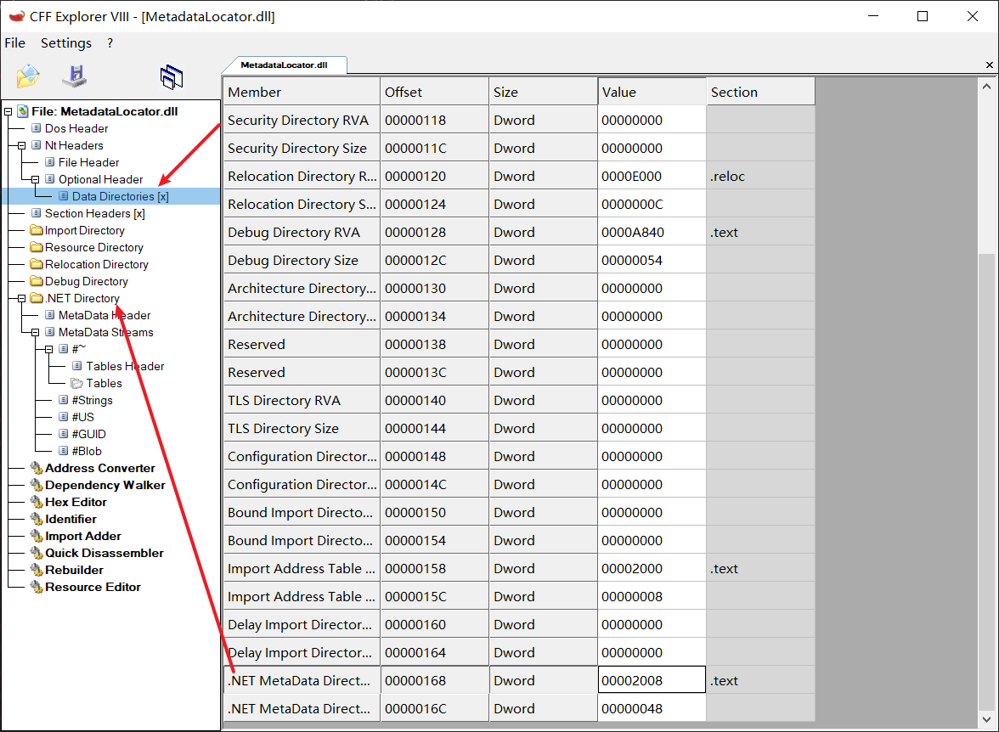
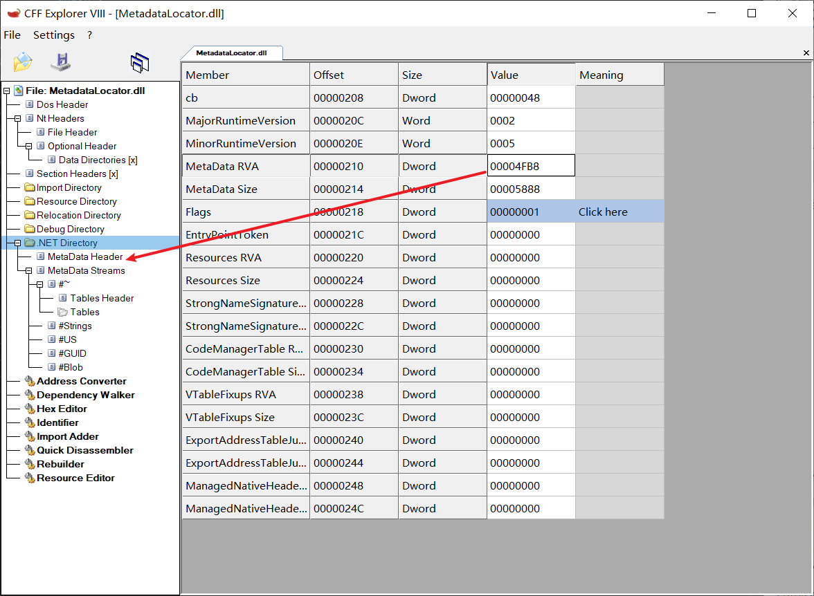
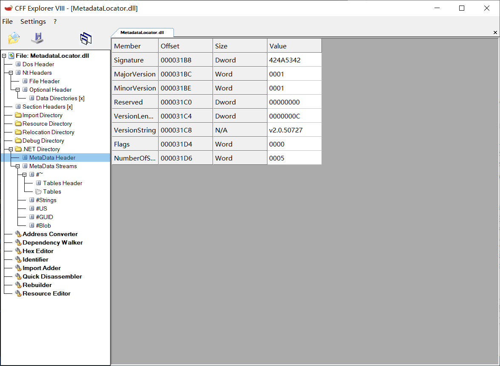
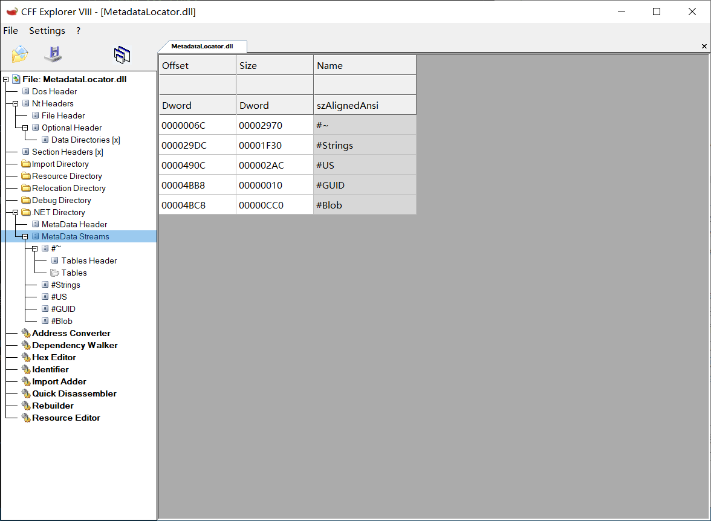
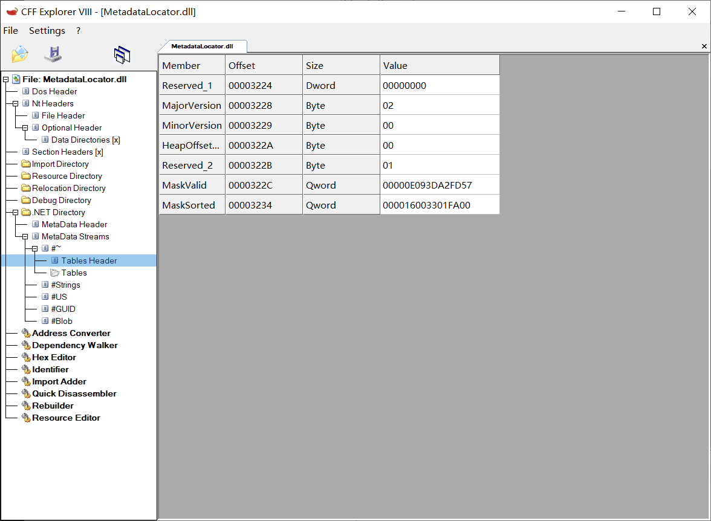

# .NET下绕过任意反Dump的方法

## 前言

.NET下的反Dump手段比较单一，无非是在运行后对PE头中的.NET部分进行抹除。由于CLR在加载程序集时已经保存了所有.NET元数据的偏移和大小，抹除这部分.NET头对程序的运行没有任何影响。但是如果我们直接Dump内存中的程序集，由于.NET头已经被抹除，Dump得到的文件是无法被dnSpy、ILSpy等工具读取的。利用CLR的内部对象，我们可以从中读取.NET的元数据信息，从而计算恢复出PE头中的.NET部分。本文将介绍如何通过这个办法，达到绕过任意反Dump技术的目的。

**在本文开始前，必须要明确的一点是，绕过反Dump不意味着可以直接Dump下来可以运行和使用的文件！绕过反Dump的目的是恢复出必要的信息让dnSpy、ILSpy等工具可以直接反编译，从而快速分析这个.NET程序集，而不是恢复出和原始的一摸一摸的没有信息丢失的.NET头！如果想要脱壳，并不能依赖于这个方法！**

**文中CLR源码来自CoreCLR v1.0**

## 恢复.NET头的思路

在前言中已经大致介绍，通过读取CLR内部对象，可以获取必要的信息来恢复.NET头。所以我们需要先了解PE头中的.NET部分和反Dump可以抹除的部分。

首先是Data Directories中的.NET元数据目录。这一项记录了.NET目录（IMAGE_COR20_HEADER）的偏移和大小。一般来说偏移是0x2008，也就是.text段的第8个字节，这是由C#和VB.NET编译器决定的。大小是sizeof(IMAGE_COR20_HEADER)，也就是固定的0x48。



CFF Explorer中的.NET Directory就是IMAGE_COR20_HEADER。



通过上一步的解析，我们可以得到IMAGE_COR20_HEADER的所在位置。其中IMAGE_COR20_HEADER的定义如下，重要的部分我给了注释。

``` cpp
typedef struct IMAGE_COR20_HEADER
{
    DWORD                   cb;                  // sizeof(IMAGE_COR20_HEADER)
    WORD                    MajorRuntimeVersion;
    WORD                    MinorRuntimeVersion;
    IMAGE_DATA_DIRECTORY    MetaData;            // .NET元数据
    DWORD                   Flags;               // 标志位，指示程序集类型，比如是否可执行，是否纯IL
    union {
        DWORD               EntryPointToken;     // Main方法的MDToken
        DWORD               EntryPointRVA;       // 入口点的RVA（如果入口是本机代码）
    } DUMMYUNIONNAME;
    IMAGE_DATA_DIRECTORY    Resources;           // .NET资源
    IMAGE_DATA_DIRECTORY    StrongNameSignature; // .NET强名称
    IMAGE_DATA_DIRECTORY    CodeManagerTable;
    IMAGE_DATA_DIRECTORY    VTableFixups;
    IMAGE_DATA_DIRECTORY    ExportAddressTableJumps;
    IMAGE_DATA_DIRECTORY    ManagedNativeHeader;
} IMAGE_COR20_HEADER, *PIMAGE_COR20_HEADER;
```

此结构中的大部分是可以被清除的（我知道的不能清除的有Resources，因为每次获取资源都要重新读取IMAGE_COR20_HEADER::Resources），但是必要的部分其实只有MetaData这个成员，其它部分如.NET资源只是作为附加项。**为了让反编译器可以尽可能显示全部信息，我们恢复MetaData，EntryPointToken这三个成员即可**。

EntryPointToken和Resources的恢复比较简单，只要恢复IMAGE_COR20_HEADER中的成员。而MetaData比较复杂，需要恢复MetaData指向的.NET元数据头。.NET元数据头的第一个结构是STORAGESIGNATURE，紧接着的是STORAGEHEADER，然后跟着STORAGESTREAM数组。这里给出它们在CFF Explorer中的显示和在CLR中的定义。

CFF Explorer中的MetaData Header就是STORAGESIGNATURE + STORAGEHEADER，MetaData Streams就是紧跟的STORAGESTREAM数组。





``` cpp
struct STORAGESIGNATURE
{
    ULONG       lSignature;             // "Magic" signature.
    USHORT      iMajorVer;              // Major file version.
    USHORT      iMinorVer;              // Minor file version.
    ULONG       iExtraData;             // Offset to next structure of information 
    ULONG       iVersionString;         // Length of version string
    BYTE        pVersion[0];            // Version string
};

struct STORAGEHEADER
{
    BYTE        fFlags;                 // STGHDR_xxx flags.
    BYTE        pad;
    USHORT      iStreams;               // How many streams are there.
};

struct STORAGESTREAM
{
    ULONG       iOffset;                // Offset in file for this stream.
    ULONG       iSize;                  // Size of the file.
    char        rcName[MAXSTREAMNAME];  // Start of name, null terminated.
};
```

STORAGESIGNATURE中的iVersionString成员表示pVersion的真实长度，也就是说STORAGESIGNATURE结构体的实际大小是sizeof(STORAGESIGNATURE) + iVersionString。STORAGEHEADER的iStreams成员表示STORAGESTREAM数组的元素数量。一般来说iStreams为5，5个STORAGESTREAM结构分别对应了#&#126;、#Strings、#US、#GUID、#Blob这5个元数据流。

在反Dump中，STORAGESIGNATURE的lSignature的成员是一定会被抹除的，它和PE头的"MZ"类似，值恒为0x424A5342，也就是"BSJB"。如果不抹除这个成员，通过搜索特征BSJB可以非常容易地定位到.NET元数据头从而绕过反Dump。和上面提到的结构IMAGE_COR20_HEADER一样，这三个结构的所有成员也都是可以抹除的。恢复的时候，**我们主要关注STORAGESTREAM这个结构中的所有三个成员，保存了指向.NET元数据流的信息，和这些元数据流对应的名称**。其它两个结构体相对而言没那么重要，可以直接填预设值。

在上面提到的5个元数据流#&#126;、#Strings、#US、#GUID、#Blob中，#&#126;是表流，必须存在的。如果表流是未压缩的，它的名称也可以是#-，元数据结构上和#&#126;是一致的。表流的头部是CMiniMdSchemaBase结构，这里给出它在CFF Explorer中的显示和在CLR中的定义。



``` cpp
class CMiniMdSchemaBase
{
    ULONG       m_ulReserved;           // Reserved, must be zero.
    BYTE        m_major;                // Version numbers.
    BYTE        m_minor;
    BYTE        m_heaps;                // Bits for heap sizes.
    BYTE        m_rid;                  // log-base-2 of largest rid.
    unsigned __int64    m_maskvalid;    // Bit mask of present table counts.
    unsigned __int64    m_sorted;       // Bit mask of sorted tables.
};
```

在CMiniMdSchemaBase结构后面，紧跟着一个UINT32数组，元素数量是m_maskvalid表示的存在的表的数量。这个数组的元素按顺序表示了每个存在的表的行数。

CLR加载.NET程序集时，这些成员都会被保存到CLR内部，所以这些成员也都是可以抹除的。**恢复时，我们主要关注哪些表是存在的，并且它们的行数分别是多少。通过这些数据我们可以恢复出m_maskvalid成员和行数数组**。

## 关键的CLR内部对象

有了恢复.NET头的思路，我们可以开始了解CLR内部对象了，通过它们来恢复.NET头。这部分内容将展开介绍关键的CLR内部对象作为铺垫。**这些CLR内部对象我会省略掉很多无关的部分，而且不同版本CLR的定义也略有区别，所以列出的成员在结构体中的偏移是不一定的**。关于具体如何使用，将会在下一部分详细说明。

### Module

Module类对应mscorlib里System.Reflection.RuntimeModule类的本机对象布局，定义在ceeload.h里。

``` cpp
class Module
{
    PTR_CUTF8               m_pSimpleName;
    PTR_PEFile              m_file;
    MethodDesc              *m_pDllMain;
    Volatile<DWORD>          m_dwTransientFlags;
    Volatile<DWORD>          m_dwPersistedFlags;
    VASigCookieBlock        *m_pVASigCookieBlock;
    PTR_Assembly            m_pAssembly;
    mdFile                  m_moduleRef;
};
```

* m_pSimpleName是模块名，值等于C#代码的assembly.Module.Assembly.GetName().Name，在.NET Framework 4.5.3之前不存在这个成员。
* m_file是指向PEFile结构的指针，可以用来获取模块基址和大小等信息，非常重要。
* m_pDllMain是指向DllMain方法的指针，仅对C++/CLI生成的程序集有效。
* m_pAssembly是指向Assembly结构的指针，这里不需要使用它。

### PEFile

PEFile类CLR加载器的输入，表示一个抽象的PE文件。它的子类是PEAssembly和PEModule。如果被加载为程序集，那就创建PEAssembly，如果用Assembly.LoadModule方法加载为模块，那么就创建PEModule。在.NET Core里面，多模块程序集特性被移除了。所以.NET Core里面只有PEAssembly，没有PEModule了。

PEFile有多种加载方式：
1. HMODULE - PEFile是在响应“自发的”系统回调时加载的。只有通过LoadLibrary加载exe主模块和IJW dll，或非托管代码中存在静态导入才会出现这种情况。
2. Fusion loads - 这是最常见的情况。从Fusion中获得路径，并通过PEImage加载PEFile。
    1. Display name loads - 这些是基于元数据的绑定。
    2. Path loads - 从完整的绝对路径加载
3. Byte arrays - 由用户代码显式加载。这也是通过PEImage加载的。
4. Dynamic - 此时PEFile不是实际的PE映像，而是基于反射的模块的占位符。

``` cpp
class PEFile
{
    PTR_PEImage              m_identity;
    PTR_PEImage              m_openedILimage;
    PTR_PEImage              m_nativeImage;
    BOOL                     m_fCanUseNativeImage;
    BOOL                     m_MDImportIsRW_Debugger_Use_Only;
    Volatile<BOOL>           m_bHasPersistentMDImport;
    IMDInternalImport       *m_pMDImport;
    IMetaDataImport2        *m_pImporter;
    IMetaDataEmit           *m_pEmitter;
};
```

* m_identity是作为标识符的指向PEImage结构的指针。一般情况下不用这个成员，而是使用m_openedILimage。在PEFile::GetILimage函数里，如果m_openedILimage为空，m_identity的值会赋给m_openedILimage。
* m_openedILimage是作为提供元数据的指向PEImage结构的指针。我们恢复.NET头会使用这个成员获取信息。
* m_nativeImage是用于NGEN等情况的指向PEImage结构的指针。比如mscorlib.ni.dll这种NGEN创建的预编译的模块，就会加载并保存到m_nativeImage成员。
* m_pMDImport是指向IMDInternalImport接口的指针，我们可以用这个接口读取一些元数据信息。

PEFile的子类PEAssembly和PEModule我们不需要过于关心，里面没有什么可用的信息。通过观察PEFile的成员，我们可以大概认为PEFile是对PEImage的包装，封装了各种情况下.NET程序集加载的结果。CLR只需要使用抽象的IMDInternalImport接口来获取元数据即可，不需要关心PE映像的具体细节。

### PEImage

PEImage是由CLR的“模拟LoadLibrary”机制加载的PE文件。PEImage可以加载为FLAT（与磁盘上的文件布局相同）或MAPPED（PE区段映射到虚拟地址）。

``` cpp
class PEImage
{
    SString     m_path;
    LONG        m_refCount;
    SString     m_sModuleFileNameHintUsedByDac;
    BOOL        m_bIsTrustedNativeImage;
    BOOL        m_bIsNativeImageInstall;
    BOOL        m_bPassiveDomainOnly;
    SimpleRWLock *m_pLayoutLock;
    PTR_PEImageLayout m_pLayouts[IMAGE_COUNT];
    BOOL      m_bInHashMap;
    IMDInternalImport* m_pMDImport;
    IMDInternalImport* m_pNativeMDImport;
};
```

* m_path是PE映像的路径。如果PEImage是通过文件加载的，那么m_path就是这个文件的路径。如果PEImage是通过内存加载的，也就是使用了Assembly.Load(byte[])等方法加载，那么m_path就是空。
* m_pLayouts保存了PEImageLayout指针的数组。PEImageLayout提供了具体的PE映像的布局信息，包括模块基址和模块大小。所以m_pLayouts是一个很重要的成员。
* m_pMDImport是指向IMDInternalImport接口的指针，我们可以用这个接口读取一些元数据信息。这个成员和PEFile的m_pMDImport可以认为是一样的。

### PEImageLayout

PEImageLayout是指具体的PE映像布局，有MappedImageLayout、LoadedImageLayout、FlatImageLayout等子类。子类的成员不需要关心，重要的部分都在基类PEImageLayout中。

``` cpp
class PEDecoder
{
    TADDR               m_base;
    COUNT_T             m_size;
    ULONG               m_flags;
    PTR_IMAGE_NT_HEADERS   m_pNTHeaders;
    PTR_IMAGE_COR20_HEADER m_pCorHeader;
    PTR_CORCOMPILE_HEADER  m_pNativeHeader;
    PTR_READYTORUN_HEADER  m_pReadyToRunHeader;
};

class PEImageLayout : public PEDecoder
{
    Volatile<LONG> m_refCount;
    PEImage* m_pOwner;
    DWORD m_Layout;
};
```

* m_base是模块基址。
* m_size是模块大小。
* m_pCorHeader是指向IMAGE_COR20_HEADER结构的指针。被反Dump保护抹除的偏移就可以使用这个成员恢复。
* m_Layout表示当前布局是什么类型，比如FLAT、MAPPED、LOADED。

### MDInternalRO && MDInternalRW

这两个类是CLR内部元数据接口IMDInternalImport的实现类。获取了IMDInternalImport接口的指针意味着拿到了这两个类的实例。通过这两个类，我们可以获取关于元数据表流和堆流的所有信息。

``` cpp
class MDInternalRO : public IMDInternalImport, IMDCommon
{
    CLiteWeightStgdb<CMiniMd>   m_LiteWeightStgdb;
    CMethodSemanticsMap *m_pMethodSemanticsMap; // Possible array of method semantics pointers, ordered by method token.
    mdTypeDef           m_tdModule;         // <Module> typedef value.
    LONG                m_cRefs;            // Ref count.
};
```

* m_LiteWeightStgdb是保存了元数据信息的成员，通过它可以读取元数据信息从而恢复.NET头。

``` cpp
class MDInternalRW : public IMDInternalImportENC, public IMDCommon
{
    CLiteWeightStgdbRW  *m_pStgdb;
    mdTypeDef           m_tdModule;         // <Module> typedef value.
    LONG                m_cRefs;            // Ref count.
    bool                m_fOwnStgdb;
    IUnknown            *m_pUnk;
    IUnknown            *m_pUserUnk;        // Release at shutdown.
    IMetaDataHelper     *m_pIMetaDataHelper;// pointer to cached public interface
    UTSemReadWrite      *m_pSemReadWrite;   // read write lock for multi-threading.
    bool                m_fOwnSem;          // Does MDInternalRW own this read write lock object?
};
```

* m_pStgdb和上面的MDInternalRO::m_LiteWeightStgdb一样，是保存了元数据信息的成员，通过它可以读取元数据信息从而恢复.NET头。

### CLiteWeightStgdb && CLiteWeightStgdbRW

这两个是对CMiniMd和CMiniMdRW的包装。CLiteWeightStgdbRW这个类不是非常重要，没有恢复.NET头需要的信息。实际上我们只需要CLiteWeightStgdb这个类。它们的定义如下。

``` cpp
template <class MiniMd>
class CLiteWeightStgdb
{
    MiniMd      m_MiniMd;               // embedded compress meta data schemas definition
    const void  *m_pvMd;                // Pointer to meta data.
    ULONG       m_cbMd;                 // Size of the meta data.
}

class CLiteWeightStgdbRW : public CLiteWeightStgdb<CMiniMdRW>
{
    UINT32      m_cbSaveSize;               // Size of the saved streams.
    int         m_bSaveCompressed;          // If true, save as compressed stream (#-, not #~)
    VOID*       m_pImage;                   // Set in OpenForRead, NULL for anything but PE files
    DWORD       m_dwImageSize;              // On-disk size of image
    DWORD       m_dwPEKind;                 // The kind of PE - 0: not a PE.
    DWORD       m_dwMachine;                // Machine as defined in NT header.
    STORAGESTREAMLST *m_pStreamList;
    CLiteWeightStgdbRW *m_pNextStgdb;
    FILETYPE m_eFileType;
    WCHAR *  m_wszFileName;     // Database file name (NULL or non-empty string)
    DWORD    m_dwDatabaseLFT;   // Low bytes of the database file's last write time
    DWORD    m_dwDatabaseLFS;   // Low bytes of the database file's size
    StgIO *  m_pStgIO;          // For file i/o.
}
```

* m_MiniMd是CMiniMd和CMiniMdRW，下一小节会提到这两个类。
* m_pvMd是指向元数据的指针，对应CFF Explorer中.NET Directory的MetaData RVA。
* m_cbMd是元数据的大小，对应CFF Explorer中.NET Directory的MetaData Size。值得注意的一点是对于CMiniMdRW，也就是未压缩的表流，m_cbMd是无效的，我们需要自己计算元数据总大小。

### CMiniMd & CMiniMdRW

CMiniMd是CLR内部的元数据Provider实现，与其类似的还有一个CMiniMdRW。两者不同之处是，CMiniMd是用于#&#126;这种已压缩的表流，而CMiniMdRW是用于#-这种未压缩的表流。

从结构上来说它们有一个共同的基类CMiniMdBase。

``` cpp
class CMiniMdBase
{
    CMiniMdSchema   m_Schema;                       // data header.
    ULONG           m_TblCount;                     // Tables in this database.
    BOOL            m_fVerifiedByTrustedSource;     // whether the data was verified by a trusted source
    CMiniTableDef   m_TableDefs[TBL_COUNT];
    ULONG           m_iStringsMask;
    ULONG           m_iGuidsMask;
    ULONG           m_iBlobsMask;
};
```

* m_Schema是上面提到的CMiniMdSchemaBase结构的子类，是用来恢复表流头部的关键之一。

CLR会为压缩的表流使用CMiniMd，因为它不可扩充，结构体积更小，运行速度也更快。

``` cpp
class CMiniMd : public CMiniMdBase
{
    MetaData::TableRO m_Tables[TBL_COUNT];
    struct MetaData::HotTablesDirectory * m_pHotTablesDirectory;
    MetaData::StringHeapRO m_StringHeap;
    MetaData::BlobHeapRO   m_BlobHeap;
    MetaData::BlobHeapRO   m_UserStringHeap;
    MetaData::GuidHeapRO   m_GuidHeap;
};
```

* m_Tables是保存了每一个元数据表的数组。数组元素类型TableRO内部保存了指向每一个元数据表起始地址的指针。用来恢复#&#126;。
* m_StringHeap是字符串流，保存了方法名、类名等元数据字符串。类型StringHeapRO的最终基类是StgPoolSeg，下文会介绍。用来恢复#Strings。
* m_BlobHeap是二进制对象流。类型BlobHeapRO的最终基类是StgPoolSeg，下文会介绍。用来恢复#Blob。
* m_UserStringHeap是用户字符串流，保存了用户定义的字符串，如'string s = "Hello World"'。类型BlobHeapRO的最终基类是StgPoolSeg，下文会介绍。用来恢复#US。
* m_GuidHeap是GUID流。类型GuidHeapRO的最终基类是StgPoolSeg，下文会介绍。用来恢复#GUID。

对于未压缩的表流#-，CLR会使用CMiniMdRW。它是可以扩充追加数据的。下面列出的只是一部分成员，还有很多没列出的。总之就是比CMiniMd大而且复杂了不少。

``` cpp
class CMiniMdRW : public CMiniMdBase
{
    CMemberRefHash *m_pMemberRefHash;
    CMemberDefHash *m_pMemberDefHash;
    CLookUpHash * m_pLookUpHashs[TBL_COUNT];
    MapSHash<UINT32, UINT32> m_StringPoolOffsetHash;
    CMetaDataHashBase *m_pNamedItemHash;
    ULONG       m_maxRid;               // Highest RID so far allocated.
    ULONG       m_limRid;               // Limit on RID before growing.
    ULONG       m_maxIx;                // Highest pool index so far.
    ULONG       m_limIx;                // Limit on pool index before growing.
    enum        {eg_ok, eg_grow, eg_grown} m_eGrow; // Is a grow required? done?
    MetaData::TableRW m_Tables[TBL_COUNT];
    VirtualSort *m_pVS[TBL_COUNT];      // Virtual sorters, one per table, but sparse.
    MetaData::StringHeapRW m_StringHeap;
    MetaData::BlobHeapRW   m_BlobHeap;
    MetaData::BlobHeapRW   m_UserStringHeap;
    MetaData::GuidHeapRW   m_GuidHeap;
    IMapToken  *m_pHandler;     // Remap handler.
    ULONG m_cbSaveSize;         // Estimate of save size.
};
```

* m_Tables是保存了每一个元数据表的数组。数组元素类型TableRW内部是一个StgPoolSeg的子类。用来恢复#&#126;。
* m_StringHeap是字符串流，保存了方法名、类名等元数据字符串。类型StringHeapRW的最终基类是StgPoolSeg，下文会介绍。用来恢复#Strings。
* m_BlobHeap是二进制对象流。类型BlobHeapRW的最终基类是StgPoolSeg，下文会介绍。用来恢复#Blob。
* m_UserStringHeap是用户字符串流，保存了用户定义的字符串，如'string s = "Hello World"'。类型BlobHeapRW的最终基类是StgPoolSeg，下文会介绍。用来恢复#US。
* m_GuidHeap是GUID流。类型GuidHeapRW的最终基类是StgPoolSeg，下文会介绍。用来恢复#GUID。

这里RW和RO的区别就是，RW是可写的，可以在数据段后再追加数据段，而RO是只读的，初始化之后就不能更改了。

### CMiniTableDef

CMiniTableDef是表示元数据表定义的结构，里面保存了表的字段、大小、行数，其中行数是我们用来恢复.NET头的。

``` cpp
struct CMiniColDef
{
    BYTE        m_Type;                 // Type of the column.
    BYTE        m_oColumn;              // Offset of the column.
    BYTE        m_cbColumn;             // Size of the column.
};

struct CMiniTableDef
{
    CMiniColDef *m_pColDefs;            // Array of field defs.
    BYTE        m_cCols;                // Count of columns in the table.
    BYTE        m_iKey;                 // Column which is the key, if any.
    USHORT      m_cbRec;                // Size of the records.
};
```

* m_pColDefs是表示表内有哪些字段的数组。
* m_cCols是表内字段数量，也就是m_pColDefs数组的长度。
* m_cbRec是表的行数，这个是用来恢复.NET头中表流头部的关键之一。

### StgPoolSeg

上面提到的StringHeapRO、BlobHeapRO、GuidHeapRO、StringHeapRW、BlobHeapRW、GuidHeapRW都是最终继承自StgPoolSeg的子类。关键的保存数据位置和大小的成员就在基类StgPoolSeg中。所以了解StgPoolSeg的机构即可。

``` cpp
class StgPoolSeg
{
    BYTE       *m_pSegData;     // Pointer to the data.
    StgPoolSeg *m_pNextSeg;     // Pointer to next segment, or NULL.
    // Size of the segment buffer. If this is last segment (code:m_pNextSeg is NULL), then it's the 
    // allocation size. If this is not the last segment, then this is shrinked to segment data size 
    // (code:m_cbSegNext).
    ULONG       m_cbSegSize;
    ULONG       m_cbSegNext;    // Offset of next available byte in segment. Segment relative.
};
```

## 通过CLR内部对象恢复.NET头

在大致了解反Dump保护可能抹除的数据和CLR内部对象后，我们就可以通过代码定位CLR内部对象，然后恢复.NET头了。这里我们做最极端的假设，反Dump技术抹除了所有可能的数据，我们要依赖CLR内部对象恢复它们。我们按顺序，从外向内地一层一层恢复。

**以下提到的代码在文末都有完整地实现。**

### 定位IMAGE_COR20_HEADER

对于Data Directories的.NET MetaData Directory。


我们可以使用反射API得到System.Reflection.RuntimeModule。然后使用反射API获取它的私有字段m_pData。这个字段的值是指向CLR内部对象Module的指针。

获取Module对象后，我们使用Module::m_file，得到PEFile对象，这个PEFile是PEAssembly和PEModule，但是实际上只需要使用基类PEFile的内容。

然后我们找到PEFile::m_openedILimage，用来拿到作为PEFile后端的PEImage。

最后我们从PEImage中，获取PEImageLayout即可拿到IMAGE_COR20_HEADER，也就是Data Directories的.NET MetaData Directory。但是PEImage中有好几个PEImageLayout，我们需要的布局是LOADED。LOADED指用来提供IL代码的那一个，并不是一个具体的布局如FLAT、MAPPED，而是一个抽象的。CLR会从已有的布局里面选取一个已经打开的，作为LOADED布局。

简单地用C#代码表示就是：

``` cs
var module = assembly.Module.m_pData;
// Get native Module object
var pCorHeader = module->m_file->m_openedILimage.m_pLayouts[IMAGE_LOADED]->m_pCorHeader;
// Get IMAGE_COR20_HEADER
```

然后搜索是这些成员偏移的关键代码：

``` cs
static Pointer ScanLoadedImageLayoutPointer(out bool isMappedLayoutExisting) {
	const bool InMemory = true;

	var assemblyFlags = InMemory ? TestAssemblyFlags.InMemory : 0;
	var assembly = TestAssemblyManager.GetAssembly(assemblyFlags);
	nuint module = assembly.ModuleHandle;
	Utils.Check((Module*)module, assembly.Module.Assembly.GetName().Name);
	// Get native Module object

	uint m_file_Offset;
	if (RuntimeEnvironment.Version >= RuntimeVersion.Fx453)
		m_file_Offset = (uint)((nuint)(&Module_453.Dummy->m_file) - (nuint)Module_453.Dummy);
	else
		m_file_Offset = (uint)((nuint)(&Module_20.Dummy->m_file) - (nuint)Module_20.Dummy);
	nuint m_file = *(nuint*)(module + m_file_Offset);
	Utils.Check((PEFile*)m_file);
	// Module.m_file

	uint m_openedILimage_Offset = (uint)((nuint)(&PEFile.Dummy->m_openedILimage) - (nuint)PEFile.Dummy);
	nuint m_openedILimage = *(nuint*)(m_file + m_openedILimage_Offset);
	Utils.Check((PEImage*)m_openedILimage, InMemory);
	// PEFile.m_openedILimage

	nuint m_pMDImport = MetadataImport.Create(assembly.Module).This;
	uint m_pMDImport_Offset;
	bool found = false;
	for (m_pMDImport_Offset = 0x40; m_pMDImport_Offset < 0xD0; m_pMDImport_Offset += 4) {
		if (*(nuint*)(m_openedILimage + m_pMDImport_Offset) != m_pMDImport)
			continue;
		found = true;
		break;
	}
	Utils.Check(found);
	// PEFile.m_pMDImport (not use, just for locating previous member 'm_pLayouts')
	isMappedLayoutExisting = false;
	uint m_pLayouts_Loaded_Offset = m_pMDImport_Offset - 4 - (uint)sizeof(nuint);
	uint m_pLayouts_Offset_Min = m_pLayouts_Loaded_Offset - (4 * (uint)sizeof(nuint));
	nuint actualModuleBase = ReflectionHelpers.GetNativeModuleHandle(assembly.Module);
	found = false;
	for (; m_pLayouts_Loaded_Offset >= m_pLayouts_Offset_Min; m_pLayouts_Loaded_Offset -= 4) {
		var m_pLayout = *(RuntimeDefinitions.PEImageLayout**)(m_openedILimage + m_pLayouts_Loaded_Offset);
		if (!Memory.TryReadUIntPtr((nuint)m_pLayout, out _))
			continue;
		if (!Memory.TryReadUIntPtr(m_pLayout->__vfptr, out _))
			continue;
		if (actualModuleBase != m_pLayout->__base.m_base)
			continue;
		Debug2.Assert(InMemory);
		var m_pLayout_prev1 = *(RuntimeDefinitions.PEImageLayout**)(m_openedILimage + m_pLayouts_Loaded_Offset - (uint)sizeof(nuint));
		var m_pLayout_prev2 = *(RuntimeDefinitions.PEImageLayout**)(m_openedILimage + m_pLayouts_Loaded_Offset - (2 * (uint)sizeof(nuint)));
		if (m_pLayout_prev2 == m_pLayout)
			isMappedLayoutExisting = true;
		else if (m_pLayout_prev1 == m_pLayout)
			isMappedLayoutExisting = false; // latest .NET, TODO: update comment when .NET 7.0 released
		found = true;
		break;
	}
	Utils.Check(found);
	nuint m_pLayouts_Loaded = *(nuint*)(m_openedILimage + m_pLayouts_Loaded_Offset);
	Utils.Check((RuntimeDefinitions.PEImageLayout*)m_pLayouts_Loaded, InMemory);
	// PEImage.m_pLayouts[IMAGE_LOADED]

	uint m_pCorHeader_Offset = (uint)((nuint)(&RuntimeDefinitions.PEImageLayout.Dummy->__base.m_pCorHeader) - (nuint)RuntimeDefinitions.PEImageLayout.Dummy);
	nuint m_pCorHeader = *(nuint*)(m_pLayouts_Loaded + m_pCorHeader_Offset);
	Utils.Check((IMAGE_COR20_HEADER*)m_pCorHeader);
	// PEImageLayout.m_pCorHeader

	var pointer = new Pointer(new[] {
		m_file_Offset,
		m_openedILimage_Offset,
		m_pLayouts_Loaded_Offset
	});
	Utils.Check(Utils.Verify(pointer, null, p => Memory.TryReadUIntPtr(p + (uint)sizeof(nuint), out nuint @base) && (ushort)@base == 0));
	Utils.Check(Utils.Verify(Utils.WithOffset(pointer, m_pCorHeader_Offset), null, p => Memory.TryReadUInt32(p, out uint cb) && cb == 0x48));
	return pointer;
}
```

### 定位CLiteWeightStgdb

在定位MetaData之前，我们获取元数据相关信息需要先定位到CLiteWeightStgdb结构。

简单表示：

``` cs
var pMDImport = GetMetadataImport(assembly.Module);
// Get IMDInternalImport
var pStgdb = null;
if (table_stream_is_compressed)
    pStgdb =  &(((MDInternalRO*)pMDImport)->m_LiteWeightStgdb);
else
    pStgdb =  ((MDInternalRW*)pMDImport->m_pStgdb;
// Get CLiteWeightStgdb
```

关键代码：

``` cs
static Pointer ScanLiteWeightStgdbPointer(bool uncompressed, out nuint vfptr) {
	const bool InMemory = false;

	var assemblyFlags = InMemory ? TestAssemblyFlags.InMemory : 0;
	if (uncompressed)
		assemblyFlags |= TestAssemblyFlags.Uncompressed;
	var assembly = TestAssemblyManager.GetAssembly(assemblyFlags);
	nuint module = assembly.ModuleHandle;
	Utils.Check((Module*)module, assembly.Module.Assembly.GetName().Name);
	// Get native Module object

	uint m_file_Offset;
	if (RuntimeEnvironment.Version >= RuntimeVersion.Fx453)
		m_file_Offset = (uint)((nuint)(&Module_453.Dummy->m_file) - (nuint)Module_453.Dummy);
	else
		m_file_Offset = (uint)((nuint)(&Module_20.Dummy->m_file) - (nuint)Module_20.Dummy);
	nuint m_file = *(nuint*)(module + m_file_Offset);
	Utils.Check((PEFile*)m_file);
	// Module.m_file

	var metadataImport = MetadataImport.Create(assembly.Module);
	vfptr = metadataImport.Vfptr;
	nuint m_pMDImport = metadataImport.This;
	uint m_pMDImport_Offset;
	bool found = false;
	for (m_pMDImport_Offset = 0; m_pMDImport_Offset < 8 * (uint)sizeof(nuint); m_pMDImport_Offset += 4) {
		if (*(nuint*)(m_file + m_pMDImport_Offset) != m_pMDImport)
			continue;
		found = true;
		break;
	}
	Utils.Check(found);
	// PEFile.m_pMDImport

	uint m_pStgdb_Offset = 0;
	if (uncompressed) {
		if (RuntimeEnvironment.Version >= RuntimeVersion.Fx45)
			m_pStgdb_Offset = (uint)((nuint)(&MDInternalRW_45.Dummy->m_pStgdb) - (nuint)MDInternalRW_45.Dummy);
		else
			m_pStgdb_Offset = (uint)((nuint)(&MDInternalRW_20.Dummy->m_pStgdb) - (nuint)MDInternalRW_20.Dummy);
	}
	// MDInternalRW.m_pStgdb

	var pointer = new Pointer(new[] {
		m_file_Offset,
		m_pMDImport_Offset
	});
	if (m_pStgdb_Offset != 0)
		pointer.Add(m_pStgdb_Offset);
	Utils.Check(Utils.Verify(pointer, uncompressed, p => Memory.TryReadUInt32(p, out _)));
	return pointer;
}
```

### 定位元数据

在定位了IMAGE_COR20_HEADER之后，里面有一个最关键的成员MetaData需要定位。


简单表示：

``` cs
var pMDImport = GetMetadataImport(assembly.Module);
// Get IMDInternalImport
var m_pvMd = null;
if (table_stream_is_compressed)
    m_pvMd =  ((MDInternalRO*)pMDImport)->m_LiteWeightStgdb.m_pvMd;
else
    m_pvMd =  ((MDInternalRW*)pMDImport->m_pStgdb->m_pvMd;
// Get metadata address
```

关键代码：

``` cs
static void ScanMetadataOffsets(Pointer stgdbPointer, bool uncompressed, out uint metadataAddressOffset, out uint metadataSizeOffset) {
	const bool InMemory = false;

	var assemblyFlags = InMemory ? TestAssemblyFlags.InMemory : 0;
	if (uncompressed)
		assemblyFlags |= TestAssemblyFlags.Uncompressed;
	var assembly = TestAssemblyManager.GetAssembly(assemblyFlags);
	nuint module = assembly.ModuleHandle;
	Utils.Check((Module*)module, assembly.Module.Assembly.GetName().Name);
	// Get native Module object

	nuint pStgdb = Utils.ReadUIntPtr(stgdbPointer, module);
	var peInfo = PEInfo.Create(assembly.Module);
	var imageLayout = peInfo.MappedLayout.IsInvalid ? peInfo.LoadedLayout : peInfo.MappedLayout;
	var m_pCorHeader = (IMAGE_COR20_HEADER*)imageLayout.CorHeaderAddress;
	nuint m_pvMd = imageLayout.ImageBase + m_pCorHeader->MetaData.VirtualAddress;
	uint m_cbMd = uncompressed ? 0x1c : m_pCorHeader->MetaData.Size;
	// *pcb = sizeof(STORAGESIGNATURE) + pStorage->GetVersionStringLength();
	// TODO: we should calculate actual metadata size for uncompressed metadata
	uint start = uncompressed ? (sizeof(nuint) == 4 ? 0x1000u : 0x19A0) : (sizeof(nuint) == 4 ? 0x350u : 0x5B0);
	uint end = uncompressed ? (sizeof(nuint) == 4 ? 0x1200u : 0x1BA0) : (sizeof(nuint) == 4 ? 0x39Cu : 0x5FC);
	uint m_pvMd_Offset = 0;
	for (uint offset = start; offset <= end; offset += 4) {
		if (*(nuint*)(pStgdb + offset) != m_pvMd)
			continue;
		if (*(uint*)(pStgdb + offset + (uint)sizeof(nuint)) != m_cbMd)
			continue;
		m_pvMd_Offset = offset;
		break;
	}
	Utils.Check(m_pvMd_Offset != 0);

	Utils.Check(Utils.Verify(Utils.WithOffset(stgdbPointer, m_pvMd_Offset), uncompressed, p => Memory.TryReadUInt32(p, out uint signature) && signature == 0x424A5342));
	metadataAddressOffset = m_pvMd_Offset;
	metadataSizeOffset = m_pvMd_Offset + (uint)sizeof(nuint);
}
```

### 定位元数据表流头部

表流相对来说麻烦一些，有更多的数据要填。首先是获取表流Schema。

简单表示：

``` cs
var pMDImport = GetMetadataImport(assembly.Module);
// Get IMDInternalImport
var pMiniMd = null;
if (table_stream_is_compressed)
    pMiniMd =  &(((MDInternalRO*)pMDImport)->m_LiteWeightStgdb.m_MiniMd);
else
    pMiniMd =  &(((MDInternalRW*)pMDImport->m_pStgdb->m_MiniMd);
// Get CMiniMd
var m_Schema = pMiniMd->m_Schema;
// Get metadata schema
```

关键代码：

``` cs
static void ScanSchemaOffset(Pointer stgdbPointer, MiniMetadataInfo info, bool uncompressed, out uint schemaOffset) {
	const bool InMemory = false;

	var assemblyFlags = InMemory ? TestAssemblyFlags.InMemory : 0;
	if (uncompressed)
		assemblyFlags |= TestAssemblyFlags.Uncompressed;
	var assembly = TestAssemblyManager.GetAssembly(assemblyFlags);
	nuint module = assembly.ModuleHandle;
	Utils.Check((Module*)module, assembly.Module.Assembly.GetName().Name);
	// Get native Module object

	nuint pStgdb = Utils.ReadUIntPtr(stgdbPointer, module);
	for (schemaOffset = 0; schemaOffset < 0x30; schemaOffset += 4) {
		if (*(ulong*)(pStgdb + schemaOffset) != info.Header1)
			continue;
		if (*(ulong*)(pStgdb + schemaOffset + 0x08) != info.ValidMask)
			continue;
		if (*(ulong*)(pStgdb + schemaOffset + 0x10) != info.SortedMask)
			continue;
		break;
	}
	Utils.Check(schemaOffset != 0x30);
	// CMiniMdBase.m_Schema
}
```

在获取Schema后，我们还要获取目标模块存在哪些元数据表，行数分别是多少。由于CLR内部没有保存行数，而是直接保存了指向每个元数据表的指针，所以我们需要获取每个元数据表的地址，然后计算通过表的大小除以每行大小，计算求出每个元数据表的行数。

简单表示：

``` cs
var pMDImport = GetMetadataImport(assembly.Module);
// Get IMDInternalImport
var pMiniMd = null;
if (table_stream_is_compressed)
    pMiniMd =  &(((MDInternalRO*)pMDImport)->m_LiteWeightStgdb.m_MiniMd);
else
    pMiniMd =  &(((MDInternalRW*)pMDImport->m_pStgdb->m_MiniMd);
// Get CMiniMd
var m_TableDefs = pMiniMd->m_TableDefs;
// Get metadata table definitions (to get row size)
var m_Tables = pMiniMd->m_Tables;
// Get metadata tables (to get table address)
```

关键代码：

``` cs
static void ScanTableDefsOffsets(Pointer stgdbPointer, bool uncompressed, uint schemaOffset, out uint tableCountOffset, out uint tableDefsOffset) {
	const bool InMemory = false;

	var assemblyFlags = InMemory ? TestAssemblyFlags.InMemory : 0;
	if (uncompressed)
		assemblyFlags |= TestAssemblyFlags.Uncompressed;
	var assembly = TestAssemblyManager.GetAssembly(assemblyFlags);
	nuint module = assembly.ModuleHandle;
	Utils.Check((Module*)module, assembly.Module.Assembly.GetName().Name);
	// Get native Module object

	nuint pSchema = Utils.ReadPointer(Utils.WithOffset(stgdbPointer, schemaOffset), module);
	nuint p = pSchema + (uint)sizeof(CMiniMdSchema);
	uint m_TblCount = *(uint*)p;
	tableCountOffset = schemaOffset + (uint)(p - pSchema);
	Utils.Check(m_TblCount == TBL_COUNT_V1 || m_TblCount == TBL_COUNT_V2);
	// CMiniMdBase.m_TblCount

	if (RuntimeEnvironment.Version >= RuntimeVersion.Fx40)
		p += (uint)((nuint)(&CMiniMdBase_40.Dummy->m_TableDefs) - (nuint)(&CMiniMdBase_40.Dummy->m_TblCount));
	else
		p += (uint)((nuint)(&CMiniMdBase_20.Dummy->m_TableDefs) - (nuint)(&CMiniMdBase_20.Dummy->m_TblCount));
	tableDefsOffset = schemaOffset + (uint)(p - pSchema);
	var m_TableDefs = (CMiniTableDef*)p;
	for (int i = 0; i < TBL_COUNT; i++)
		Utils.Check(Memory.TryReadUInt32((nuint)m_TableDefs[i].m_pColDefs, out _));
	// CMiniMdBase.m_TableDefs
}

static void ScanTableOffset(Pointer stgdbPointer, MiniMetadataInfo info, bool uncompressed, out uint tableAddressOffset, out uint nextTableOffset) {
	const bool InMemory = false;

	var assemblyFlags = InMemory ? TestAssemblyFlags.InMemory : 0;
	if (uncompressed)
		assemblyFlags |= TestAssemblyFlags.Uncompressed;
	var assembly = TestAssemblyManager.GetAssembly(assemblyFlags);
	nuint module = assembly.ModuleHandle;
	Utils.Check((Module*)module, assembly.Module.Assembly.GetName().Name);
	// Get native Module object

	tableAddressOffset = 0;
	nextTableOffset = 0;
	nuint pStgdb = Utils.ReadUIntPtr(stgdbPointer, module);
	uint start = uncompressed ? (sizeof(nuint) == 4 ? 0x2A0u : 0x500) : (sizeof(nuint) == 4 ? 0x200u : 0x350);
	uint end = uncompressed ? (sizeof(nuint) == 4 ? 0x4A0u : 0x800) : (sizeof(nuint) == 4 ? 0x300u : 0x450);
	for (uint offset = start; offset < end; offset += 4) {
		nuint pFirst = pStgdb + offset;
		if (*(nuint*)pFirst != info.TableAddress[0])
			continue;

		uint start2 = 4;
		uint end2 = uncompressed ? 0x100u : 0x20;
		uint offset2 = start2;
		for (; offset2 < end2; offset2 += 4) {
			if (*(nuint*)(pFirst + offset2) != info.TableAddress[1])
				continue;
			if (*(nuint*)(pFirst + (2 * offset2)) != info.TableAddress[2])
				continue;
			break;
		}
		if (offset2 == end2)
			continue;

		tableAddressOffset = offset;
		nextTableOffset = offset2;
		break;
	}
	Utils.Check(tableAddressOffset != 0);
	Utils.Check(nextTableOffset != 0);
	// CMiniMd.m_Tables
}
```

### 定位元数据堆流

最后我们定位元数据堆流，也就是#Strings、#US、#GUID、#Blob这四个堆流。还原的时候比较简单，我们只需要把这4个堆流的偏移、大小和名字写入到.NET头。

简单表示：

``` cs
var pMDImport = GetMetadataImport(assembly.Module);
// Get IMDInternalImport
var pMiniMd = null;
if (table_stream_is_compressed)
    pMiniMd =  &(((MDInternalRO*)pMDImport)->m_LiteWeightStgdb.m_MiniMd);
else
    pMiniMd =  &(((MDInternalRW*)pMDImport->m_pStgdb->m_MiniMd);
// Get CMiniMd
var m_StringHeap = pMiniMd->m_StringHeap;
// Get #Strings
var m_BlobHeap = pMiniMd->m_BlobHeap;
// Get #Blob
var m_UserStringHeap = pMiniMd->m_UserStringHeap;
// Get #US
var m_GuidHeap = pMiniMd->m_GuidHeap;
// Get #GUID
```

关键代码：

``` cs
static void ScanHeapOffsets(Pointer stgdbPointer, MiniMetadataInfo info, bool uncompressed, out uint[] heapAddressOffsets, out uint[] heapSizeOffsets) {
	const bool InMemory = false;

	var assemblyFlags = InMemory ? TestAssemblyFlags.InMemory : 0;
	if (uncompressed)
		assemblyFlags |= TestAssemblyFlags.Uncompressed;
	var assembly = TestAssemblyManager.GetAssembly(assemblyFlags);
	nuint module = assembly.ModuleHandle;
	Utils.Check((Module*)module, assembly.Module.Assembly.GetName().Name);
	// Get native Module object

	nuint pStgdb = Utils.ReadUIntPtr(stgdbPointer, module);
	uint start = uncompressed ? (sizeof(nuint) == 4 ? 0xD00u : 0x1500) : (sizeof(nuint) == 4 ? 0x2A0u : 0x500);
	uint end = uncompressed ? (sizeof(nuint) == 4 ? 0x1000u : 0x1900) : (sizeof(nuint) == 4 ? 0x3A0u : 0x600);
	heapAddressOffsets = new uint[4];
	heapSizeOffsets = new uint[heapAddressOffsets.Length];
	int found = 0;
	for (uint offset = start; offset < end; offset += 4) {
		nuint address = *(nuint*)(pStgdb + offset);
		uint size = *(uint*)(pStgdb + offset + (2 * (uint)sizeof(nuint)));
		if (address == info.StringHeapAddress) {
			Utils.Check(info.StringHeapSize - 8 < size && size <= info.StringHeapSize);
			Utils.Check(heapAddressOffsets[0] == 0);
			heapAddressOffsets[StringHeapIndex] = offset;
			heapSizeOffsets[StringHeapIndex] = offset + (2 * (uint)sizeof(nuint));
			found++;
		}
		else if (address == info.UserStringHeapAddress) {
			Utils.Check(info.UserStringHeapSize - 8 < size && size <= info.UserStringHeapSize);
			Utils.Check(heapAddressOffsets[1] == 0);
			heapAddressOffsets[UserStringsHeapIndex] = offset;
			heapSizeOffsets[UserStringsHeapIndex] = offset + (2 * (uint)sizeof(nuint));
			found++;
		}
		else if (address == info.GuidHeapAddress) {
			Utils.Check(info.GuidHeapSize - 8 < size && size <= info.GuidHeapSize);
			Utils.Check(heapAddressOffsets[2] == 0);
			heapAddressOffsets[GuidHeapIndex] = offset;
			heapSizeOffsets[GuidHeapIndex] = offset + (2 * (uint)sizeof(nuint));
			found++;
		}
		else if (address == info.BlobHeapAddress) {
			Utils.Check(info.BlobHeapSize - 8 < size && size <= info.BlobHeapSize);
			Utils.Check(heapAddressOffsets[3] == 0);
			heapAddressOffsets[BlobHeapIndex] = offset;
			heapSizeOffsets[BlobHeapIndex] = offset + (2 * (uint)sizeof(nuint));
			found++;
		}
	}
	Utils.Check(found == 4);
	// Find heeap info offsets

	for (int i = 0; i < heapAddressOffsets.Length; i++)
		Utils.Check(Utils.Verify(Utils.WithOffset(stgdbPointer, heapAddressOffsets[i]), uncompressed, p => Memory.TryReadUInt32(p, out _)));
}
```

### 恢复.NET头

在寻找完需要的CLR内部对象的成员偏移后，我们就可以通过这些信息来还原.NET头了。

``` cs
static unsafe void FixDotNetHeaders(byte[] data, MetadataInfo metadataInfo, PEImageLayout imageLayout) {
	fixed (byte* p = data) {
		var pNETDirectory = (IMAGE_DATA_DIRECTORY*)(p + GetDotNetDirectoryRVA(data));
		pNETDirectory->VirtualAddress = (uint)imageLayout.CorHeaderAddress;
		pNETDirectory->Size = (uint)sizeof(IMAGE_COR20_HEADER);
		// Set Data Directories
		var pCor20Header = (IMAGE_COR20_HEADER*)(p + (uint)imageLayout.CorHeaderAddress);
		pCor20Header->cb = (uint)sizeof(IMAGE_COR20_HEADER);
		pCor20Header->MajorRuntimeVersion = 0x2;
		pCor20Header->MinorRuntimeVersion = 0x5;
		pCor20Header->MetaData.VirtualAddress = (uint)metadataInfo.MetadataAddress;
		pCor20Header->MetaData.Size = GetMetadataSize(metadataInfo);
		// Set .NET Directory
		var pStorageSignature = (STORAGESIGNATURE*)(p + (uint)metadataInfo.MetadataAddress);
		pStorageSignature->lSignature = 0x424A5342;
		pStorageSignature->iMajorVer = 0x1;
		pStorageSignature->iMinorVer = 0x1;
		pStorageSignature->iExtraData = 0x0;
		pStorageSignature->iVersionString = 0xC;
		var versionString = Encoding.ASCII.GetBytes("v4.0.30319");
		for (int i = 0; i < versionString.Length; i++)
			pStorageSignature->pVersion[i] = versionString[i];
		// versionString仅仅占位用，程序集具体运行时版本用dnlib获取
		// Set StorageSignature
		var pStorageHeader = (STORAGEHEADER*)((byte*)pStorageSignature + 0x10 + pStorageSignature->iVersionString);
		pStorageHeader->fFlags = 0x0;
		pStorageHeader->pad = 0x0;
		pStorageHeader->iStreams = 0x5;
		// Set StorageHeader
		var pStreamHeader = (uint*)((byte*)pStorageHeader + sizeof(STORAGEHEADER));
		var tableStream = metadataInfo.TableStream;
		if (!tableStream.IsInvalid) {
			*pStreamHeader = (uint)tableStream.Address;
			*pStreamHeader -= (uint)metadataInfo.MetadataAddress;
			pStreamHeader++;
			*pStreamHeader = tableStream.Length;
			pStreamHeader++;
			*pStreamHeader = tableStream.IsCompressed ? 0x00007E23u : 0x000002D23;
			pStreamHeader++;
		}
		// Set #~ or #-
		var stringHeap = metadataInfo.StringHeap;
		if (!stringHeap.IsInvalid) {
			*pStreamHeader = (uint)stringHeap.Address;
			*pStreamHeader -= (uint)metadataInfo.MetadataAddress;
			pStreamHeader++;
			*pStreamHeader = stringHeap.Length;
			pStreamHeader++;
			*pStreamHeader = 0x72745323;
			pStreamHeader++;
			*pStreamHeader = 0x73676E69;
			pStreamHeader++;
			*pStreamHeader = 0x00000000;
			pStreamHeader++;
		}
		// Set #Strings
		var userStringHeap = metadataInfo.UserStringHeap;
		if (!userStringHeap.IsInvalid) {
			*pStreamHeader = (uint)userStringHeap.Address;
			*pStreamHeader -= (uint)metadataInfo.MetadataAddress;
			pStreamHeader++;
			*pStreamHeader = userStringHeap.Length;
			pStreamHeader++;
			*pStreamHeader = 0x00535523;
			pStreamHeader++;
		}
		// Set #US
		var guidHeap = metadataInfo.GuidHeap;
		if (!guidHeap.IsInvalid) {
			*pStreamHeader = (uint)guidHeap.Address;
			*pStreamHeader -= (uint)metadataInfo.MetadataAddress;
			pStreamHeader++;
			*pStreamHeader = guidHeap.Length;
			pStreamHeader++;
			*pStreamHeader = 0x49554723;
			pStreamHeader++;
			*pStreamHeader = 0x00000044;
			pStreamHeader++;
		}
		// Set #GUID
		var blobHeap = metadataInfo.BlobHeap;
		if (!blobHeap.IsInvalid) {
			*pStreamHeader = (uint)blobHeap.Address;
			*pStreamHeader -= (uint)metadataInfo.MetadataAddress;
			pStreamHeader++;
			*pStreamHeader = blobHeap.Length;
			pStreamHeader++;
			*pStreamHeader = 0x6F6C4223;
			pStreamHeader++;
			*pStreamHeader = 0x00000062;
			pStreamHeader++;
		}
		// Set #GUID
		switch (GetCorLibVersion(data).Major) {
		case 2:
			versionString = Encoding.ASCII.GetBytes("v2.0.50727");
			break;
		case 4:
			versionString = Encoding.ASCII.GetBytes("v4.0.30319");
			break;
		default:
			throw new NotSupportedException();
		}
		for (int i = 0; i < versionString.Length; i++)
			pStorageSignature->pVersion[i] = versionString[i];
		// Re set Version
	}
}
```

## 源码与成品下载

这个方法已经在我最新的ExtremeDumper里面实现了，可以实现对.NET程序集反Dump保护绕过。

元数据定位的代码：[wwh1004/MetadataLocator](https://github.com/wwh1004/MetadataLocator)

通过CLR内部对象还原.NET头：[wwh1004/ExtremeDumper.AntiAntiDump](https://github.com/wwh1004/ExtremeDumper/tree/master/ExtremeDumper.AntiAntiDump)
