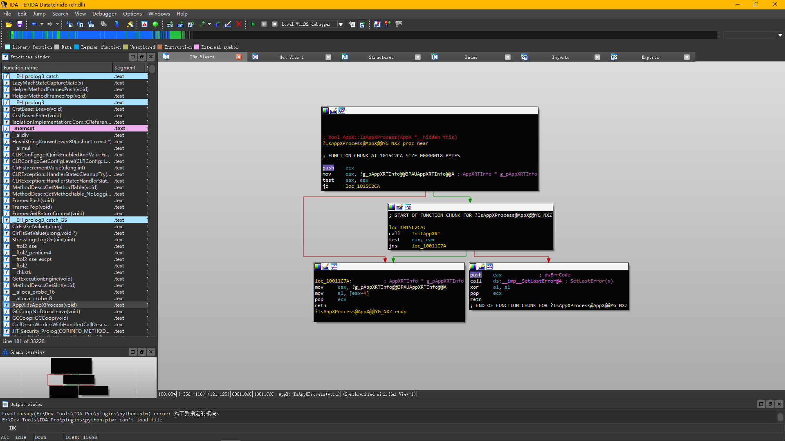
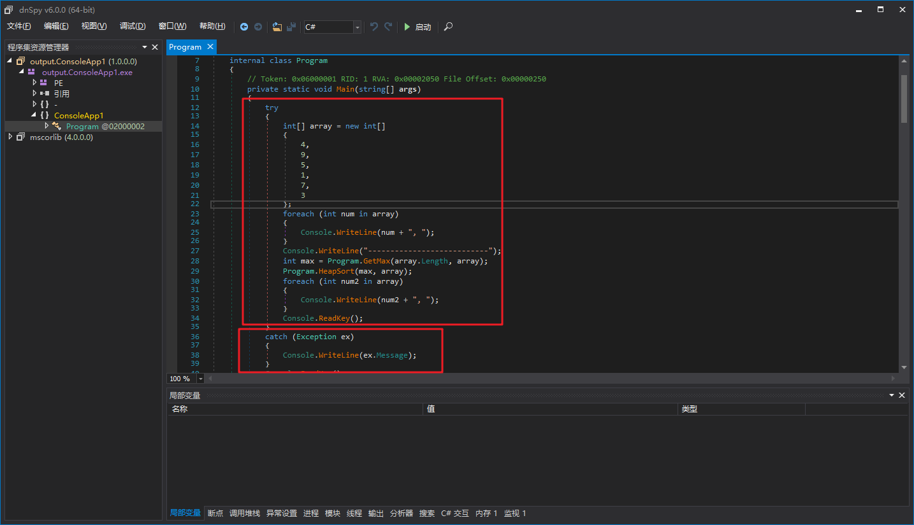
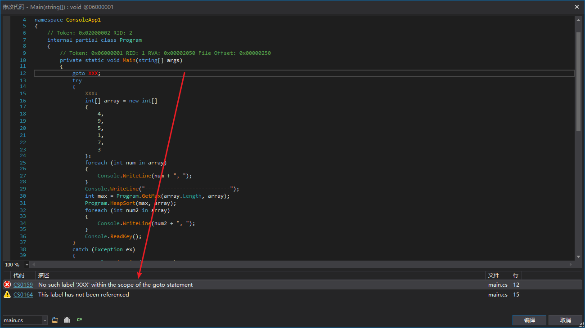
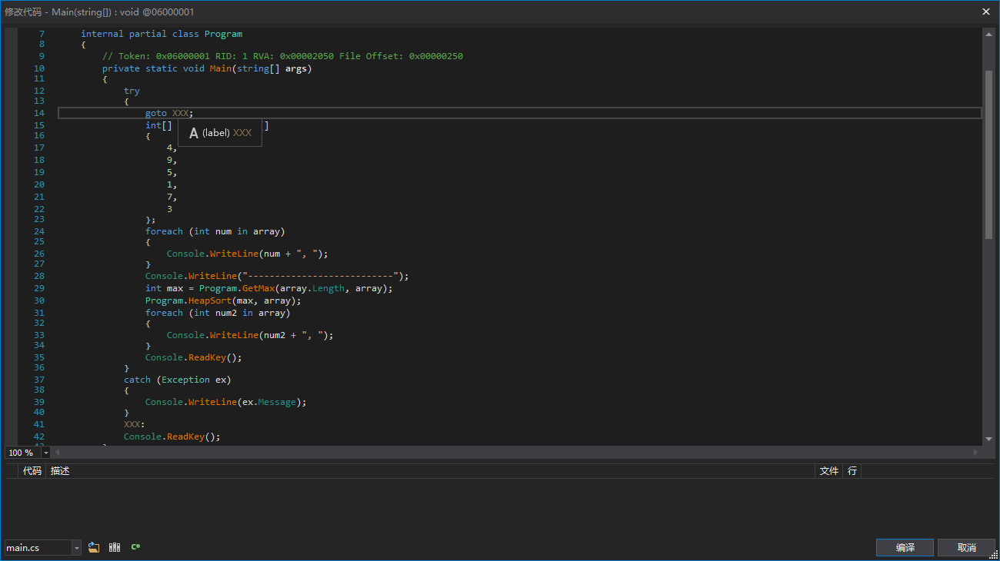
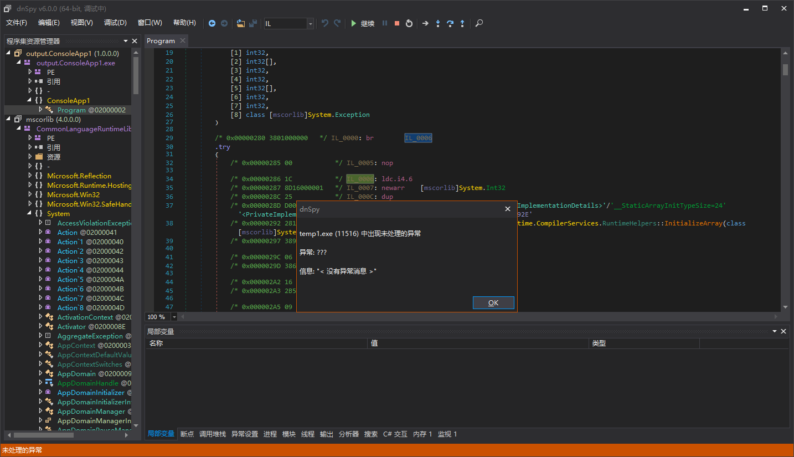
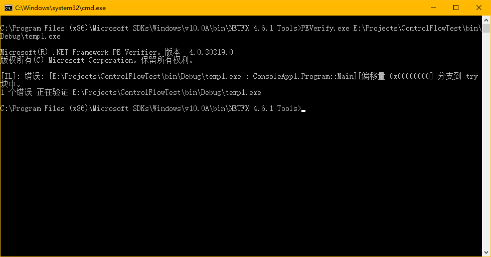
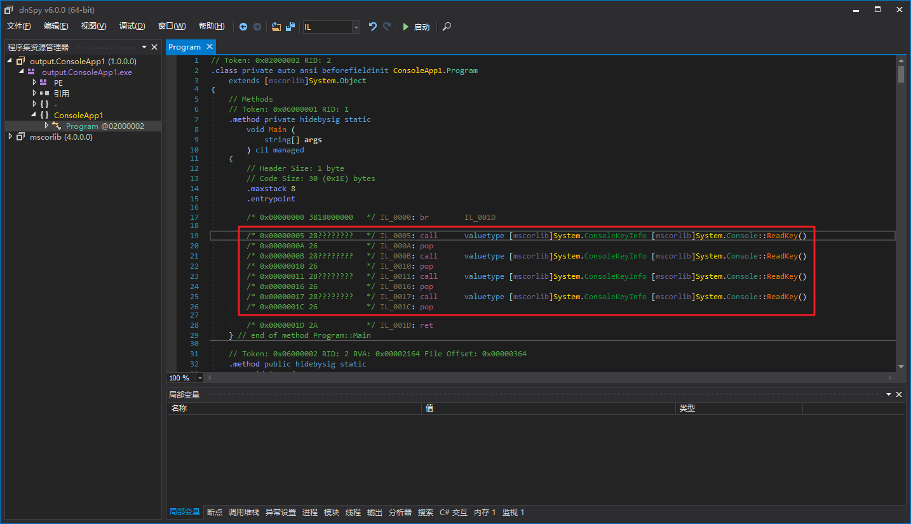
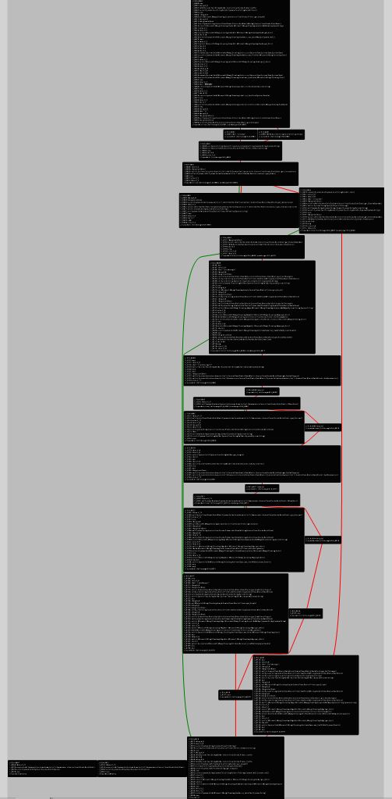
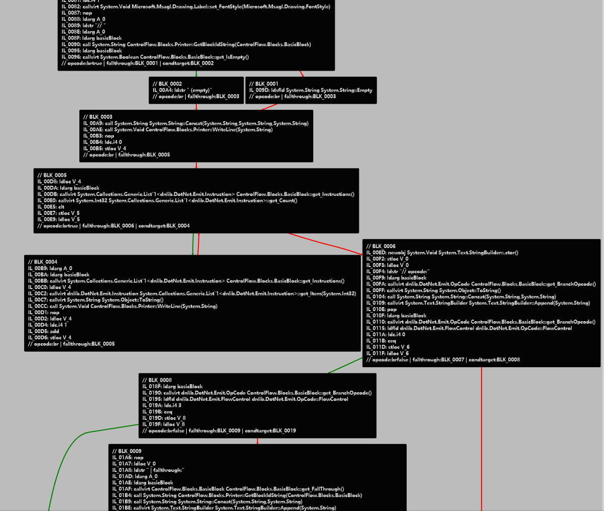

# .NET控制流分析（一）-入门

## 前言

新的一年又开始了，去年发的文章应该只算是基础，今年我们研究研究难的。我个人认为.NET下最难的3种保护应该是：

- IL级虚拟机
- 控制流混淆
- Jit Hook

如果不解除这些保护，其中任意一种都会极大地阻碍我们使用dnSpy对一个程序集的分析。

今天我们来简单的入门一下我认为的难点之一"控制流"，入门控制流分析的前提是你要对IL有一定的了解。如果看懂了，那么恭喜你。对于一些简单的控制流混淆，你可以写出自己的反混淆工具了。如果没看懂，那也没关系，这个要慢慢来，我自己研究这个也花了些时间。读这篇文章千万不能走马观花，一定要打开vs，自己动手写代码，跟着文章一步一步来。

之前我写控制流分析项目的目的只是学习控制流，想了解最底层的实现和原理。虽然有现成的项目，比如0xd4d大神，也就是dnSpy作者的de4dot.blocks，但是de4dot是GPLv3协议开源的，项目本身也不维护了，关键是项目里面也没几处注释。假如有什么BUG，只能自己修复，有时间读懂别人到达写了什么，是什么意思，不如自己写一个项目，从零开始写。

控制流这个东西非常抽象，<del>我也不是特别熟悉那些绘图的类库（主要还是懒，也没什么时间，没去学）</del>，所以我们只是使用最暴力最简单的方法，把控制流全部转化成字符串信息显示出来供我们调试。我记得在我发的以前的一个帖子里面，有位同学说希望有视频解说。正好控制流的讲解不是几行文字就可以说清楚的，所以我会录个视频，补充些文章里面说不清的东西。**今天上午学了下流图类库，文章末尾有把控制流画出来的代码！！！**

不知道大家发现没，文章标题带了个"（一）"。因为这个东西挺复杂的，一篇文章说完，写着累，看着也累。所以如果有时间的话，可能还会有"（二）"，"（三）"等等。

这篇文章只是入门，不会涉及到任何控制流混淆，我们仅仅要搭建一个框架，能够分析出控制流，表示出控制流，并且把分析并处理后的结果反馈到方法体中。

整个项目代码比较多，去空行，注释，只有一个符号的行来算代码行数也有2k+。所以下面只会提到比较关键的代码，剩下的代码可以下载附件查看。附件的代码是完整的，直接添加到新建项目里面就可以用。

视频地址：[https://www.bilibili.com/video/av42023976](https://www.bilibili.com/video/av42023976)

## 定义结构

**前排提醒：文章中定义的结构和de4dot.blocks中的略有区别，但思想是差不多的**

建好一栋房子要做好框架，一个框架也要选好材料。我们要定义出一个结构，能够**无损**地把方法体中线性的指令流，异常处理子句，局部变量转换为更易于分析的结构。



比如IDA会在跳转前进行截断，成为一个代码片段，这个片段我们可以成为Block。我们可以通过各种跳转语句，把一个方法体转换成很多Block，也就是"块"。

当然，事情远没这么简单，我们回到.NET，可以发现.NET还有异常处理子句这种东西。



比如图中2个红框，第一个是try，第二个是catch，如果try的执行正常，那么就不会进入catch，所以我们还需要依赖异常处理子句来对方法体进行分块。

那么是不是这样就结束了呢？肯定不是的，一个try或者一个catch可以称为一个作用域，我们可以从更小范围的子作用域跳转到更大范围的父作用域，但是我们不能从更大范围的父作用域跳转到更小范围的子作用域。





第一张图的代码是非法的，而第二张图的代码是合法的。

从IL层面来看，我们只能跳转到一个作用域的第一条语句，不能跳转到作用域的其它语句，什么意思呢？





第一张图的br跳转到的try块第二条语句，这样就是非法的。

要离开try块怎么办呢？使用[leave](https://docs.microsoft.com/zh-cn/dotnet/api/system.reflection.emit.opcodes.leave)指令。

C#中为了防止出现这种情况，也就有了上文所说的"大范围不能进小范围，小范围可以进大范围"。

catch块不会被任何跳转指令直接引用，仅仅当try块内出现异常，才会进入catch块。

至此，我们可以这样定义结构（部分代码已省略）：

``` csharp
public enum ScopeBlockType {
	Normal,
	Try,
	Filter,
	Catch,
	Finally,
	Fault
}
public interface IBlock {
	IBlock Scope { get; set; }
	bool HasExtraData { get; }
	void PushExtraData(object obj);
	void PopExtraData();
	T PeekExtraData<T>();
}
public abstract class BlockBase : IBlock {
	private IBlock _scope;
	private Stack<object> _extraDataStack;
	public IBlock Scope {
		get => _scope;
		set => _scope = value;
	}
	public bool HasExtraData => _extraDataStack != null && _extraDataStack.Count != 0;
	public T PeekExtraData<T>() {
		return (T)_extraDataStack.Peek();
	}
	public void PopExtraData() {
		_extraDataStack.Pop();
	}
	public void PushExtraData(object obj) {
		if (_extraDataStack == null)
			_extraDataStack = new Stack<object>();
		_extraDataStack.Push(obj);
	}
}
public sealed class BasicBlock : BlockBase {
	private List<Instruction> _instructions;
	private OpCode _branchOpcode;
	private BasicBlock _fallThrough;
	private BasicBlock _conditionalTarget;
	private List<BasicBlock> _switchTargets;
	public List<Instruction> Instructions {
		get => _instructions;
		set => _instructions = value;
	}
	public bool IsEmpty => _instructions.Count == 0;
	public OpCode BranchOpcode {
		get => _branchOpcode;
		set => _branchOpcode = value;
	}
	public BasicBlock FallThrough {
		get => _fallThrough;
		set => _fallThrough = value;
	}
	public BasicBlock ConditionalTarget {
		get => _conditionalTarget;
		set => _conditionalTarget = value;
	}
	public List<BasicBlock> SwitchTargets {
		get => _switchTargets;
		set => _switchTargets = value;
	}
}
public abstract class ScopeBlock : BlockBase {
	protected List<IBlock> _blocks;
	protected ScopeBlockType _type;
	public List<IBlock> Blocks {
		get => _blocks;
		set => _blocks = value;
	}
	public IBlock FirstBlock {
		get => _blocks[0];
		set => _blocks[0] = value;
	}
	public IBlock LastBlock {
		get => _blocks[_blocks.Count - 1];
		set => _blocks[_blocks.Count - 1] = value;
	}
	public ScopeBlockType Type {
		get => _type;
		set => _type = value;
	}
}
public sealed class TryBlock : ScopeBlock {
	private readonly List<ScopeBlock> _handlers;
	public List<ScopeBlock> Handlers => _handlers;
}
public sealed class FilterBlock : ScopeBlock {
	private HandlerBlock _handler;
	public HandlerBlock Handler {
		get => _handler;
		set => _handler = value;
	}
}
public sealed class HandlerBlock : ScopeBlock {
	private ITypeDefOrRef _catchType;
	public ITypeDefOrRef CatchType {
		get => _catchType;
		set => _catchType = value;
	}
}
public sealed class MethodBlock : ScopeBlock {
	private List<Local> _variables;
	public List<Local> Variables {
		get => _variables;
		set => _variables = value;
	}
}
```

我对这段定义解释一下，这里有个很奇怪的BlockBase，还有ExtraData，这个ExtraData可以理解成附加数据，有时我们分析控制流，需要把一段数据和一个块绑定在一起，这时ExtraData就发挥作用了。因为不是绑定一次数据，可能有很多数据要绑定，所以我们需要Stack&lt;T&gt;，也就是栈类型，可以先进后出，非常符合我们的编程习惯，初始化时Push数据，要用时Peek，用完了Pop就好。

BasicBlock是最小的单元，叫做基本块。为了方便，如果基本块最后一条指令会改变控制流，我们会把基本块中最后一条指令删掉，赋值给字段_branchOpcode，然后把跳转目标赋值给_fallThrough，_conditionalTarget，_switchTargets。这样我们更新控制流间的跳转关系就变得方便了很多。

很多个基本块在一起，可以变成一个作用域块，也就是ScopeBlock。当然ScopeBlock也可以相互嵌套，比如一个ScopeBlock中包含另一个ScopeBlock。

## 指令流转换到块

小标题中的块就是指的我们之前定义的结构体，比如BasicBlock叫做基本块。

再回到IDA显示的那张反汇编的控制流图上，我们可以发现，控制流其实是一副有向图。


这副有向图可能有环，自环，一个点可能会连接到许多点。我们处理起来可以利用"图"的一些思想（这个不难，百度搜一下BFS，DFS，有向图，搞清楚这3个就OK）

我们添加一个类，叫做"BlockParser"，添加如下代码：

``` csharp
public sealed class BlockParser {
	private readonly IList<Instruction> _instructions;
	private readonly IList<ExceptionHandler> _exceptionHandlers;
	private readonly IList<Local> _variables;

    public BlockParser(IList<Instruction> instructions, IList<ExceptionHandler> exceptionHandlers, IList<Local> variables) {
		if (instructions == null)
			throw new ArgumentNullException(nameof(instructions));
		if (exceptionHandlers == null)
			throw new ArgumentNullException(nameof(exceptionHandlers));
		if (variables == null)
			throw new ArgumentNullException(nameof(variables));
		if (HasNotSupportedInstruction(instructions))
			throw new NotSupportedException("存在不受支持的指令。");

		_instructions = instructions;
		_exceptionHandlers = exceptionHandlers;
		_variables = variables;
	}

	private static bool HasNotSupportedInstruction(IEnumerable<Instruction> instructions) {
		foreach (Instruction instruction in instructions)
			switch (instruction.OpCode.Code) {
			case Code.Jmp:
				return true;
			}
		return false;
	}
}
```

jmp指令我们不需要处理，因为处理起来很麻烦，正常的.NET程序里面也不会出现这个指令，想了解jmp是什么，可以看[MSDN](https://docs.microsoft.com/zh-cn/dotnet/api/system.reflection.emit.opcodes.jmp)，IL里的jmp和汇编的jmp不是一个东西。

首先我们要分析出潜在的入口。为什么说是潜在的呢？因为方法体可能被混淆了，充斥着许多不可能被执行的指令，比如这样的：



红框部分就是不会被使用的基本块，虽然红框中第一条语句IL_0005处的确是一个入口点。

我们添加字段：

``` csharp
private bool[] _isEntrys;
private int[] _blockLengths;
```

_isEntrys表明某条指令是否为潜在的入口点。如果是，那么_blockLengths中会有一个记录，表明了这个入口点表示的基本块有几条指令。	

然后我们可以直接从方法体的开头到结尾扫描一遍，得到上面提到的2个信息。

``` csharp
private void AnalyzeEntrys() {
	_isEntrys = new bool[_instructions.Count];
	_isEntrys[0] = true;
	for (int i = 0; i < _instructions.Count; i++) {
		Instruction instruction;

		instruction = _instructions[i];
		switch (instruction.OpCode.FlowControl) {
		case FlowControl.Branch:
		case FlowControl.Cond_Branch:
		case FlowControl.Return:
		case FlowControl.Throw:
			if (i + 1 != _instructions.Count)
				// 如果当前不是最后一条指令，那么下一条指令就是新入口
				_isEntrys[i + 1] = true;
			if (instruction.OpCode.OperandType == OperandType.InlineBrTarget)
				// brX
				_isEntrys[_instructionDictionary[(Instruction)instruction.Operand]] = true;
			else if (instruction.OpCode.OperandType == OperandType.InlineSwitch)
				// switch
				foreach (Instruction target in (IEnumerable<Instruction>)instruction.Operand)
					_isEntrys[_instructionDictionary[target]] = true;
			break;
		}
	}
	foreach (ExceptionHandlerInfo exceptionHandlerInfo in _exceptionHandlerInfos) {
		_isEntrys[exceptionHandlerInfo.TryStartIndex] = true;
		if (exceptionHandlerInfo.TryEndIndex != _instructions.Count)
			_isEntrys[exceptionHandlerInfo.TryEndIndex] = true;
		// try
		if (exceptionHandlerInfo.FilterStartIndex != -1)
			_isEntrys[exceptionHandlerInfo.FilterStartIndex] = true;
		// filter
		_isEntrys[exceptionHandlerInfo.HandlerStartIndex] = true;
		if (exceptionHandlerInfo.HandlerEndIndex != _instructions.Count)
			_isEntrys[exceptionHandlerInfo.HandlerEndIndex] = true;
		// handler
	}
}
```

接下来我们要从每个入口开始进行DFS或者BFS，通过跳转指令排除掉无效的入口点，并且创建出基本块。

DFS，也就是深度优先搜索，有一个很不好的地方，就是如果方法体太大，跳转太多，可能会堆栈溢出，因为深度优先搜索是递归式的。BFS，也就是广度优先搜索，代码会比DFS多一些，但是没多多少。以后我们很多算法都会用到递归操作，所以我们选择代码少的DFS，要分块的时候可以创建一个新线程，指定一个4MB 16MB的堆栈，绝对不会溢出。

``` csharp
private void AnalyzeReferencesAndCreateBasicBlocks(int startIndex) {
	if (!_isEntrys[startIndex])
		throw new InvalidOperationException("入口识别出错。");

	int exitIndex;
	Instruction exit;
	int nextEntryIndex;

	exitIndex = FindExitIndex(startIndex, out _blockLengths[startIndex]);
	_basicBlocks[startIndex] = new BasicBlock(EnumerateInstructions(startIndex, _blockLengths[startIndex]));
	exit = _instructions[exitIndex];
	switch (exit.OpCode.FlowControl) {
	case FlowControl.Branch:
		// 分支块被引用
		nextEntryIndex = _instructionDictionary[(Instruction)exit.Operand];
		if (_blockLengths[nextEntryIndex] == 0)
			// 分支块未被分析
			AnalyzeReferencesAndCreateBasicBlocks(nextEntryIndex);
		break;
	case FlowControl.Cond_Branch:
		// 下一个块和分支块被引用
		nextEntryIndex = exitIndex + 1;
		if (nextEntryIndex < _instructions.Count && _blockLengths[nextEntryIndex] == 0)
			// 下一条指令就是未分析的新块的入口
			AnalyzeReferencesAndCreateBasicBlocks(nextEntryIndex);
		if (exit.OpCode.OperandType == OperandType.InlineBrTarget) {
			// bxx
			nextEntryIndex = _instructionDictionary[(Instruction)exit.Operand];
			if (_blockLengths[nextEntryIndex] == 0)
				AnalyzeReferencesAndCreateBasicBlocks(nextEntryIndex);
		}
		else if (exit.OpCode.OperandType == OperandType.InlineSwitch) {
			// switch
			foreach (Instruction nextEntry in (IEnumerable<Instruction>)exit.Operand) {
				nextEntryIndex = _instructionDictionary[nextEntry];
				if (_blockLengths[nextEntryIndex] == 0)
					AnalyzeReferencesAndCreateBasicBlocks(nextEntryIndex);
			}
		}
		break;
	case FlowControl.Call:
	case FlowControl.Next:
		// 下一个块被引用
		nextEntryIndex = exitIndex + 1;
		if (_blockLengths[nextEntryIndex] == 0)
			// 我们不需要判断是否到了结尾
			// 如果没ret，br，throw之类的指令就到了块的结尾，说明这个方法体的控制流是有问题的
			AnalyzeReferencesAndCreateBasicBlocks(nextEntryIndex);
		break;
	}
}
```

这个就是通过DFS创建出有效的，被使用了的基本块的核心代码。当然，这个创建出来的基本块还是线性的，没有任何块与块之间的信息。

然后我们要为这些基本块添加分支，也就是添加块与块之间的跳转关系（没有包含关系）：

``` csharp
private void AddBranchs() {
	BasicBlock nextBasicBlock;

	nextBasicBlock = null;
	for (int i = _basicBlocks.Length - 1; i >= 0; i--) {
		BasicBlock basicBlock;
		List<Instruction> instructions;
		int lastInstructionIndex;
		Instruction lastInstruction;

		basicBlock = _basicBlocks[i];
		if (basicBlock == null)
			continue;
		instructions = basicBlock.Instructions;
		lastInstructionIndex = instructions.Count - 1;
		lastInstruction = instructions[lastInstructionIndex];
		switch (lastInstruction.OpCode.FlowControl) {
		case FlowControl.Branch:
			basicBlock.BranchOpcode = lastInstruction.OpCode;
			basicBlock.FallThrough = _basicBlocks[_instructionDictionary[(Instruction)lastInstruction.Operand]];
			instructions.RemoveAt(lastInstructionIndex);
			break;
		case FlowControl.Cond_Branch:
			if (nextBasicBlock == null)
				// nextBasicBlock不应该为null，因为在此之前我们已经移除了无效代码
				throw new InvalidOperationException();
			basicBlock.BranchOpcode = lastInstruction.OpCode;
			basicBlock.FallThrough = nextBasicBlock;
			if (lastInstruction.OpCode.Code == Code.Switch) {
				Instruction[] switchTargets;

				switchTargets = (Instruction[])lastInstruction.Operand;
				basicBlock.SwitchTargets = new List<BasicBlock>(switchTargets.Length);
				for (int j = 0; j < switchTargets.Length; j++)
					basicBlock.SwitchTargets.Add(_basicBlocks[_instructionDictionary[switchTargets[j]]]);
			}
			else
				basicBlock.ConditionalTarget = _basicBlocks[_instructionDictionary[(Instruction)lastInstruction.Operand]];
			instructions.RemoveAt(lastInstructionIndex);
			break;
		case FlowControl.Call:
		case FlowControl.Next:
			if (nextBasicBlock == null)
				throw new InvalidOperationException();
			basicBlock.BranchOpcode = OpCodes.Br;
			basicBlock.FallThrough = nextBasicBlock;
			break;
		case FlowControl.Return:
		case FlowControl.Throw:
			basicBlock.BranchOpcode = lastInstruction.OpCode;
			instructions.RemoveAt(lastInstructionIndex);
			break;
		}
		nextBasicBlock = basicBlock;
	}
}
```

处理一些简单的情况，也许不需要转换成树状结构，也就是不需要为基本块之间添加包含关系。但是绝大多数情况，我们都需要转换成树状结构（我们之前定义的MethodBlock）。

块与块之间的包含关系只与异常处理子句有关，我们只需要把try/catch包含的基本块合并到一起。

在这之前，我们要定义出一种新的异常处理子句结构。我们可以在一个try的入口点，也就是try作用域中的第一个基本块标记一下，表示这里有异常处理子句。因为在同一个入口点上，可能是一个try块有多个handler，比如：

``` csharp
try {
	code...
}
catch (Exception1) {
	code...
}
catch (Exception2) {
	code...
}
```

还有可能是更复杂的情况，try之间还有嵌套关系：

``` csharp
try {
	try {
		code...
	}
	catch {
		code...
	}
	code...
}
catch (Exception1) {
	code...
}
catch (Exception2) {
	code...
}
```

考虑到这些情况，我们的结构可以这样定义。当然，并不是一定要这样定义。只是因为我更喜欢这样定义，觉得方便。如果你有更方便的结构，也可以用你的方式进行定义，能达到最终目的就行。

``` csharp
private sealed class LinkedExceptionHandlerInfo {
	private readonly ExceptionHandlerInfo _value;
	private readonly List<ExceptionHandlerInfo> _handlers;
	private List<LinkedExceptionHandlerInfo> _children;

	public ExceptionHandlerInfo TryInfo => _value;

	public List<ExceptionHandlerInfo> Handlers => _handlers;

	public bool HasChildren => _children != null && _children.Count != 0;

	public List<LinkedExceptionHandlerInfo> Children {
		get {
			if (_children == null)
				_children = new List<LinkedExceptionHandlerInfo>();
			return _children;
		}
	}
}
```

然后，我们要分析出异常处理子句之间的关系，保存到刚刚定义的结构中。

我们再添加一个虚假的异常处理子句，叫做dummy。dummy是任何异常处理子句的parent，这个会便于我们进行递归操作来合并作用域中所有块到一个作用域。

``` csharp
private LinkedExceptionHandlerInfo _linkedExceptionHandlerInfoRoot;

private void AnalyzeExceptionHandlers() {
	_linkedExceptionHandlerInfoRoot = new LinkedExceptionHandlerInfo(new ExceptionHandlerInfo(0, int.MaxValue));
	// 创建Dummy
	foreach (ExceptionHandlerInfo exceptionHandlerInfo in _exceptionHandlerInfos) {
		bool isTryEqual;
		LinkedExceptionHandlerInfo scope;

		if (!exceptionHandlerInfo.IsVisited) {
			Debug.Assert(false);
			// 正常情况下我们不会遇到无效异常处理信息，目前也没有壳会加入无效异常处理信息
			continue;
		}
		scope = _linkedExceptionHandlerInfoRoot.FindParent(exceptionHandlerInfo, out isTryEqual);
		if (isTryEqual)
			scope.Handlers.Add(exceptionHandlerInfo);
		else {
			List<LinkedExceptionHandlerInfo> children;
			LinkedExceptionHandlerInfo child;

			children = scope.Children;
			child = new LinkedExceptionHandlerInfo(exceptionHandlerInfo);
			if (!scope.HasChildren)
				children.Add(child);
			else {
				int subChildCount;

				subChildCount = 0;
				for (int i = 0; i < children.Count; i++) {
					LinkedExceptionHandlerInfo subChild;

					subChild = children[i];
					// 判断child是否为某个subChild的scope
					if (child.TryInfo.HasChild(subChild.TryInfo)) {
						child.Children.Add(subChild);
						subChildCount++;
					}
					else
						// 将subChild提前
						children[i - subChildCount] = subChild;
				}
				children.RemoveRange(children.Count - subChildCount, subChildCount);
				children.Add(child);
			}
		}
	}
}
```

还记得我们之前声明的接口IBlock吗，所有块的结构都要继承自IBlock，表示这是一个块。

我们添加一个字段_blocks表示这个接口的数组。

``` csharp
private IBlock[] _blocks;

private void CombineExceptionHandlers(LinkedExceptionHandlerInfo linkedExceptionHandlerInfo) {
	ExceptionHandlerInfo tryInfo;
	TryBlock tryBlock;

	if (linkedExceptionHandlerInfo.HasChildren)
		// 找到最小异常处理块
		foreach (LinkedExceptionHandlerInfo child in linkedExceptionHandlerInfo.Children)
			CombineExceptionHandlers(child);
	tryInfo = linkedExceptionHandlerInfo.TryInfo;
	tryBlock = new TryBlock(EnumerateNonNullBlocks(tryInfo.TryStartIndex, tryInfo.TryEndIndex));
	RemoveBlocks(tryInfo.TryStartIndex, tryInfo.TryEndIndex);
	_blocks[tryInfo.TryStartIndex] = tryBlock;
	// try
	foreach (ExceptionHandlerInfo handlerInfo in linkedExceptionHandlerInfo.Handlers) {
		AddHandler(tryBlock, handlerInfo);
		RemoveBlocks(handlerInfo.FilterStartIndex == -1 ? handlerInfo.HandlerStartIndex : handlerInfo.FilterStartIndex, handlerInfo.HandlerEndIndex);
	}
	// filter/handler
}
```

这样，我们就得到了块与块之间的包含关系，有了一个完整的树状结构，接下来去除_blocks数组里面的null，就是一个MethodBlock了。

## 以文本形式显示块

代码不是写出来就没BUG的，要调试了很多次之后才可能没BUG。控制流这个东西本来就抽象，不经过特殊处理，你不能像看河流一样，看出有什么分支，从哪里流向哪里。我们用一个最简单的办法，转换成字符串来显示出这里块。

我们先添加一个Helper类叫做BlockEnumerator，可以帮助我们遍历一个IBlock中存在的所有块。

大概是这样的：

``` csharp
public abstract class BlockEnumerator {
	protected void Enumerate(IEnumerable<IBlock> blocks);
	protected void Enumerate(IBlock block);
	protected virtual void OnBasicBlock(BasicBlock basicBlock);
	protected virtual void OnScopeBlockEnter(ScopeBlock scopeBlock);
	protected virtual void OnScopeBlockLeave(ScopeBlock scopeBlock);
	protected virtual void OnTryBlockEnter(TryBlock tryBlock);
	protected virtual void OnTryBlockLeave(TryBlock tryBlock);
	protected virtual void OnFilterBlockEnter(FilterBlock filterBlock);
	protected virtual void OnFilterBlockLeave(FilterBlock filterBlock);
	protected virtual void OnHandlerBlockEnter(HandlerBlock handlerBlock);
	protected virtual void OnHandlerBlockLeave(HandlerBlock handlerBlock);
	protected virtual void OnMethodBlockEnter(MethodBlock methodBlock);
	protected virtual void OnMethodBlockLeave(MethodBlock methodBlock);
}
```

我们继承这个类，写一个叫BlockPrinter的类，重写基类中OnXXBlockXX的虚函数。比如遇到基本块，我们可以这样：

``` csharp
protected override void OnBasicBlock(BasicBlock basicBlock) {
	StringBuilder branchInfo;

	if (_needNewLine)
		_buffer.AppendLine();
	WriteLine("// " + GetBlockIdString(basicBlock) + (basicBlock.IsEmpty ? " (empty)" : string.Empty));
	for (int i = 0; i < basicBlock.Instructions.Count; i++)
		WriteLine(basicBlock.Instructions[i].ToString());
	branchInfo = new StringBuilder();
	branchInfo.Append("// opcode:" + basicBlock.BranchOpcode.ToString());
	if (basicBlock.BranchOpcode.FlowControl == FlowControl.Branch)
		branchInfo.Append(" | fallthrough:" + GetBlockIdString(basicBlock.FallThrough));
	else if (basicBlock.BranchOpcode.FlowControl == FlowControl.Cond_Branch) {
		branchInfo.Append(" | fallthrough:" + GetBlockIdString(basicBlock.FallThrough));
		if (basicBlock.BranchOpcode.Code == Code.Switch) {
			branchInfo.Append(" | switchtarget:{");
			foreach (BasicBlock target in basicBlock.SwitchTargets)
				branchInfo.Append(GetBlockIdString(target) + " ");
			branchInfo[branchInfo.Length - 1] = '}';
		}
		else
			branchInfo.Append(" | condtarget:" + GetBlockIdString(basicBlock.ConditionalTarget));
	}
	WriteLine(branchInfo.ToString());
	_needNewLine = true;
}
```

其它类型的IBlock也一样处理，代码不贴，附件里都有。

## 块转换回指令流

指令流转换到块是一个复杂的过程，块转换回指令流就简单许多了。

首先，我们要把树状结构的块转换回线性的基本块数组，这一步是不是和"指令流转换到块"中的一步恰好相反呢？

转换到基本块之后，我们才能更方便地生成跳转语句和元数据中的异常处理子句。

我们先添加一个类叫BlockInfo，这个类的实例要作为额外数据添加到每一个基本块。

如果一个基本块是一个异常处理子句的入口点，那么这个基本块的BlockInfo的_tryBlocks将不为null，我们可以利用额外信息来生成异常处理子句。

``` csharp
private sealed class BlockInfo {
	private readonly int _index;
	private readonly Instruction _branchInstruction;
	private readonly List<TryBlock> _tryBlocks;
	private bool _canSkip;

	public int Index => _index;

	public Instruction BranchInstruction => _branchInstruction;

	public List<TryBlock> TryBlocks => _tryBlocks;

	/// <summary>
	/// 表示当前块是否可以被跳过（当前块必须为只有一条br指令，br的目标就是下一个基本块）
	/// </summary>
	public bool CanSkip {
		get => _canSkip;
		set => _canSkip = value;
	}
}
```

再添加一个类叫BlockLayouter。这个类可以把MethodBlock转换成许多基本块的集合，并且为基本块添加额外数据

``` csharp
private sealed class BlockLayouter : BlockEnumerator {
	private readonly List<BasicBlock> _basicBlocks;
	private readonly List<TryBlock> _lastTryBlocks;
	private int _index;

	public BlockLayouter(List<BasicBlock> basicBlocks) {
		if (basicBlocks == null)
			throw new ArgumentNullException(nameof(basicBlocks));

		_basicBlocks = basicBlocks;
		_lastTryBlocks = new List<TryBlock>();
	}

	public void LayoutAndCreateBlockInfo(MethodBlock methodBlock) {
		Enumerate(methodBlock);
	}

	protected override void OnBasicBlock(BasicBlock basicBlock) {
		basicBlock.PushExtraData(new BlockInfo(_index, _lastTryBlocks));
		_basicBlocks.Add(basicBlock);
		_lastTryBlocks.Clear();
		_index++;
	}

	protected override void OnTryBlockEnter(TryBlock tryBlock) {
		_lastTryBlocks.Add(tryBlock);
	}
}
```

我们利用转换得到的List&lt;BasicBlock&gt;生成指令流。

``` csharp
private void GenerateInstructions() {
	_instructions = new List<Instruction>();
	for (int i = 0; i < _basicBlocks.Count - 1; i++) {
		BasicBlock basicBlock;

		basicBlock = _basicBlocks[i];
		if (basicBlock.IsEmpty && basicBlock.BranchOpcode.Code == Code.Br && basicBlock.FallThrough == _basicBlocks[i + 1])
			basicBlock.PeekExtraData<BlockInfo>().CanSkip = true;
	}
	// 设置CanSkip
	foreach (BasicBlock basicBlock in _basicBlocks) {
		Instruction branchInstruction;

		branchInstruction = basicBlock.PeekExtraData<BlockInfo>().BranchInstruction;
		branchInstruction.OpCode = basicBlock.BranchOpcode;
		if (branchInstruction.OpCode.FlowControl == FlowControl.Branch)
			branchInstruction.Operand = GetFirstInstruction(basicBlock.FallThrough);
		else if (branchInstruction.OpCode.FlowControl == FlowControl.Cond_Branch)
			if (branchInstruction.OpCode.Code == Code.Switch) {
				Instruction[] switchTargets;

				switchTargets = new Instruction[basicBlock.SwitchTargets.Count];
				for (int i = 0; i < switchTargets.Length; i++)
					switchTargets[i] = GetFirstInstruction(basicBlock.SwitchTargets[i]);
				branchInstruction.Operand = switchTargets;
			}
			else
				branchInstruction.Operand = GetFirstInstruction(basicBlock.ConditionalTarget);
	}
	// 添加跳转指令
	for (int i = 0; i < _basicBlocks.Count; i++) {
		BasicBlock basicBlock;
		BlockInfo blockInfo;
		Instruction branchInstruction;
		BasicBlock nextBasicBlock;

		basicBlock = _basicBlocks[i];
		blockInfo = basicBlock.PeekExtraData<BlockInfo>();
		if (blockInfo.CanSkip)
			continue;
		branchInstruction = blockInfo.BranchInstruction;
		nextBasicBlock = i + 1 == _basicBlocks.Count ? null : _basicBlocks[i + 1];
		if (branchInstruction.OpCode.Code == Code.Br) {
			AppendInstructions(basicBlock, basicBlock.FallThrough == nextBasicBlock);
			// 为无条件跳转指令时，如果直达块就是下一个块，那么可以省略分支指令
		}
		else if (branchInstruction.OpCode.FlowControl == FlowControl.Cond_Branch) {
			AppendInstructions(basicBlock, false);
			if (basicBlock.FallThrough != nextBasicBlock)
				// 需要修复跳转
				_instructions.Add(new Instruction(OpCodes.Br, GetFirstInstruction(basicBlock.FallThrough)));
		}
		else
			AppendInstructions(basicBlock, false);

	}
}

private void AppendInstructions(BasicBlock basicBlock, bool canSkipBranchInstruction) {
	if (!basicBlock.IsEmpty)
		_instructions.AddRange(basicBlock.Instructions);
	if (!canSkipBranchInstruction)
		_instructions.Add(basicBlock.PeekExtraData<BlockInfo>().BranchInstruction);
}
```

代码中的CanSkip代表这个块是不是一个只有br跳转指令，没有其它指令的基本块，而且br的目标就是下一个基本块。如果是，这个基本块可以被省略，完全不处理。如果一个基本块的跳转指令是br，目标也是下一个基本块，那么我们只需要添加这个基本块的其它指令，不需要添加跳转指令。

接着就是生成异常处理子句。核心代码就这一点：

``` csharp
private void GenerateExceptionHandlers() {
	_exceptionHandlers = new List<ExceptionHandler>();
	for (int i = _basicBlocks.Count - 1; i >= 0; i--) {
		// 最里面的异常块应该首先声明。(错误: 0x801318A4)
		// 所以我们倒序遍历
		BasicBlock basicBlock;
		List<TryBlock> tryBlocks;

		basicBlock = _basicBlocks[i];
		tryBlocks = basicBlock.PeekExtraData<BlockInfo>().TryBlocks;
		if (tryBlocks == null || tryBlocks.Count == 0)
			continue;
		for (int j = tryBlocks.Count - 1; j >= 0; j--) {
			TryBlock tryBlock;

			tryBlock = tryBlocks[j];
			foreach (ScopeBlock scopeBlock in tryBlock.Handlers)
				if (scopeBlock is FilterBlock) {
					FilterBlock filterBlock;

					filterBlock = (FilterBlock)scopeBlock;
					_exceptionHandlers.Add(GetExceptionHandler(tryBlock, GetFirstBasicBlock(filterBlock.FirstBlock), filterBlock.Handler));
				}
				else {
					HandlerBlock handlerBlock;

					handlerBlock = (HandlerBlock)scopeBlock;
					_exceptionHandlers.Add(GetExceptionHandler(tryBlock, null, handlerBlock));
				}
		}
	}
}
```

还有生成用到了的局部变量列表，这里就不贴了。其实我那个生成局部变量的代码可能有点麻烦，直接改成遍历所有基本块，发现了第一次遇到的局部变量就添加到列表简单很多。整个项目都打包好了，我就懒得改了。

## 画出控制流

这个是新加的一节，我也是今天上午临时学了一下画控制流，这里直接贴下效果图。然后这个画出的控制流好像不能表现出异常处理块的关系。





红线表示无条件跳转，绿线表示条件跳转。画出来好像也没什么卵用，只是看着舒服些。

## 下载

控制流分析项目下载地址：
[百度云](https://pan.baidu.com/s/1LngQL7wd8Ank3Kn6Mh-7wQ) 提取码: mms4

控制流绘制项目下载地址（没源码，反编译压缩包里面的ConsoleApp1.exe就可以）：
[百度云](https://pan.baidu.com/s/1VMZBZKBxud29j9DtHupOPg) 提取码: nbpe
