# .NET控制流分析（二）-反混淆

## 前言

本来想分成2块写的，因为有一部分简单，还有一部分很难，非常难。但是想想还是算了，一篇文章写完也可以，因为都是和反混淆有关的内容。不过估计文章会非常长，字数非常多。

这篇文章还是要按顺序看，文章前半部分讲的是简单的，后半部分是难的，并且需要前半部分的一些知识。

前半部分比较简单，会说一些比较通用的代码和思路。

后半部分更有征对性，实战讲解ConfuserEx的控制流混淆清除。为什么讲ConfuserEx的控制流混淆？因为我觉得ConfuserEx的控制流混淆是最难的，至少在我遇到的壳里面来说。其它壳都是一个简单的switch(num)，case里面一条num=x;就没了，而ConfuserEx的控制流混淆是线性的，下一个被执行的基本块与上一个被执行的基本块有关，无法静态解密switch混淆，必需虚拟执行。

## 基础

### 递归模型

很多时候一个方法里面会有try块，这样的话，一个方法块里面就会有小作用域，也就是那个try块。控制流混淆只会在同一个作用域里面进行混淆，没见过会跨作用域混淆的。什么意思的？

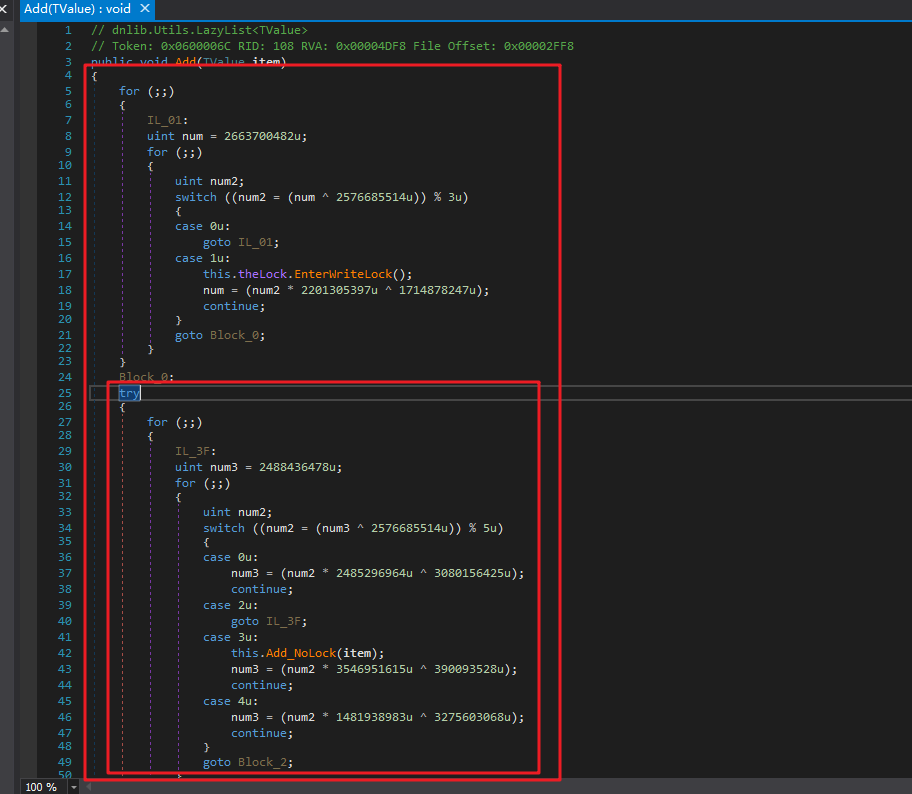

比如这个大的红框，就是一个作用域，try包括的地方可以看作一个整体，控制流混淆的时候不会把try这个整体拆成多个部分。而try内部是一个作用域，不是一个整体，可以拆成多个部分，继续混淆。

所以我们要写出Helper类能简化遍历每一个作用域来反混淆的操作。这个类就叫做BlockRecursiveModel，代码在这个系列的上一篇文章的附件里有。这里就截图看看大概样子。

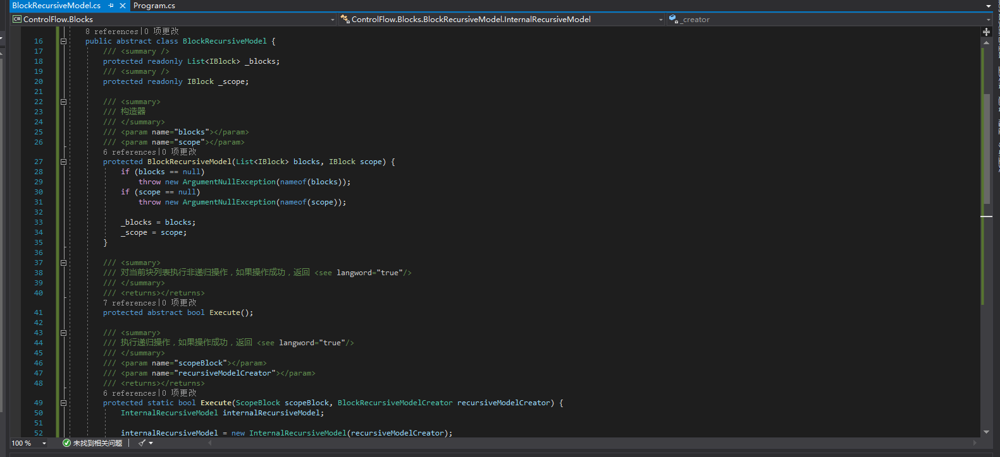

### 块排序器

为什么要排序？首先是减小代码体积，如果不排序，IL代码可能就会像这样，到处是无条件跳转指令br，让我们几乎无法阅读IL代码。


而排序之后逻辑清晰很多：

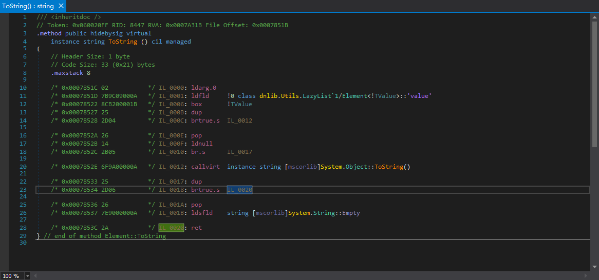

这只是一个非常简单的方法体。如果是复杂的方法体，代码会膨胀很多，排序显得非常重要。

当然，排序只是对生成的指令流有影响，对我们分析树状结构的控制流，也就是分成块之后的控制流是没有影响的。

分块之后无论是什么顺序储存在List&lt;T&gt;里面，结构其实都是一样的：

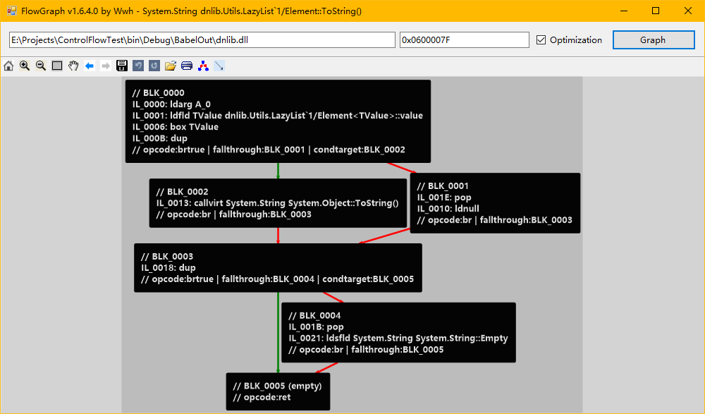

这个是我写的工具，文章末尾会附上编译好的程序。

有了刚才说的BlockRecursiveModel，块排序的代码其实非常简单，我们要先分析出在相同作用域内，块与块直接的引用关系，再使用拓扑排序就行了。有人会说拓扑排序只能排有向无环图，但是我们这里是可以使用拓扑排序的，至于为什么我就不解释了，自己试试就知道。

要分析引用关系，我们还是要先定义个额外信息，来储存我们分析的结果：

``` csharp
private sealed class BlockInfo {
	private readonly List<IBlock> _references;
	private bool _isVisited;

	public List<IBlock> References => _references;

	public bool IsVisited {
		get => _isVisited;
		set => _isVisited = value;
	}
}
```

References表示的是引用，意思是会跳转到哪些块。

``` csharp
private void AddXref(BasicBlock source, BasicBlock target) {
	IBlock targetRoot;
	List<IBlock> references;

	targetRoot = target.GetRootBlock(_scope);
	if (targetRoot == null)
		// 跳出scope范围的我们不做处理
		return;
	references = source.GetRootBlock(_scope).PeekExtraData<BlockInfo>().References;
	if (!references.Contains(targetRoot))
		references.Add(targetRoot);
}

public static IBlock GetRootBlock(this IBlock block, IBlock scope) {
	if (block == null)
		throw new ArgumentNullException(nameof(block));
	if (scope == null)
		throw new ArgumentNullException(nameof(scope));

	while (true) {
		if (block.Scope == scope)
			return block;
		else
			block = block.Scope;
		if (block == null)
			return null;
	}
}
```

代码里面的source代表会发生跳转的基本块，target表示会跳转到的基本块。

分析出所有引用关系之后，我们直接使用拓扑排序就行：

``` csharp
private sealed class TopologicalSorter {
	private readonly List<IBlock> _blocks;
	private readonly Stack<IBlock> _blockStack;

	public TopologicalSorter(List<IBlock> blocks) {
		if (blocks == null)
			throw new ArgumentNullException(nameof(blocks));

		_blocks = blocks;
		_blockStack = new Stack<IBlock>(_blocks.Count);
	}

	public Stack<IBlock> Sort() {
		DfsSort(_blocks[0]);
		return _blockStack;
	}

	private void DfsSort(IBlock block) {
		BlockInfo blockInfo;

		blockInfo = block.PeekExtraData<BlockInfo>();
		blockInfo.IsVisited = true;
		for (int i = blockInfo.References.Count - 1; i >= 0; i--)
			if (!blockInfo.References[i].PeekExtraData<BlockInfo>().IsVisited)
				DfsSort(blockInfo.References[i]);
		_blockStack.Push(block);
	}
}
```

整个排序的完整代码都在上一篇文章的附件的压缩包里面，叫BlockSorter.cs

### 移除NOP

移除NOP这个操作非常简单，因为我们已经转换成了块，遍历每个基本块块，把每个基本块的NOP都移除就好。

既然简单，那为什么还要提这个呢？

因为我们的目标是把所有情况尽可能的简化，变成一种情况，这样我们处理起来就方便很多。而NOP的存在可能会影响我们识别特征。

### 基本块内联

什么叫内联，比如这样：

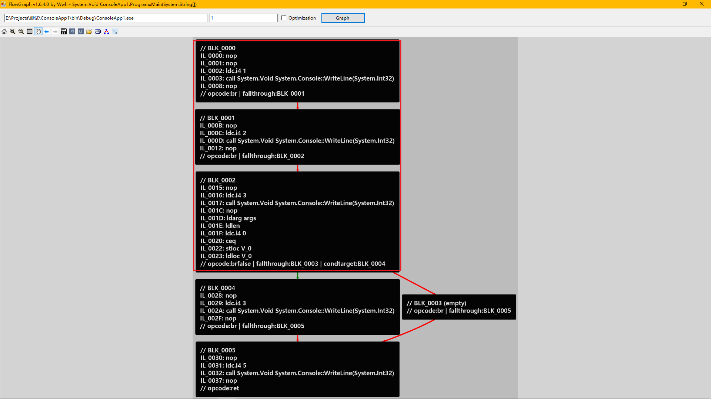

红框中3个基本块就是可以内联到一起的，为什么呢？因为BLK_0002只被一个基本块引用了，BLK_0001也是，只被一个基本块引用，并且引用方是无条件跳转，那就可以内联起来。BLK_0004虽然只被一个基本块引用，但是引用方BLK_0002是条件跳转，我们就不能内联。

内联之后：

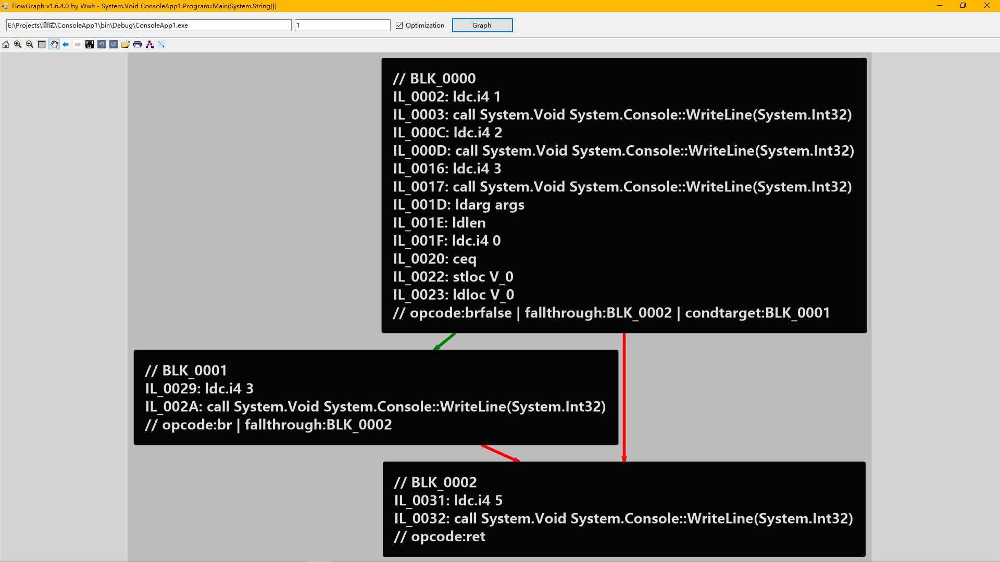

是不是效果明显，控制流清晰了很多，没有冗余的东西？

这里再扯一下我的FlowGraph，这个工具有个Optimization选项，开了之后就会把可以内联的块都内联到一起，并且清除NOP，对块进行排序。

除了这种情况，我们还有一种情况可以内联，就是某个基本块是空块，并且跳转指令是无条件跳转指令br。这种情况下，无论引用方有几个，引用方是什么跳转指令，我们都可以内联。

比如这样的：

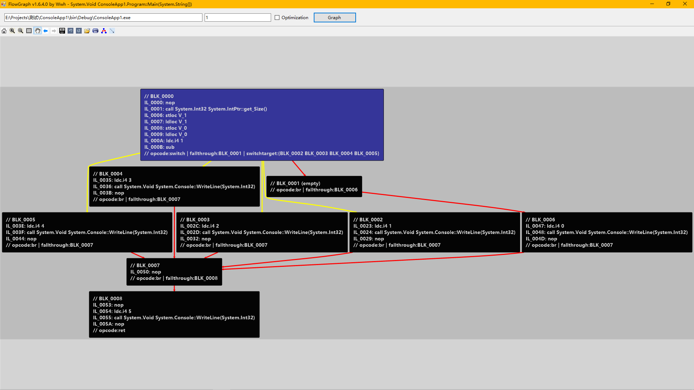

这里的BLK_0007就是一个空块（nop指令等于不存在，我们会优化掉），而且是跳转指令是无条件跳转指令br。虽然BLK_0007的引用方有BLK_0002 BLK_0003 BLK_0004 BLK_0005 BLK_0006共5个，但是我们都可以内联起来。

内联起来的效果：

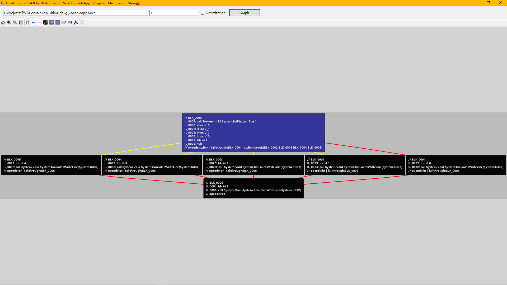

而这一段控制流的源代码其实非常简单，就是Debug模式下编译一个switch+goto

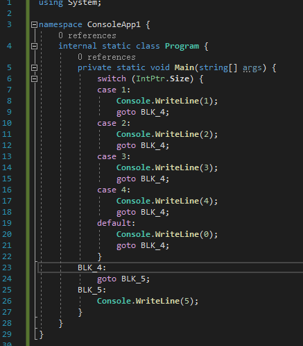

脑补一下，这个代码生成是不是更像我们开了优化之后的控制流图？

这个就是内联的牛逼之处，可以极大地简化控制流。虽然牛逼，但是实现就比上面地代码更复杂了。

实际上也没复杂多少，代码直接放出来，其实就200行。

``` csharp
using System.Collections.Generic;
using ControlFlow.Blocks;
using dnlib.DotNet.Emit;

namespace ControlFlow.Deobfuscation {
	/// <summary>
	/// 可以移除的基本块A，不移除可能会妨碍我们分析：
	/// 1. 一个基本块A没有其它指令，只有br这个无条件跳转指令
	/// 2. 一个基本块B无条件跳转到一个作用域相同的基本块A，且A只被B引用
	/// </summary>
	public sealed class BlockInliner : BlockRecursiveModel {
		private BlockInliner(List<IBlock> blocks, IBlock scope) : base(blocks, scope) {
		}

		/// <summary>
		/// 内联
		/// </summary>
		/// <param name="methodBlock"></param>
		/// <returns></returns>
		public static bool Inline(MethodBlock methodBlock) {
			bool result;

			methodBlock.PushExtraDataAllBasicBlocks(() => new BlockInfo());
			new BlockXref(methodBlock, AddXref).Analyze();
			// 我们需要分析出所有块间的引用关系之后才能彻底完成内联
			result = Execute(methodBlock, (blocks, scope) => new BlockInliner(blocks, scope));
			methodBlock.PopExtraDataAllBasicBlocks();
			return result;
		}

		private static void AddXref(BasicBlock source, BasicBlock target) {
			List<BasicBlock> references;
			List<BasicBlock> dereferences;

			references = source.PeekExtraData<BlockInfo>().References;
			if (!references.Contains(target))
				references.Add(target);
			dereferences = target.PeekExtraData<BlockInfo>().Dereferences;
			if (!dereferences.Contains(source))
				dereferences.Add(source);
		}

		/// <summary />
		protected override bool Execute() {
			bool isModified;
			bool next;

			if (_blocks.Count < 2)
				return false;
			isModified = FixEntryBlockIfBrOnly();
			// 如果作用域的入口（也就是作用域的第一个块）是空块，我们特殊处理
			do {
				for (int i = 1; i < _blocks.Count; i++) {
					// 跳过入口块，这段代码处理不了入口块
					BasicBlock target;
					BlockInfo targetInfo;

					target = _blocks[i] as BasicBlock;
					// target代表可能可以被合并的块
					if (target == null)
						// 作用域块不能合并到其它块
						continue;
					targetInfo = target.PeekExtraData<BlockInfo>();
					if (CanInline(target, targetInfo)) {
						UpdateReferencesOfDereferences(target, targetInfo);
						// 更新target反向引用的引用
						UpdateDereferencesOfReferences(target, targetInfo);
						// 更新target引用的反向引用
						targetInfo.IsInlineed = true;
					}
				}
				next = _blocks.RemoveAll(block => block is BasicBlock && block.PeekExtraData<BlockInfo>().IsInlineed) != 0;
				if (next)
					isModified = true;
			} while (next);
			return isModified;
		}

		private static bool CanInline(BasicBlock target, BlockInfo targetInfo) {
			if (target.IsEmpty && target.BranchOpcode.Code == Code.Br) {
				// 空的br跳转块，可以无条件合并
				return true;
			}
			else {
				BasicBlock dereference;

				if (targetInfo.Dereferences.Count != 1)
					// 当target只被一个块引用时才可以被内联
					return false;
				dereference = targetInfo.Dereferences[0];
				if (dereference.BranchOpcode.Code != Code.Br)
					// 引用当前块的块必须为基本块，并且最后一条指令为br
					// 如果为leave，表示反向引用来自其它作用域，target和反向引用不在同一作用域，这时我们不能对target进行内联
					return false;
				return true;
			}
		}

		private static void UpdateReferencesOfDereferences(BasicBlock target, BlockInfo targetInfo) {
			foreach (BasicBlock dereference in targetInfo.Dereferences) {
				if (dereference.BranchOpcode.Code == Code.Br) {
					// br无条件跳转，直接内联基本块
					if (!target.IsEmpty)
						dereference.Instructions.AddRange(target.Instructions);
					dereference.BranchOpcode = target.BranchOpcode;
					dereference.FallThrough = target.FallThrough;
					dereference.ConditionalTarget = target.ConditionalTarget;
					dereference.SwitchTargets = target.SwitchTargets;
				}
				else {
					// 要逐个判断哪里使用了target
					if (dereference.FallThrough == target)
						dereference.FallThrough = target.FallThrough;
					if (dereference.ConditionalTarget == target)
						dereference.ConditionalTarget = target.FallThrough;
					if (dereference.SwitchTargets != null)
						for (int j = 0; j < dereference.SwitchTargets.Count; j++)
							if (dereference.SwitchTargets[j] == target)
								dereference.SwitchTargets[j] = target.FallThrough;
				}
				ListReplace(dereference.PeekExtraData<BlockInfo>().References, target, targetInfo.References);
				// 将target反向引用的引用中的target换成target的引用
			}
		}

		private static void UpdateDereferencesOfReferences(BasicBlock target, BlockInfo targetInfo) {
			foreach (BasicBlock reference in targetInfo.References)
				ListReplace(reference.PeekExtraData<BlockInfo>().Dereferences, target, targetInfo.Dereferences);
			// 将target引用的反向引用中的target换成target的反向引用
		}

		private static void ListReplace<T>(List<T> list, T oldItem, List<T> newItems) {
			if (newItems.Count > 1) {
				list.Remove(oldItem);
				foreach (T newItem in newItems)
					if (!list.Contains(newItem))
						list.Add(newItem);
			}
			else if (newItems.Count == 1) {
				for (int i = 0; i < list.Count; i++)
					if (ReferenceEquals(list[i], oldItem))
						list[i] = newItems[0];
			}
		}

		private bool FixEntryBlockIfBrOnly() {
			if (!IsBrOnlyBlock(_blocks[0]))
				return false;

			BasicBlock entryBlock;
			IBlock fallThroughRoot;

			entryBlock = (BasicBlock)_blocks[0];
			fallThroughRoot = GetNonBrOnlyFallThrough(entryBlock).GetRootBlock(_scope);
			_blocks[_blocks.IndexOf(fallThroughRoot)] = entryBlock;
			_blocks[0] = fallThroughRoot;
			// 我们只交换入口基本块和br-only最终到达的块的位置
			// 所以FixEntryBlockIfBrOnly必须在最开始被调用，然后当前作用域块的入口才能被修复
			return false;
		}

		private static bool IsBrOnlyBlock(IBlock block) {
			BasicBlock basicBlock;

			basicBlock = block as BasicBlock;
			return basicBlock != null && IsBrOnlyBlock(basicBlock);
		}

		private static bool IsBrOnlyBlock(BasicBlock basicBlock) {
			return basicBlock.IsEmpty && basicBlock.BranchOpcode.Code == Code.Br;
		}

		private static BasicBlock GetNonBrOnlyFallThrough(BasicBlock basicBlock) {
			return IsBrOnlyBlock(basicBlock) ? GetNonBrOnlyFallThrough(basicBlock.FallThrough) : basicBlock;
		}

		private sealed class BlockInfo {
			private List<BasicBlock> _references;
			private List<BasicBlock> _dereferences;
			private bool _isInlineed;

			public List<BasicBlock> References {
				get => _references;
				set => _references = value;
			}

			public List<BasicBlock> Dereferences {
				get => _dereferences;
				set => _dereferences = value;
			}

			public bool IsInlineed {
				get => _isInlineed;
				set => _isInlineed = value;
			}

			public BlockInfo() {
				_references = new List<BasicBlock>();
				_dereferences = new List<BasicBlock>();
			}
		}
	}
}
```

还是再强调一下，控制流分析系列的文章肯定不会简单，走马观花地看是不行的，要完全地看懂上面贴出的代码，还是要自己编译上面的代码（放到上一篇文章放出的源码里面编译），到VS里面单步调试，一点一点看完整的流程。

### 标准化

之前写的3个小节，都是标准化需要的操作。什么是标准化？把控制流化简到最简，就是标准化。对控制流进行标准化之后，我们匹配特征将会非常的容易，清理效果可以提升很多。

代码：

``` csharp
/// <summary>
/// 创建标准化的方法块
/// </summary>
/// <param name="methodDef"></param>
/// <returns></returns>
public static MethodBlock CreateStandardMethodBlock(this MethodDef methodDef) {
	if (methodDef == null)
		throw new ArgumentNullException(nameof(methodDef));

	MethodBlock methodBlock;

	methodBlock = methodDef.CreateMethodBlock();
	methodBlock.Standardize();
	return methodBlock;
}

/// <summary>
/// 对方法块进行标准化（移除NOP，内联，排序）
/// </summary>
/// <param name="methodBlock"></param>
public static void Standardize(this MethodBlock methodBlock) {
	if (methodBlock == null)
		throw new ArgumentNullException(nameof(methodBlock));

	NopRemover.Remove(methodBlock);
	BlockSorter.Sort(methodBlock);
	// 这里不是为了排序，而是为了清除无效块，否则BlockInliner内联可能不彻底
	BlockInliner.Inline(methodBlock);
	BlockSorter.Sort(methodBlock);
	// 拓扑排序
}
```

## Switch混淆

我目前遇到的最难的控制流混淆应该就是ConfuserEx的Switch混淆，能搞定ConfuserEx的Switch混淆，其它控制流混淆应该没问题了，所以这里只讲ConfuserEx。编译好的工具文章末尾也有。

ConfuserEx的控制流混淆有很多种模式，这里只说ConfuserEx-GUI加出的控制流混淆，也就是Switch-Normal模式。其它模式可以看官方文档 [Control Flow Protection - Wiki](https://github.com/yck1509/ConfuserEx/wiki/Control-Flow-Protection)。其它模式的反混淆，原理都差不多的，就不重复讲了。

然后关于ConfuserEx的一些Mod版本，控制流混淆的变化都不是特别大，反混淆原理也是相同的。

### 分析

找个ConfuserEx加控制流混淆的程序，用dnSpy先看看特征。

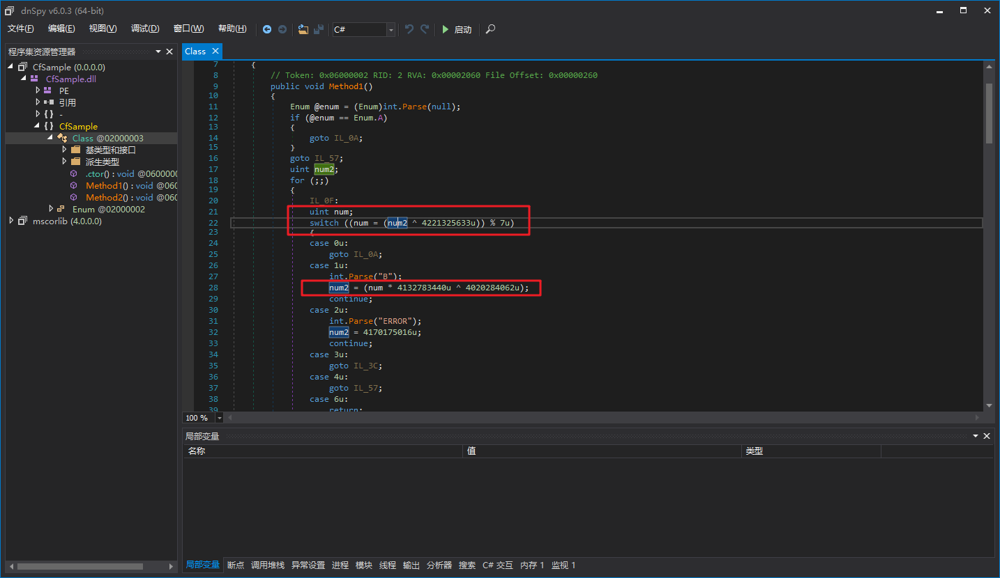

很明显的，这种不能静态解密，要跳转到的下一个case与上一个case有关。dnSpy看着有2个局部变量控制着控制流，事实上是这样吗？

不是！其中有一个num是反编译器生成的。

我们看看IL：

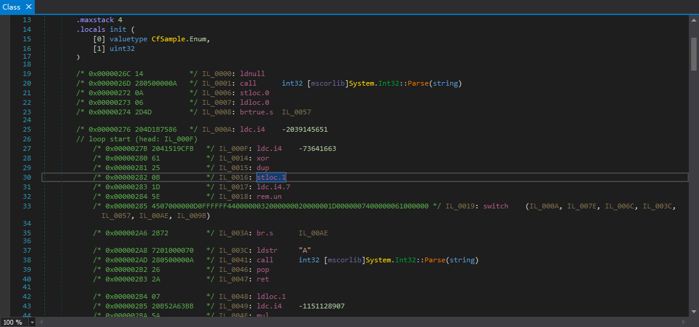

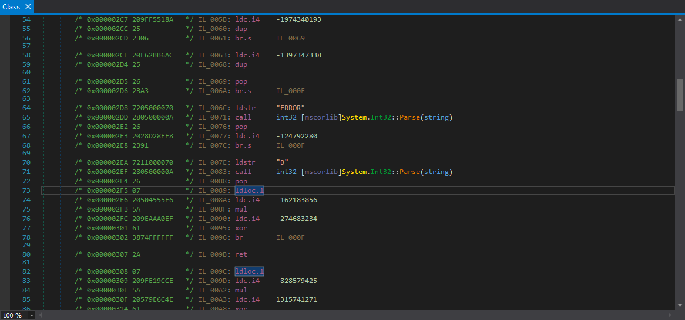

只用到了局部变量V_1。

为什么ConfuserEx生成的控制流混淆里面的常量都特别的大？关键还是一个求余运算，比如 x % 7，那么结果的取值范围就是{0, 1, 2, 3, 4, 5, 6}，恰好7个结果。

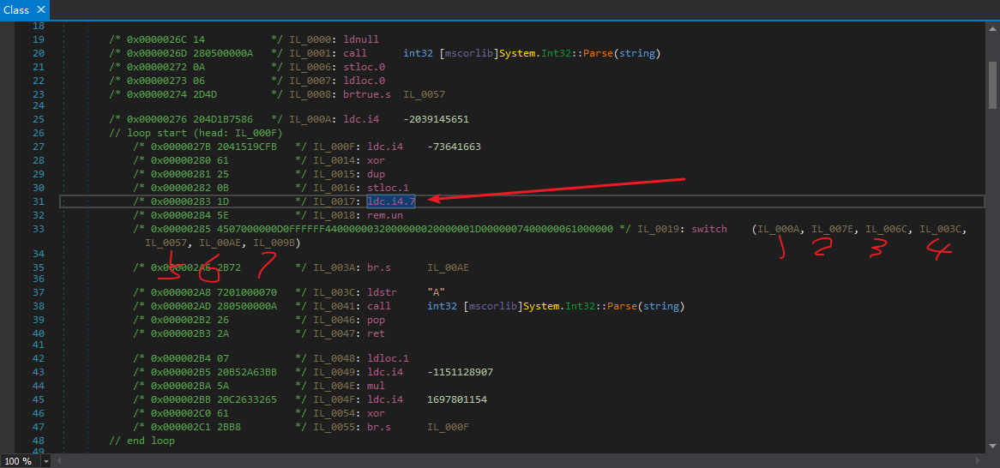

比如这个switch，有7个条件跳转目标，那么就是% 7，也就是除以7求余数。

我们还会注意到，对num赋值有2种情况，一种是和num本身的值有关的，一种是无关的：

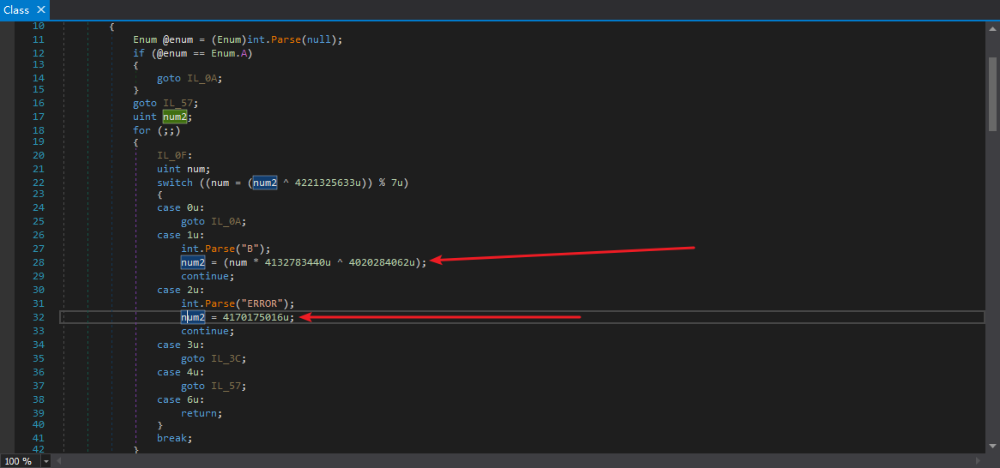

为什么会出现直接一条num = ????;就完事的代码呢？全部使用上下文相关，也就是线性编码不是强度更高么？这个肯定不是ConfuserEx作者故意的，这个也是有原因的。我们可以看看ConfuserEx源码，在这里可以找到答案：

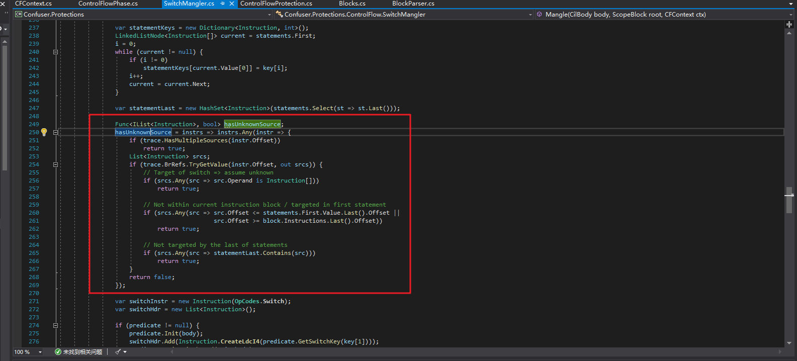

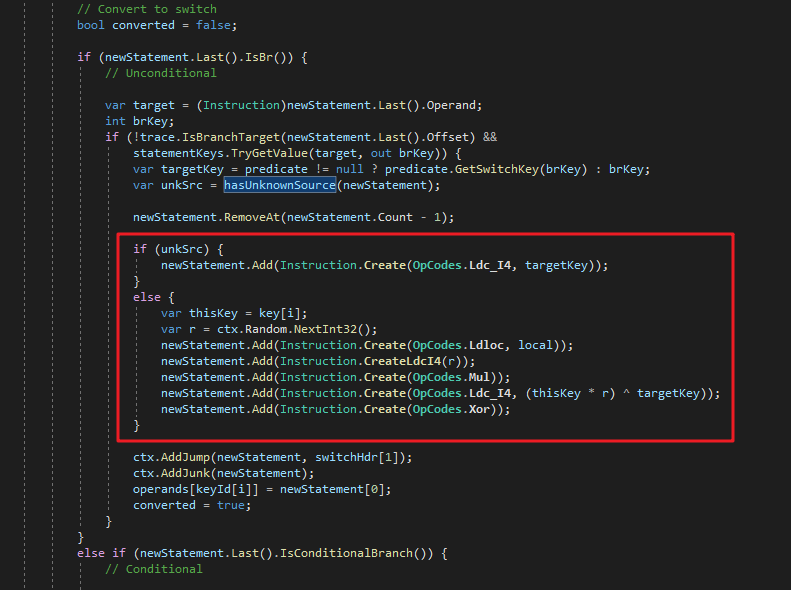

这段代码的意思是，如果一个基本块A有未知来源，意思就是有非已知的基本块会跳转基本块A，那么就不生成线性解码的代码。因为如果是一个未知的基本块跳转到了基本块A，那么此时的num的值是不确定的，如果还是用num = num * xxxx ^ xxxx;，就会导致解码出的num是错误的。

所以我们可以得出这种线性Switch混淆的一个结论：

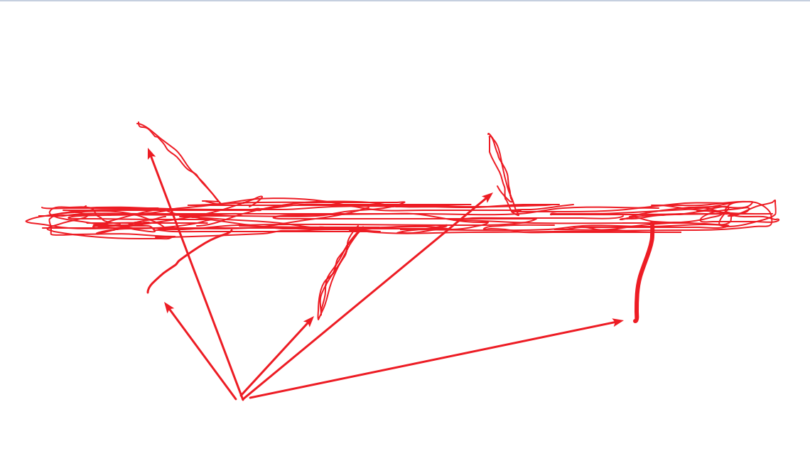

线性Switch混淆就像图中一坨混在一起的线，直接进入内部，是清理不了混淆的。而线性Switch混淆有且至少有一个为未知源准备的入口点，也就是图中箭头指着的几个很细的线条，也就是ConfuserEx Switch混淆中的直接对num进行赋值的地方。

我们再用工具FlowGraph看看（开了优化的）：

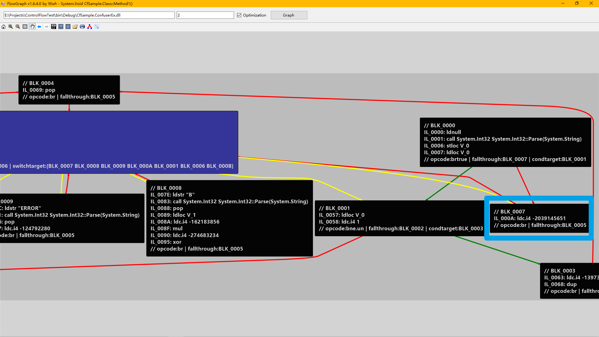

蓝色框圈出来的就是这个线性Switch的一个入口点。

我们可以再看看其它方法体，也是如此：

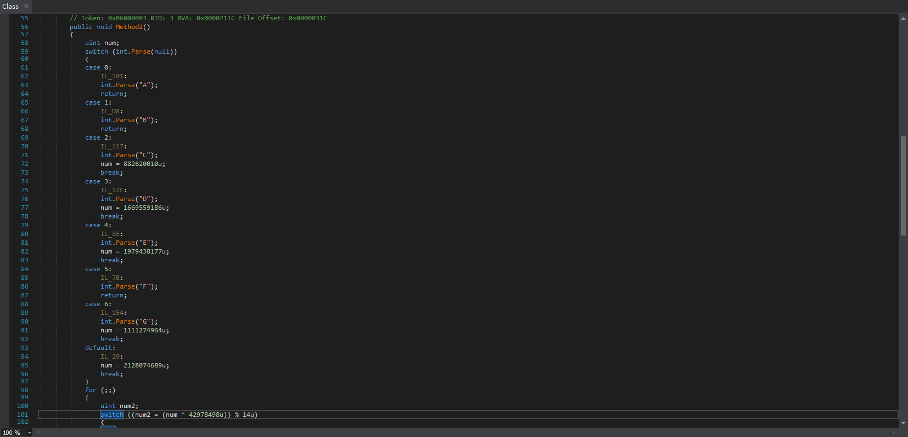

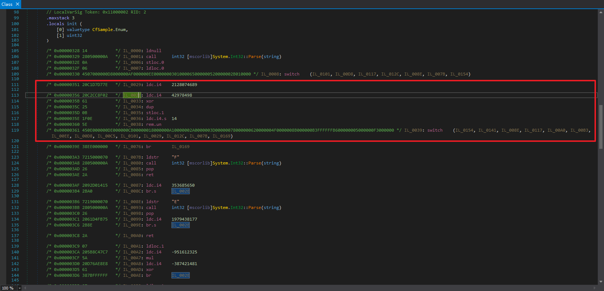

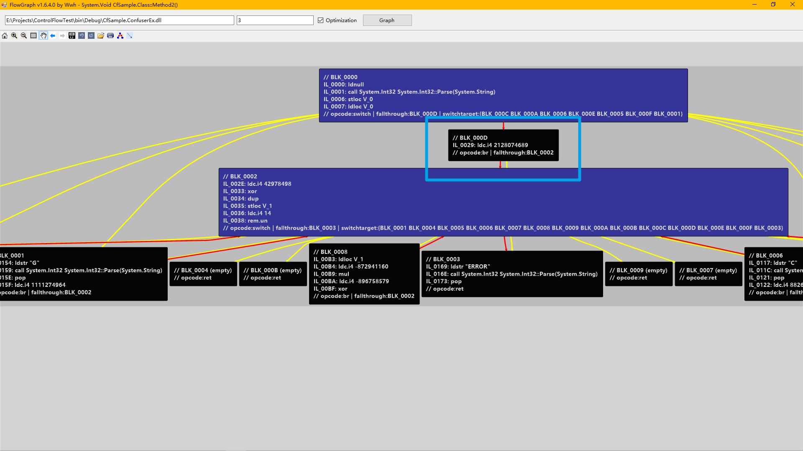

和之前总结的特征一样。

所以，我们要清理线性Switch混淆，只能从这种入口点进入，虚拟执行部分代码，才可以达到效果。

### 虚拟机

虚拟执行需要虚拟机。虽然有现成的虚拟机，比如de4dot.blocks里面的虚拟机，但是我就是喜欢造轮子，自己写的用着舒服，修改起来也方便，看别人的代码太累了，看懂了还要自己修改，不如从头写一个。

虚拟机完整代码文章末尾也有。

#### 操作码分类

我们可以先对所有指令操作码进行分类，对我们需要的操作码进行模拟，不需要的就不模拟。

这里我贴上我分类好的：

``` csharp
Add
Add_Ovf
Add_Ovf_Un
And
Div
Div_Un
Mul
Mul_Ovf
Mul_Ovf_Un
Neg
Not
Or
Rem
Rem_Un
Shl
Shr
Shr_Un
Sub
Sub_Ovf
Sub_Ovf_Un
Xor
// 运算

Ceq
Cgt
Cgt_Un
Ckfinite
Clt
Clt_Un
// 判断

Box
Castclass
Conv_I
Conv_I1
Conv_I2
Conv_I4
Conv_I8
Conv_Ovf_I
Conv_Ovf_I_Un
Conv_Ovf_I1
Conv_Ovf_I1_Un
Conv_Ovf_I2
Conv_Ovf_I2_Un
Conv_Ovf_I4
Conv_Ovf_I4_Un
Conv_Ovf_I8
Conv_Ovf_I8_Un
Conv_Ovf_U
Conv_Ovf_U_Un
Conv_Ovf_U1
Conv_Ovf_U1_Un
Conv_Ovf_U2
Conv_Ovf_U2_Un
Conv_Ovf_U4
Conv_Ovf_U4_Un
Conv_Ovf_U8
Conv_Ovf_U8_Un
Conv_R_Un
Conv_R4
Conv_R8
Conv_U
Conv_U1
Conv_U2
Conv_U4
Conv_U8
Unbox
Unbox_Any
// 转换

Dup
Ldarg
Ldarga
Ldc_I4
Ldc_I8
Ldc_R4
Ldc_R8
Ldelem
Ldelem_I
Ldelem_I1
Ldelem_I2
Ldelem_I4
Ldelem_I8
Ldelem_R4
Ldelem_R8
Ldelem_Ref
Ldelem_U1
Ldelem_U2
Ldelem_U4
Ldelema
Ldfld
Ldflda
Ldftn
Ldind_I
Ldind_I1
Ldind_I2
Ldind_I4
Ldind_I8
Ldind_R4
Ldind_R8
Ldind_Ref
Ldind_U1
Ldind_U2
Ldind_U4
Ldlen
Ldloc
Ldloca
Ldnull
Ldobj
Ldsfld
Ldsflda
Ldstr
Ldtoken
Ldvirtftn
Newarr
Newobj
Pop
Starg
Stelem
Stelem_I
Stelem_I1
Stelem_I2
Stelem_I4
Stelem_I8
Stelem_R4
Stelem_R8
Stelem_Ref
Stfld
Stind_I
Stind_I1
Stind_I2
Stind_I4
Stind_I8
Stind_R4
Stind_R8
Stind_Ref
Stloc
Stobj
Stsfld
// 取值赋值

Beq
Bge
Bge_Un
Bgt
Bgt_Un
Ble
Ble_Un
Blt
Blt_Un
Bne_Un
Br
Brfalse
Brtrue
Endfilter
Endfinally
Leave
Ret
Rethrow
Switch
Throw
// 分支

Call
Calli
Callvirt
// 调用

Arglist
Cpblk
Cpobj
Initblk
Initobj
Isinst
Localloc
Mkrefany
Refanytype
Refanyval
Sizeof
// 其它
```

比如处理ConfuserEx控制流混淆，我们实现部分取值赋值，分配指令的虚拟化，还有所有运算指令的虚拟化就够了，非常简单。

#### 虚拟值

我把虚拟机中的值分成了几种常见类型：

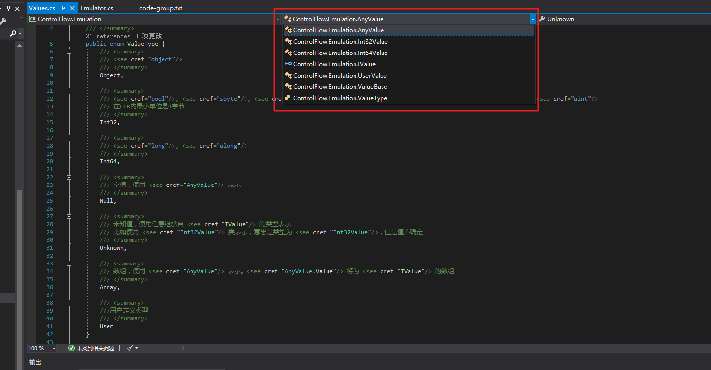

再写一个一个接口，表示虚拟值就行。

``` csharp
/// <summary>
/// 值标志
/// </summary>
public enum ValueType {
	/// <summary>
	/// <see cref="object"/>
	/// </summary>
	Object,

	/// <summary>
	/// <see cref="bool"/>, <see cref="sbyte"/>, <see cref="byte"/>, <see cref="short"/>, <see cref="ushort"/>, <see cref="int"/>, <see cref="uint"/>
	/// 在CLR内最小单位是4字节
	/// </summary>
	Int32,

	/// <summary>
	/// <see cref="long"/>, <see cref="ulong"/>
	/// </summary>
	Int64,

	/// <summary>
	/// 空值，使用 <see cref="AnyValue"/> 表示
	/// </summary>
	Null,

	/// <summary>
	/// 未知值，使用任意继承自 <see cref="IValue"/> 的类型表示
	/// 比如使用 <see cref="Int32Value"/> 类表示，意思是类型为 <see cref="Int32Value"/>，但是值不确定
	/// </summary>
	Unknown,

	/// <summary>
	/// 数组，使用 <see cref="AnyValue"/> 表示。<see cref="AnyValue.Value"/> 将为 <see cref="IValue"/> 的数组
	/// </summary>
	Array,

	/// <summary>
	///用户定义类型
	/// </summary>
	User
}

/// <summary>
/// 表示一个值
/// </summary>
public interface IValue {
	/// <summary>
	/// 标志
	/// </summary>
	ValueType Type { get; set; }

	/// <summary>
	/// 值类型返回 this 指针，引用类型深度克隆自身
	/// </summary>
	/// <returns></returns>
	IValue Clone();
}
```

#### 架构

我用的是de4dot.blocks里面的架构，稍微修改了一下，把虚拟机和上下文（Context）本身分离了。

``` csharp
/*
 * 虚拟机本身参考了de4dot的设计
 * 
 * 以下代码应与ControlFlow.Blocks项目没有任何关系
 * 转换部分应该由扩展类Extensions完成
 * 模拟器Emulator类只需要完成模拟的功能，不需要关心是什么样的Block
 * 也不需要关心异常处理块是什么样的
 * 只需要返回失败，由用户进行判断和处理
 * 用户需要判断是何种原因造成了模拟的失败
 * 
 * 这个项目和ControlFlow.Blocks项目一样
 * 需要先使用ControlFlow.Blocks.Extensions.SimplifyMacros(MethodDef)化简指令
 * 否则可能模拟失败
 */

/// <summary>
/// 模拟器上下文
/// </summary>
public sealed class EmulationContext {
	private readonly Dictionary<Local, IValue> _variables;
	private readonly Stack<IValue> _evaluationStack;

	/// <summary>
	/// 局部变量
	/// </summary>
	public Dictionary<Local, IValue> Variables => _variables;

	/// <summary>
	/// 计算堆栈
	/// </summary>
	public Stack<IValue> EvaluationStack => _evaluationStack;

	/// <summary>
	/// 构造器
	/// </summary>
	public EmulationContext() {
		_evaluationStack = new Stack<IValue>();
		_variables = new Dictionary<Local, IValue>();
	}

	/// <summary>
	/// 构造器
	/// </summary>
	/// <param name="variables"></param>
	public EmulationContext(IEnumerable<Local> variables) : this() {
		if (variables == null)
			throw new ArgumentNullException(nameof(variables));

		foreach (Local variable in variables)
			_variables.Add(variable, null);
	}

	private EmulationContext(Dictionary<Local, IValue> variables, Stack<IValue> evaluationStack) {
		if (variables == null)
			throw new ArgumentNullException(nameof(variables));
		if (evaluationStack == null)
			throw new ArgumentNullException(nameof(evaluationStack));

		_variables = variables;
		_evaluationStack = evaluationStack;
	}

	/// <summary>
	/// 克隆当前实例
	/// </summary>
	/// <returns></returns>
	public EmulationContext Clone() {
		IValue[] array;
		Stack<IValue> evaluationStack;
		Dictionary<Local, IValue> variables;

		array = _evaluationStack.ToArray();
		evaluationStack = new Stack<IValue>(_evaluationStack.Count);
		for (int i = array.Length - 1; i >= 0; i--)
			evaluationStack.Push(array[i].Clone());
		variables = new Dictionary<Local, IValue>(_variables.Count);
		foreach (KeyValuePair<Local, IValue> variable in _variables)
			variables.Add(variable.Key, variable.Value?.Clone());
		return new EmulationContext(variables, evaluationStack);
	}
}

/// <summary>
/// 模拟器结果
/// </summary>
public sealed class EmulationResult {
	private readonly bool _success;
	private readonly Instruction _failedInstruction;
	private readonly Exception _exception;

	/// <summary>
	/// 是否成功
	/// </summary>
	public bool Success => _success;

	/// <summary>
	/// 模拟失败的指令
	/// </summary>
	public Instruction FailedInstruction => _failedInstruction;

	/// <summary>
	/// 异常（如果有）
	/// </summary>
	public Exception Exception => _exception;

	internal EmulationResult(bool success, Instruction failedInstruction, Exception exception) {
		_success = success;
		_failedInstruction = failedInstruction;
		_exception = exception;
	}
}
```

给虚拟机一个上下文，传入要虚拟执行的指令，返回执行结果，就是这么简单，并不复杂。

比如我们要虚拟执行运算指令，我们要用好C#的lambda。

``` csharp
private bool Template_Arithmetic(Func<int, int, int> operation32, Func<long, long, long> operation64) {
	IValue x;
	IValue y;
	IValue result;

	y = EvaluationStack.Pop();
	x = EvaluationStack.Pop();
	result = CheckAndTryGetUnknownValue_Arithmetic(x, y);
	if (result != null) {
		EvaluationStack.Push(result);
		return true;
	}
	if (x is Int32Value && y is Int32Value) {
		if (operation32 == null)
			ThrowNotImpl();
		result = new Int32Value(operation32(((Int32Value)x).Int32, ((Int32Value)y).Int32));
	}
	else {
		if (operation32 == null)
			ThrowNotImpl();
		result = new Int64Value(operation64(GetInt64_Arithmetic(x), GetInt64_Arithmetic(y)));
	}
	EvaluationStack.Push(result);
	return true;
}

private static IValue CheckAndTryGetUnknownValue_Arithmetic(IValue x) {
	if (!(x is Int32Value) && !(x is Int64Value))
		ThrowErrorType();
	if (x.Type == ValueType.Unknown)
		return x is Int32Value ? (IValue)Int32Value.Unknown : Int64Value.Unknown;
	else
		return null;
}

private static IValue CheckAndTryGetUnknownValue_Arithmetic(IValue x, IValue y) {
	if ((!(x is Int32Value) && !(x is Int64Value)) || (!(y is Int32Value) && !(y is Int64Value)))
		ThrowErrorType();
	if (x.Type == ValueType.Unknown || y.Type == ValueType.Unknown)
		return x is Int32Value ? (IValue)Int32Value.Unknown : Int64Value.Unknown;
	else
		return null;
}

private static long GetInt64_Arithmetic(IValue value) {
	return value is Int32Value ? ((Int32Value)value).Int32 : ((Int64Value)value).Int64;
}
```

要模拟运算指令，调用Template_Arithmetic就行，非常简单。

``` csharp
protected virtual bool Emulate_Add(Instruction instruction) {
	return Template_Arithmetic((x, y) => x + y, (x, y) => x + y);
}

protected virtual bool Emulate_And(Instruction instruction) {
	return Template_Arithmetic((x, y) => x & y, (x, y) => x & y);
}

protected virtual bool Emulate_Div(Instruction instruction) {
	return Template_Arithmetic((x, y) => x / y, (x, y) => x / y);
}
```

剩下的非常简单，就是大循环套着Switch判断操作码，然后调用对应的方法进行虚拟执行，代码不贴了。

### 清除

有了虚拟机之后，我们要清除Switch混淆就方便很多了。我们可以开始清除Switch混淆了。

先把部分情况进行特殊处理。

ConfuserEx会把条件跳转指令转换成这样的形式：

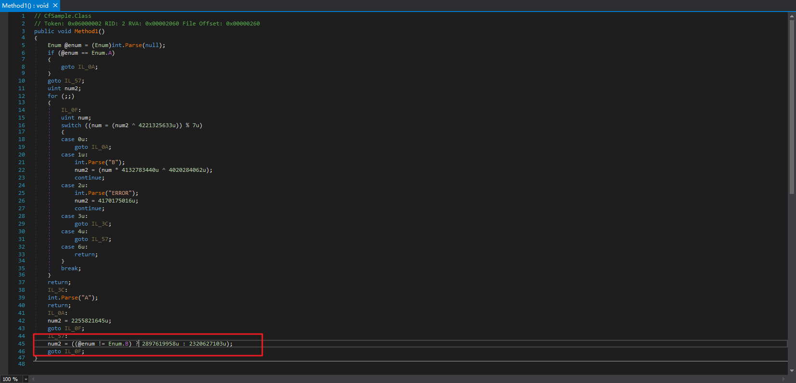

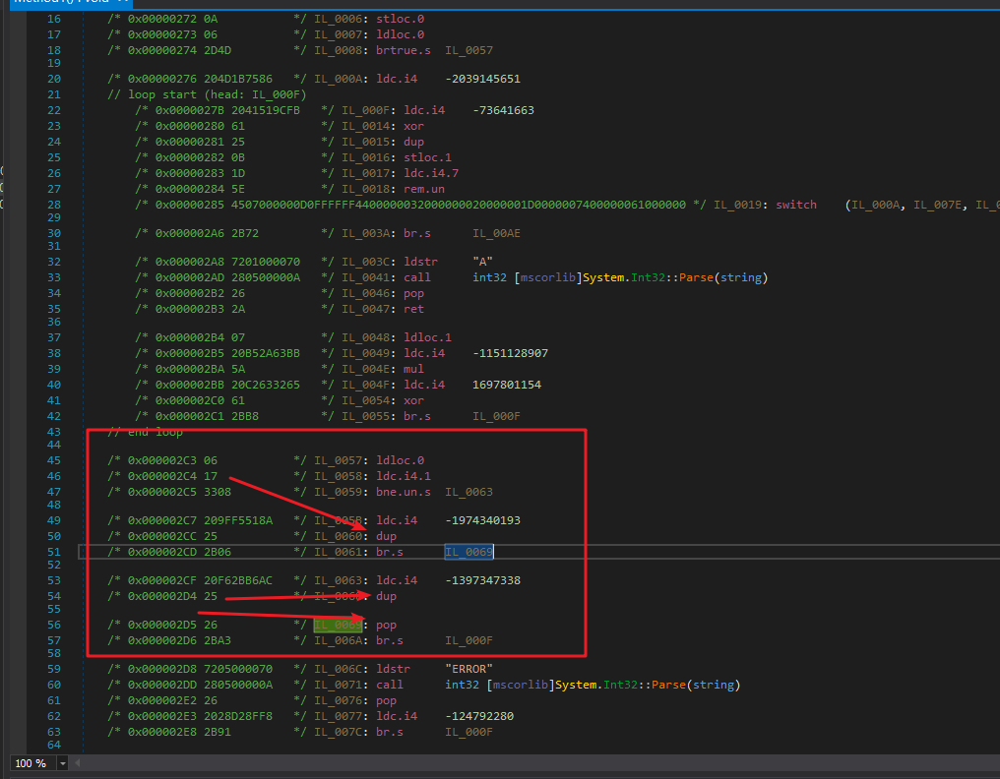

这里的dup和pop就是ConfuserEx故意干扰我们的代码，这里的dup和pop完全可以直接移除。

移除这种dup和pop的核心代码（其它代码没贴，了解个思路就行）：

``` csharp
private void HandleMultiDupWithOnePop(BasicBlock popBlock) {
	// 我们暂时只处理这种情况，多个dup块对应单个pop块（ConfuserEx）
	// 还没见到单个dup块对应多个pop块的
	int popCount;
	List<BasicBlock> dupBlocks;
	int dupCount;

	popCount = GetPopCount(popBlock);
	if (popCount == 0)
		return;
	dupBlocks = popBlock.PeekExtraData<BlockInfo>().Dereferences;
	// 假设反向引用都有dup
	if (dupBlocks.Count == 0)
		// 作用域入口点可能没有反向引用，比如方法块入口点，Catch块入口点
		return;
	foreach (BasicBlock dupBlock in dupBlocks)
		if (dupBlock.BranchOpcode.Code != Code.Br)
			// 必须是无条件跳转到pop块
			return;
	dupCount = int.MaxValue;
	foreach (BasicBlock dupBlock in dupBlocks) {
		int temp;

		temp = GetDupCount(dupBlock);
		if (temp < dupCount)
			dupCount = temp;
	}
	// 找出最小dup数量
	if (dupCount == 0)
		return;
	if (popCount < dupCount)
		dupCount = popCount;
	// 找出最小配对的dup-pop数量
	popBlock.Instructions.RemoveRange(0, dupCount);
	// pop块移除开头的pop
	foreach (BasicBlock dupBlock in dupBlocks)
		dupBlock.Instructions.RemoveRange(dupBlock.Instructions.Count - dupCount, dupCount);
	// dup块移除结尾的dup
	_dupCount += dupCount;
}
```

和之前的BlockInliner一样，我们还要对ConfuserEx混淆过的If进行内联，方便我们标记要模拟的指令来进行清理。

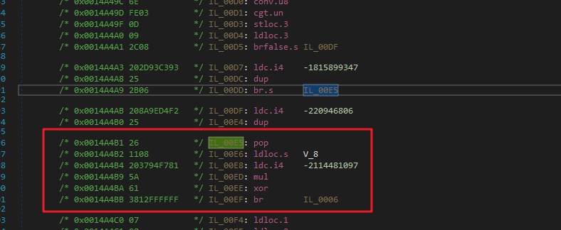

比如这种，红框中的基本块可以内联到上面2个基本块中。

我们要先定义一个抽象类，写清理线性Switch混淆的逻辑，而识别部分放到子类里面进行实现，达到代码复用。

抽象类的代码我直接贴上来了：

``` csharp
/// <summary>
/// 线性Switch反混淆（比如ConfuserEx）
/// 我们一次只清理一个线性Switch，否则代码会极其复杂
/// </summary>
public abstract class LinearSwitchDeobfuscatorBase : BlockRecursiveModel {
	/// <summary>
	/// 指令模拟器
	/// </summary>
	protected readonly Emulator _emulator;
	/// <summary>
	/// Switch块
	/// </summary>
	protected BasicBlock _switchBlock;
	private bool _isModified;

	/// <summary />
	protected LinearSwitchDeobfuscatorBase(List<IBlock> blocks, IBlock scope, EmulationContext emulationContext) : base(blocks, scope) {
		_emulator = new Emulator(emulationContext);
	}

	/// <summary />
	protected static bool Deobfuscate(MethodBlock methodBlock, BlockRecursiveModelCreator deobfuscatorCreator) {
		return Execute(methodBlock, deobfuscatorCreator);
	}

	/// <summary />
	protected override bool Execute() {
		if (_blocks.Count < 2)
			return false;
		OnBegin();
		if (_switchBlock == null)
			return false;
		foreach (BasicBlock entry in GetEntries())
			VisitAllBasicBlocks(entry);
		OnEnd();
		return _isModified;
	}

	/// <summary>
	/// 访问指定基本块，并且通过递归访问这个基本块的所有跳转目标
	/// </summary>
	/// <param name="basicBlock"></param>
	protected void VisitAllBasicBlocks(BasicBlock basicBlock) {
		BlockInfoBase blockInfo;

		if (basicBlock.Scope != _scope)
			// 指定基本块不在当前作用域，不需要继续访问了
			return;
		blockInfo = basicBlock.PeekExtraData<BlockInfoBase>();
		if (blockInfo.IsVisited && basicBlock != _switchBlock)
			// 如果基本块已经访问过并且基本块不是Switch块，直接返回
			return;
		blockInfo.IsVisited = true;
		if (blockInfo.EmulationInfo != null) {
			// 如果需要模拟
			EmulationInfo emulationInfo;
			EmulationResult emulationResult;

			emulationInfo = blockInfo.EmulationInfo;
			_isModified |= OnEmulateBegin(basicBlock);
			emulationResult = _emulator.Emulate(basicBlock.Instructions, emulationInfo.StartIndex, emulationInfo.Length);
			_isModified |= OnEmulateEnd(basicBlock);
			if (!emulationResult.Success)
				throw new NotImplementedException("暂未实现模拟失败处理，需要更新反混淆模型，或者检查是否模拟了不需要模拟的指令");
		}
		if (basicBlock == _switchBlock)
			// 我们要设置下一个要访问的基本块
			VisitAllBasicBlocks(GetNextBasicBlock());
		else
			// 如果不是Switch块，我们使用递归访问下一个基本块
			switch (basicBlock.BranchOpcode.FlowControl) {
			case FlowControl.Branch:
				// 无条件跳转，不需要备份当前模拟器上下文
				VisitAllBasicBlocks(basicBlock.FallThrough);
				break;
			case FlowControl.Cond_Branch:
				CallNextVisitAllBasicBlocksConditional(basicBlock);
				break;
			}
	}

	/// <summary>
	/// 在所有操作开始前触发
	/// 在这个方法中，必需为 _blocks 中所有基本块添加额外信息，并且设置字段 <see cref="_switchBlock"/>
	/// 如果没有找到Switch块，直接返回，而不是抛出异常
	/// </summary>
	protected abstract void OnBegin();

	/// <summary>
	/// 在所有操作完成后触发
	/// 在这个方法中，必需移除 _blocks 中所有基本块的额外信息
	/// </summary>
	protected abstract void OnEnd();

	/// <summary>
	/// 获取可用的模拟入口点
	/// </summary>
	/// <returns></returns>
	protected abstract IEnumerable<BasicBlock> GetEntries();

	/// <summary>
	/// 在指定基本块模拟前触发，返回当前基本块是否修改
	/// </summary>
	/// <param name="basicBlock"></param>
	/// <returns></returns>
	protected abstract bool OnEmulateBegin(BasicBlock basicBlock);

	/// <summary>
	/// 在指定基本块模拟后触发，返回当前基本块是否修改
	/// </summary>
	/// <param name="basicBlock"></param>
	/// <returns></returns>
	protected abstract bool OnEmulateEnd(BasicBlock basicBlock);

	/// <summary>
	/// 在遇到Switch块后，通过模拟器获取下一个基本块
	/// </summary>
	/// <returns></returns>
	protected virtual BasicBlock GetNextBasicBlock() {
		Int32Value value;

		value = _emulator.EvaluationStack.Pop() as Int32Value;
		if (value == null)
			throw new InvalidOperationException();
		return _switchBlock.SwitchTargets[value.Int32];
	}

	/// <summary>
	/// 遇到条件跳转时，递归调用VisitAllBasicBlocks
	/// </summary>
	/// <param name="basicBlock">为条件跳转的基本块</param>
	protected virtual void CallNextVisitAllBasicBlocksConditional(BasicBlock basicBlock) {
		EmulationContext context;

		context = _emulator.Context.Clone();
		// 条件跳转，有多个跳转目标，需要备份当前模拟器上下文
		if (basicBlock.FallThrough != null) {
			VisitAllBasicBlocks(basicBlock.FallThrough);
			_emulator.Context = context;
			// 恢复模拟器上下文
		}
		if (basicBlock.ConditionalTarget != null) {
			VisitAllBasicBlocks(basicBlock.ConditionalTarget);
			_emulator.Context = context;
		}
		if (basicBlock.SwitchTargets != null)
			foreach (BasicBlock target in basicBlock.SwitchTargets) {
				VisitAllBasicBlocks(target);
				_emulator.Context = context;
			}
	}

	/// <summary>
	/// 基本块额外信息基类
	/// </summary>
	protected abstract class BlockInfoBase {
		/// <summary />
		protected bool _isVisited;
		/// <summary />
		protected EmulationInfo _emulationInfo;

		/// <summary>
		/// 是否访问过这个基本块
		/// </summary>
		public bool IsVisited {
			get => _isVisited;
			set => _isVisited = value;
		}

		/// <summary>
		/// 模拟相关信息
		/// 如果需要模拟，将这个属性设置为非 <see langword="null"/>，反之保持默认，即为 <see langword="null"/>
		/// </summary>
		public EmulationInfo EmulationInfo {
			get => _emulationInfo;
			set => _emulationInfo = value;
		}
	}

	/// <summary>
	/// 提供模拟所需信息
	/// </summary>
	protected sealed class EmulationInfo {
		private readonly int _startIndex;
		private readonly int _length;

		/// <summary>
		/// 从指定索引的指令开始模拟
		/// </summary>
		public int StartIndex => _startIndex;

		/// <summary>
		/// 要模拟的指令的数量
		/// </summary>
		public int Length => _length;

		/// <summary>
		/// 构造器
		/// </summary>
		/// <param name="startIndex"></param>
		/// <param name="length"></param>
		public EmulationInfo(int startIndex, int length) {
			_startIndex = startIndex;
			_length = length;
		}
	}
}
```

代码不多，核心的部分还是在方法名带了VisitAllBasicBlocks的方法里。比如VisitAllBasicBlocks，就是模拟程序正常执行流程，遇到了Switch混淆的地方，就模拟执行，然后在OnEmulateEnd里面完成Switch混淆的解密。

做完那么多清理操作，ConfuserEx的Switch差不多原形毕露了，特征变得非常明显，我们继承LinearSwitchDeobfuscatorBase再识别一下特征就可以了。

``` csharp
public sealed class LinearSwitchDeobfuscator : LinearSwitchDeobfuscatorBase {
	private BasicBlock _lastCaseBlockAny;

	private LinearSwitchDeobfuscator(List<IBlock> blocks, IBlock scope, EmulationContext emulationContext) : base(blocks, scope, emulationContext) {
	}

	public static bool Deobfuscate(MethodBlock methodBlock) {
		bool isModified;

		isModified = false;
		while (Deobfuscate(methodBlock, (blocks, scope) => new LinearSwitchDeobfuscator(blocks, scope, methodBlock.CreateEmulationContext()))) {
			// 我们一次只能清除一个LinearSwitch，所以用while循环
			methodBlock.Standardize();
			isModified = true;
		}
		return isModified;
	}

	protected override void OnBegin() {
		foreach (BasicBlock basicBlock in _blocks.EnumerateAllBasicBlocks())
			if (IsLinearSwitchBlock(basicBlock)) {
				_switchBlock = basicBlock;
				break;
			}
		// 先寻找Switch块
		if (_switchBlock == null)
			return;
		foreach (BasicBlock basicBlock in _blocks.EnumerateAllBasicBlocks()) {
			if (basicBlock == _switchBlock)
				basicBlock.PushExtraData(new BlockInfo(BlockType.LinearSwitch) {
					EmulationInfo = new EmulationInfo(0, SwitchConstants.LinearSwitchCodes.Length)
				});
			else if (IsCaseBlock(basicBlock))
				basicBlock.PushExtraData(new BlockInfo(BlockType.Case) {
					EmulationInfo = new EmulationInfo(basicBlock.Instructions.Count - SwitchConstants.CaseCodes.Length, SwitchConstants.CaseCodes.Length)
				});
			else if (IsLinearCaseBlock(basicBlock))
				basicBlock.PushExtraData(new BlockInfo(BlockType.LinearCase) {
					EmulationInfo = new EmulationInfo(basicBlock.Instructions.Count - SwitchConstants.LinearCaseCodes1.Length, SwitchConstants.LinearCaseCodes1.Length)
					// LinearCaseCodes1和LinearCaseCodes2长度一样
				});
			else
				basicBlock.PushExtraData(new BlockInfo(BlockType.Normal));
		}
	}

	private bool IsLinearSwitchBlock(BasicBlock basicBlock) {
		return basicBlock.BranchOpcode.Code == Code.Switch && basicBlock.Instructions.CodeEquals(SwitchConstants.LinearSwitchCodes);
	}

	private bool IsCaseBlock(BasicBlock basicBlock) {
		return basicBlock.BranchOpcode.Code == Code.Br && basicBlock.FallThrough == _switchBlock && basicBlock.Instructions.EndsWith(SwitchConstants.CaseCodes);
	}

	private bool IsLinearCaseBlock(BasicBlock basicBlock) {
		return basicBlock.BranchOpcode.Code == Code.Br &&
			basicBlock.FallThrough == _switchBlock &&
			(basicBlock.Instructions.EndsWith(SwitchConstants.LinearCaseCodes1) ||
			basicBlock.Instructions.EndsWith(SwitchConstants.LinearCaseCodes2));
	}

	protected override void OnEnd() {
		foreach (BasicBlock basicBlock in _blocks.EnumerateAllBasicBlocks())
			basicBlock.PopExtraData();
	}

	protected override IEnumerable<BasicBlock> GetEntries() {
		foreach (BasicBlock basicBlock in _blocks.EnumerateAllBasicBlocks())
			if (basicBlock.PeekExtraData<BlockInfo>().Type == BlockType.Case)
				yield return basicBlock;
	}

	protected override bool OnEmulateBegin(BasicBlock basicBlock) {
		return false;
	}

	protected override bool OnEmulateEnd(BasicBlock basicBlock) {
		BlockInfo blockInfo;

		blockInfo = basicBlock.PeekExtraData<BlockInfo>();
		switch (blockInfo.Type) {
		case BlockType.LinearSwitch:
			Int32Value value;

			if (_lastCaseBlockAny == null)
				throw new InvalidOperationException();
			value = _emulator.EvaluationStack.Peek() as Int32Value;
			if (value == null)
				throw new InvalidOperationException();
			_lastCaseBlockAny.FallThrough = _switchBlock.SwitchTargets[value.Int32];
			_lastCaseBlockAny = null;
			return true;
		case BlockType.Case:
			basicBlock.Instructions.RemoveTrailingRange(SwitchConstants.CaseCodes.Length);
			_lastCaseBlockAny = basicBlock;
			break;
		case BlockType.LinearCase:
			basicBlock.Instructions.RemoveTrailingRange(SwitchConstants.LinearCaseCodes1.Length);
			_lastCaseBlockAny = basicBlock;
			break;
		}
		return false;
	}

	private enum BlockType {
		Normal,
		LinearSwitch,
		Case,
		LinearCase
	}

	private sealed class BlockInfo : BlockInfoBase {
		private readonly BlockType _type;

		public BlockType Type => _type;

		public BlockInfo(BlockType type) {
			_type = type;
		}
	}
}
```

这段代码中的清理部分在OnEmulateEnd，这个OnEmulateEnd很像一个Hook，我们在switch跳转到目标前截获当前的计算堆栈，得到switch(num)中的num，这样我们就可以知道上一个基本块要跳转到哪里了，然后我们把上一个基本块的跳转目标修改掉，就完成了一个清理操作。

如果ConfuserEx的switch混淆加了N多层，我们还要再判断一次，是否真的是线性Switch，比如这样的，就不是线性Switch：

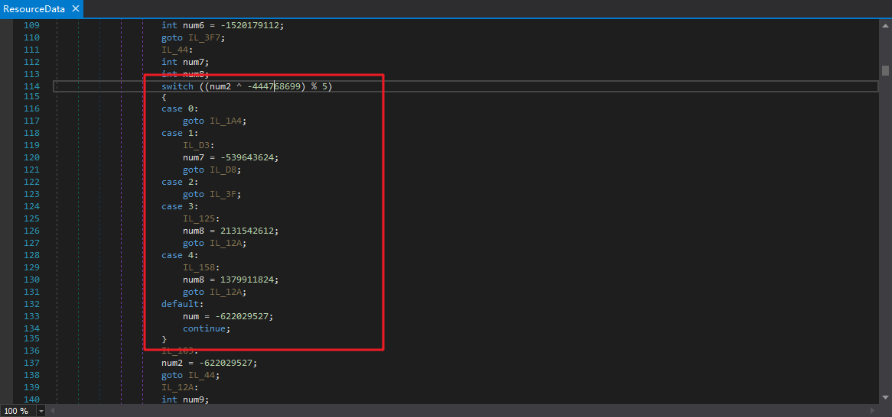

如果我们不先清理掉这些非线性的Switch就清理线性Switch，很可能导致出错。

## 下载

控制流图绘制工具FlowGraph：[百度云](https://pan.baidu.com/s/1eCu6U0ZWsIwQBM3F9ZIcDw) 提取码：csb1

反混淆工具ConfuserExSwitchDeobfuscator：[百度云](https://pan.baidu.com/s/1Cesv95OBRb_llP4zQ_QbTQ) 提取码：6hvr

虚拟机ControlFlow.Emulation：[百度云](https://pan.baidu.com/s/10k372M1LAJQkg8Z6jsPPNw) 提取码：d687

用来测试ConfuserExSwitchDeobfuscator的UnpackMe，我加了15层控制流混淆：[百度云](https://pan.baidu.com/s/1VegZtzj4avjIXS4qrWL8Bg) 提取码：xbj6
