# 反混淆VMP.NET之Mutation

## 前言

**这是.NET下VMP的反混淆，不是C++**

VMP v3.4增加了对.NET程序的支持，我知道的功能有反调试，JIT保护（有些奇怪，因为调试过没看到hook操作，但是确实不能直接dump），Mutation（变异），Virtualization（虚拟化）。Virtualization确实强，我搞不定，不过大概看懂结构了，可能写工具自动重命名一下可以看得更明白，强度可能还是不如KoiVM。不过Mutation还是比较好搞定的，一种类似控制流混淆的东西，或者可以说是与控制流有关的常量加密。

## 分析

由于VMP Demo版本加壳的程序只能在自己电脑上运行，所以我自己写了个.NET样本。

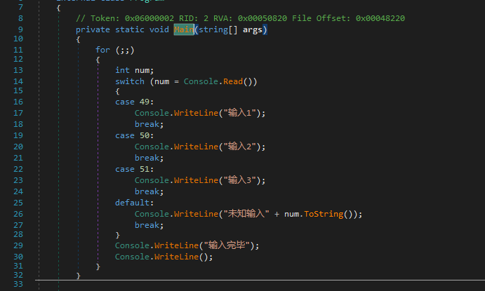

然后加壳，编译模式选择Mutation。用dnSpy打开，找到自己加壳的方法。可以发现有很多循环，这些循环是混淆器生成的。

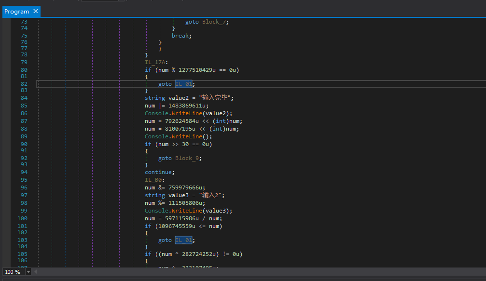

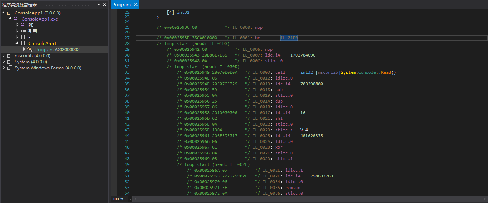

仔细观察，我们可以发现混淆比较单一，变量num是可以称为Context（上下文），执行一条指令，上下文就会自己更新一次。为什么我会选一个有switch语句的样本来加壳，因为我们需要知道进入不同的基本块，再转移到同一个基本块时，上下文是不是相同的（一般来说是相同的，因为我也想不出有不同的情况...）。

可能这样说不太容易明白，我直接调试，可以更明白些。样本中的每个case块对应了刚才说的不同的基本块，最终都会转移到同一个基本块，也就是"Console.WriteLine("输入完毕")"开始的这个基本块。所以我们在这个基本块下断点。

我们分别输入不同的数字，让switch语句跳转到不同的case块，看看是不是最终执行到"Console.WriteLine("输入完毕")"时，num的值是相同的。

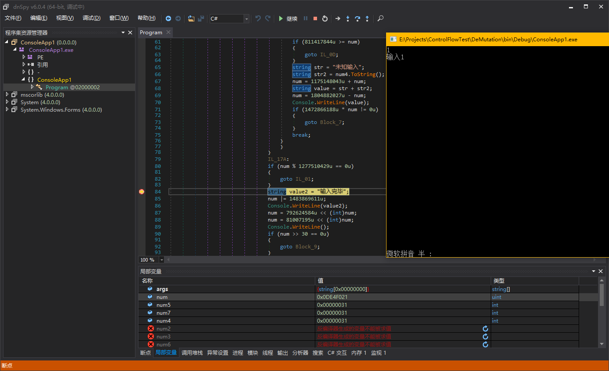

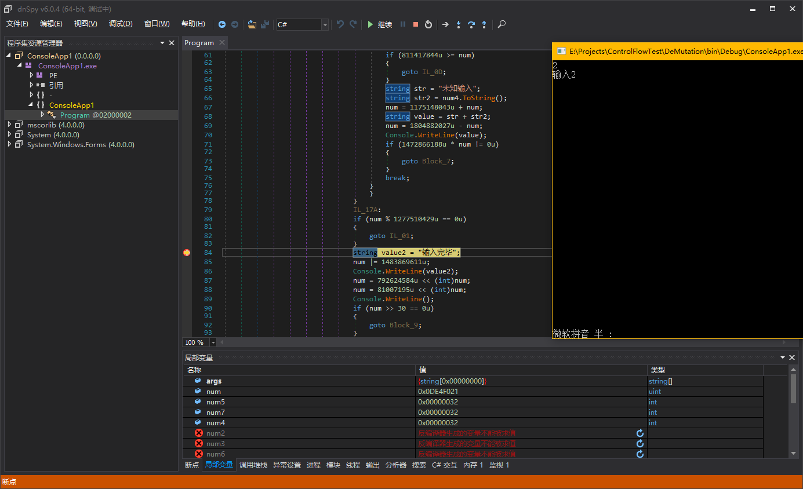

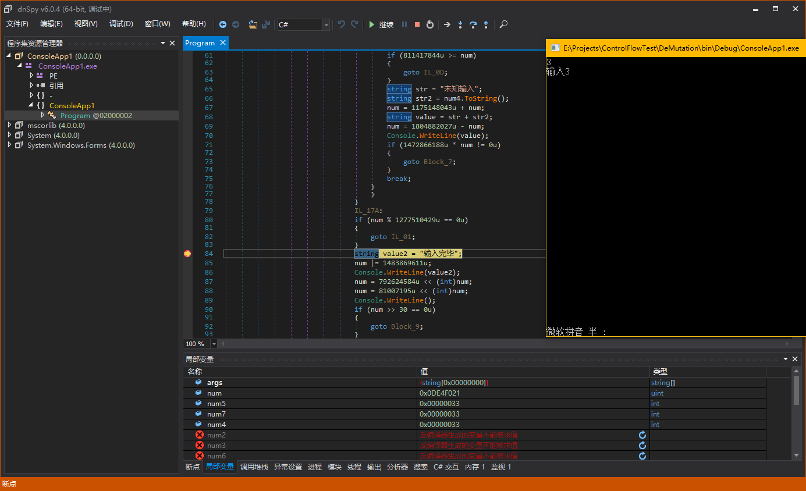

这样，我们的猜想是正确的，Mutation的宏观结构我们了解清除了，可以进行下一步分析。

我们要制订一个最简单的方案来清理掉Mutation，所以把dnSpy反编译模式切换回IL，观察num更新的语句究竟是什么样的。

这个方法的入口点就是一个br跳转，所以直接看br跳转到的基本块是怎么样的。

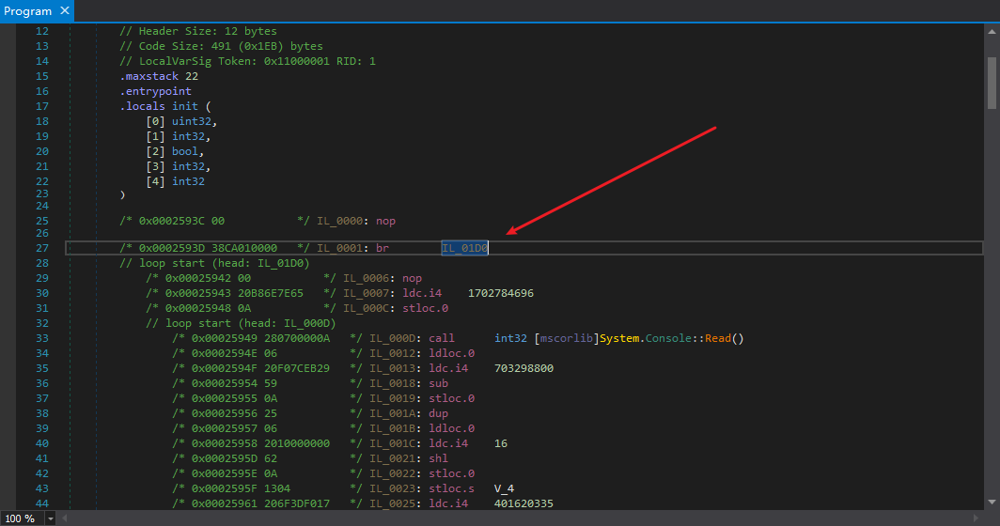

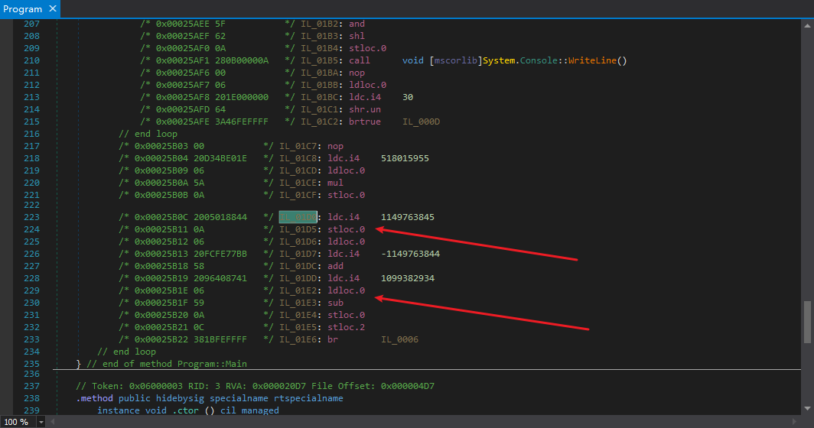

由于这个基本块是整个方法的入口点，那么这个基本块也一定是Mutation初始化的地方，也会是我们使用模拟器模拟的入口点，具体的可以看我以前的《
.NET控制流分析（二）-反混淆》，搜一下搜得到，先看看里面清理ConfuserEx的switch混淆和清理VMP.NET的Mutation很相似。

第一个箭头指着的
``` csharp
ldc.i4    1149763845
stloc.0
```
就是上下文num的初始化，后面会使用类似如下的代码来更新num
``` csharp
ldc.i4    1099382934
ldloc.0
sub
stloc.0
```
如果代码中还有常量，常量的解密和这个也是相似的，因为写之前已经分析过了，所以就不再写一遍了。

## 反混淆

这类混淆虽然简单，但是实际清理起来有些麻烦，为什么这么说？因为你要模拟整个控制流，模拟每一种可能的分支情况，才能确保你的解密结果是万无一失的。要模拟就非常麻烦了，可能造成死循环。模拟时，解密得到的结果如何处理，又是一个问题。

### 尝试

**以下内容均为我的尝试（只是部分），我也是在各种尝试之后找到的解决方案。**

我最开始的想法是特征匹配
``` csharp
ldc.i4
ldloc
add/sub/mul/div ...
```
这样的代码，遇到了直接替换成
``` csharp
nop
nop
ldc.i4
```
最后失败了，效果不太好，因为有些地方的特征并不是这样，比如混淆分支跳转指令前的（说是混淆分支跳转，因为这个跳转结果是确定的，每次跳转结果都一样）

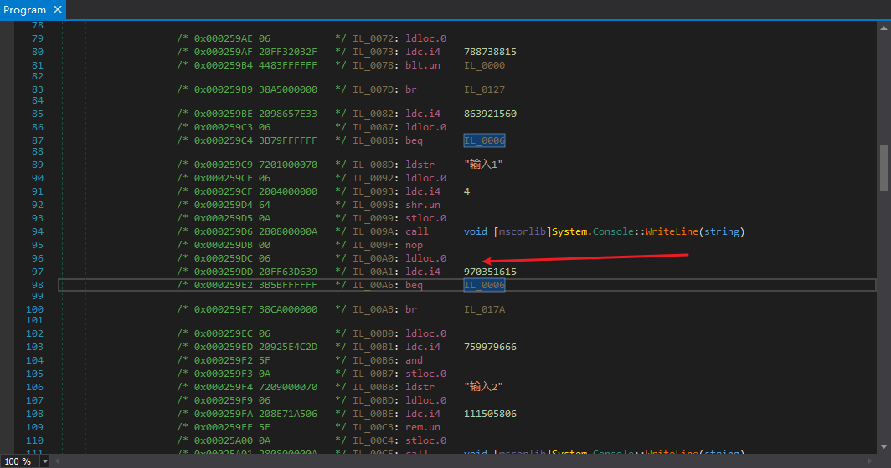

所以我想出了个非常投机取巧的方法，只替换

``` csharp
ldloc
```

为

``` csharp
ldc.i4
```

这样可以适用于所有情况。

我在每次模拟后，判断模拟的指令是不是读取变量num的，如果是，我直接替换为

``` csharp
ldc.i4
```

但是发现这样有个很大的问题。因为我没办法准确地识别被VMP.NET Mutation混淆的方法。肉眼看C#反编译结果确实一眼看出，但是用代码如何识别是一个非常大的难题。有的时候判断有误，把没混淆的识别为混淆了，然后模拟出结果，直接替换，最后发现不该替换，这下就很麻烦了。解密后原地替换，还有其它的问题，总之非常不好。

最后我决定使用一个集合来保存解密结果，同时可以验证每一次模拟的结果是不是相同的，如果不同那说明代码有问题，或者VMP有BUG，能增强稳定性。

### 写好逻辑

事实上最开始我是把逻辑和具体实现写在一起了，因为这样修改起来很方便，到后期基本上稳定，BUG没几个的时候，我才抽象出了逻辑，把底层的解密操作分开了。

因为我是写好了工具的，所以按我的源代码来讲解，先说抽象类。

以下是我的抽象类的成员列表

``` csharp
namespace ControlFlow.Deobfuscation {
	/// <summary>
	/// 混合控制流的常量解密
	/// </summary>
	public abstract class ConstantFlowDeobfuscatorBase {
		/// <summary>
		/// 要解密的方法块
		/// </summary>
		protected readonly MethodBlock _methodBlock;
		/// <summary>
		/// 指令模拟器
		/// </summary>
		protected readonly Emulator _emulator;
		/// <summary>
		/// 控制流相关的变量
		/// </summary>
		protected Local _flowContext;
		/// <summary>
		/// 解密个数
		/// </summary>
		protected int _decryptedCount;

#if DEBUG
		/// <summary />
		protected int _indent;
		/// <summary />
		public bool DEBUG;
#endif

		/// <summary>
		/// 构造器
		/// </summary>
		/// <param name="methodBlock"></param>
		protected ConstantFlowDeobfuscatorBase(MethodBlock methodBlock);

		/// <summary>
		/// 解密
		/// </summary>
		protected virtual void Deobfuscate();

		/// <summary>
		/// 访问指定基本块，并且通过递归访问这个基本块的所有跳转目标
		/// </summary>
		/// <param name="basicBlock"></param>
		protected virtual void VisitAllBasicBlocks(BasicBlock basicBlock);

		/// <summary>
		/// 在所有操作开始前触发
		/// 在这个方法中，必需为所有基本块添加额外信息，并且设置字段 <see cref="_flowContext"/>
		/// 如果没有找到 <see cref="_flowContext"/>，直接返回，而不是抛出异常
		/// </summary>
		protected abstract void OnBegin();

		/// <summary>
		/// 在所有操作完成后触发
		/// 在这个方法中，必需移除所有基本块的额外信息
		/// </summary>
		protected abstract void OnEnd();

		/// <summary>
		/// 获取可用的模拟入口点
		/// </summary>
		/// <returns></returns>
		protected abstract IEnumerable<BasicBlock> GetEntries();

		/// <summary>
		/// 在指定基本块的指定指令模拟前触发
		/// </summary>
		/// <param name="basicBlock"></param>
		/// <param name="index">指令的索引</param>
		protected abstract void OnEmulateBegin(BasicBlock basicBlock, int index);

		/// <summary>
		/// 在指定基本块的指定指令模拟后触发
		/// </summary>
		/// <param name="basicBlock"></param>
		/// <param name="index">指令的索引</param>
		protected abstract void OnEmulateEnd(BasicBlock basicBlock, int index);

		/// <summary>
		/// 在指定基本块模拟前触发
		/// </summary>
		/// <param name="basicBlock"></param>
		protected virtual void OnEmulateBegin(BasicBlock basicBlock);

		/// <summary>
		/// 在指定基本块模拟后触发
		/// </summary>
		/// <param name="basicBlock"></param>
		protected virtual void OnEmulateEnd(BasicBlock basicBlock);

		/// <summary>
		/// 在模拟运行一个基本块结束后，通过模拟分支指令来获取下一个基本块，如果无法获取，返回 <see langword="null"/>
		/// 无论是否成功，一定要平衡堆栈
		/// </summary>
		/// <param name="basicBlock"></param>
		/// <returns></returns>
		protected virtual BasicBlock EmulateBranch(BasicBlock basicBlock);

		/// <summary>
		/// 遇到条件跳转时，递归调用 <see cref="VisitAllBasicBlocks"/>
		/// </summary>
		/// <param name="basicBlock">为条件跳转的基本块</param>
		protected virtual void CallNextVisitAllBasicBlocksConditional(BasicBlock basicBlock);

#if DEBUG
		private static string DEBUG_ToString(BasicBlock basicBlock);
#endif

		/// <summary>
		/// 基本块额外信息基类
		/// </summary>
		protected abstract class BlockInfoBase {
			/// <summary>
			/// 模拟标记，如果指定指令需要模拟，将对应索引的元素设置为 <see langword="true"/>
			/// </summary>
			public bool[] EmulationMarks;

			/// <summary>
			/// 下一个要模拟的基本块（只是可能，但如果 <see cref="HashSet{T}.Count"/> 为 1 ，那就是一定）
			/// </summary>
			public List<BasicBlock> NextBasicBlocks;

			/// <summary>
			/// 是否已经进入当前基本块，防止出现循环
			/// </summary>
			public bool IsEntered;

			/// <summary>
			/// 构造器
			/// </summary>
			/// <param name="basicBlock"></param>
			protected BlockInfoBase(BasicBlock basicBlock);
		}
	}
}
```

如果看过我原来的ConfuserEx的switch混淆的清理文章，可以发现这个和那个switch清理的抽象类很像，都是需要提供所有可用入口点，模拟到结束，从而覆盖整个方法，达到解密效果。

最关键的逻辑还是在VisitAllBasicBlocks这里，就这个方法，我改过N次，N次bug都是这里逻辑问题导致的。

所以我不贴有bug的代码了，直接贴现在正常工作的代码，里面有因为bug让我写的注释。

``` csharp
protected virtual void VisitAllBasicBlocks(BasicBlock basicBlock) {
	BlockInfoBase blockInfo;

	blockInfo = basicBlock.PeekExtraData<BlockInfoBase>();
	if (blockInfo.IsEntered)
		// 如果已经进入基本块，防止循环，直接返回
		return;
#if DEBUG
	if (DEBUG)
		Console.WriteLine($"{new string(' ', _indent)}{DEBUG_ToString(basicBlock)}: {_emulator.Locals[_flowContext]}");
#endif
	blockInfo.IsEntered = true;
	OnEmulateBegin(basicBlock);
	for (int i = 0; i < basicBlock.Instructions.Count; i++)
		if (blockInfo.EmulationMarks[i]) {
			OnEmulateBegin(basicBlock, i);
			if (!_emulator.Emulate(basicBlock.Instructions[i]))
				throw new NotImplementedException("暂未实现模拟失败处理，需要更新反混淆模型，或者检查是否模拟了不需要模拟的指令");
			OnEmulateEnd(basicBlock, i);
		}
	OnEmulateEnd(basicBlock);
	switch (basicBlock.BranchOpcode.FlowControl) {
	case FlowControl.Return:
	case FlowControl.Throw:
		break;
	default:
		BasicBlock nextBasicBlock;

		nextBasicBlock = EmulateBranch(basicBlock);
		if (nextBasicBlock is null) {
#if DEBUG
			_indent += 2;
			if (DEBUG)
				Console.WriteLine(new string(' ', _indent) + "conditional");
#endif
			CallNextVisitAllBasicBlocksConditional(basicBlock);
#if DEBUG
			_indent -= 2;
#endif
		}
		else {
			// 当前模拟结果是基于当前基本块之前的基本块的，
			// 因为之前的基本块模拟结果是不一定会发生（参考CallNextVisitAllBasicBlocksConditional），所以我们不能在这里直接清理分支，而是保存起来。
			//nextBasicBlock.PeekExtraData<BlockInfoBase>().IsEntered = false;
			// 如果有while(true){}循环，这行代码可能导致死循环
			// 之前的想法是，如果下一个基本块A，也就是分支指令是可以求值的，那么就强制进入下一个基本块A模拟，不管当前是否已经处于基本块A
			// 可能暂时不需要这样做
			if (!blockInfo.NextBasicBlocks.Contains(nextBasicBlock))
				blockInfo.NextBasicBlocks.Add(nextBasicBlock);
			// 如果所有情况下，分支结果都是一样的，那么我们可以断定这里有混淆分支指令，可以清理
			// 假设之前的基本块模拟结果发生了，那么这个基本块的模拟结果是正确的，所以要强制模拟下一个基本块
			VisitAllBasicBlocks(nextBasicBlock);
		}
		break;
	}
	blockInfo.IsEntered = false;
}
```

这里的blockInfo.IsEntered原来是IsVisited，被我改成了IsEntered。为了防止模拟进入死循环，必须要防止一个基本块重复执行，但是这个度需要把握好。最开始打算如果已经模拟过这个基本块，那么就不模拟了。显然这个想法有问题。就比如文中的样本，在不同的分支下，都会跳转到那个Console.WriteLine的基本块，如果使用IsVisited来表示基本块只能模拟一次，那么就会出现不能模拟每一种分支情况，有可能导致误判。

为什么说可能误判，比如这个

``` csharp
uint num = 0;
if (xxx)
	num = RandomUInt32();
Console.WriteLine(num);
```

假设逻辑是一个基本块只能执行一次，我们先模拟的情况是if语句不执行，那么执行到

``` csharp
Console.WriteLine(num);
```

的时候，num的值是确定的，为0

然后我们模拟if分支执行的情况，因为Console.WriteLine的基本块是执行过的，所以我们不执行了。

那么最后，我们得到了一个解密结果，Console.WriteLine用的num的值是0，但是事实不是这样。

所以我们应该使用IsEntered来表示，如果已经处于一个基本块中，那么我们不能重复模拟这个基本块，来防止while(true)之类的死循环。在模拟一个基本块之前将基本块的IsEntered设置为true，在模拟完这个基本块的分支指令之后，设置为false，可以完美解决问题。

CallNextVisitAllBasicBlocksConditional的代码和ConfuserEx的switch混淆清理的代码一样（之前那个帖子的CallNextVisitAllBasicBlocksConditional的代码有bug，仔细对比下我等下发的，就知道为什么了，注意我的EmulationContext是引用类型）

``` csharp
protected virtual void CallNextVisitAllBasicBlocksConditional(BasicBlock basicBlock) {
	EmulationContext context;

	context = _emulator.Context.Clone();
	// 条件跳转，有多个跳转目标，需要备份当前模拟器上下文
	if (!(basicBlock.FallThrough is null)) {
		VisitAllBasicBlocks(basicBlock.FallThrough);
		_emulator.Context = context.Clone();
		// 恢复模拟器上下文
	}
	if (!(basicBlock.ConditionalTarget is null)) {
		VisitAllBasicBlocks(basicBlock.ConditionalTarget);
		_emulator.Context = context.Clone();
	}
	if (!(basicBlock.SwitchTargets is null))
		foreach (BasicBlock target in basicBlock.SwitchTargets) {
			VisitAllBasicBlocks(target);
			_emulator.Context = context.Clone();
		}
}
```

接下来是实现所有抽象方法和部分虚方法。代码直接贴出来了。

``` csharp
namespace ControlFlow.Deobfuscation.Specials.VMProtect {
	public sealed class MutationDeobfuscator : ConstantFlowDeobfuscatorBase {
		private static readonly Code[] InitializeFlowContextCodes = new Code[] { Code.Ldc_I4, Code.Stloc };
		private static readonly Code[] CanBeEmulatedCodes = new Code[] {
			Code.Add, Code.Add_Ovf, Code.Add_Ovf_Un, Code.And, Code.Div, Code.Div_Un, Code.Mul, Code.Mul_Ovf, Code.Mul_Ovf_Un, Code.Neg, Code.Not, Code.Or, Code.Rem, Code.Rem_Un, Code.Shl, Code.Shr, Code.Shr_Un, Code.Sub, Code.Sub_Ovf, Code.Sub_Ovf_Un, Code.Xor,
			Code.Ceq, Code.Cgt, Code.Cgt_Un, Code.Clt, Code.Clt_Un,
			Code.Ldc_I4,
			Code.Ldloc, Code.Stloc,
			Code.Beq, Code.Bge, Code.Bge_Un, Code.Bgt, Code.Bgt_Un, Code.Ble, Code.Ble_Un, Code.Blt, Code.Blt_Un, Code.Bne_Un, Code.Br, Code.Brfalse, Code.Brtrue, Code.Endfilter, Code.Endfinally, Code.Leave, Code.Ret, Code.Rethrow, Code.Switch, Code.Throw
		};

		private List<BasicBlock> _basicBlocks;
		private List<BasicBlock> _entries;
		private bool _isNotMutation;

		private MutationDeobfuscator(MethodBlock methodBlock) : base(methodBlock) {
		}

		public static int Deobfuscate(MethodBlock methodBlock) {
			MutationDeobfuscator deobfuscator;

			deobfuscator = new MutationDeobfuscator(methodBlock);
			deobfuscator.Deobfuscate();
			if (deobfuscator._decryptedCount > 0) {
				NopRemover.Remove(methodBlock);
				ConstantArithmeticRemover.Remove(methodBlock);
			}
			return deobfuscator._decryptedCount;
		}

		protected override void OnBegin() {
			Dictionary<Local, int> frequencies;
			int maxFrequency;
			Local flowContext;

			frequencies = new Dictionary<Local, int>();
			// 用于统计局部变量出现频率
			_basicBlocks = _methodBlock.GetAllBasicBlocks();
			foreach (BasicBlock basicBlock in _basicBlocks)
				foreach (Instruction instruction in basicBlock.Instructions) {
					Local local;

					if (instruction.OpCode.Code != Code.Ldloc && instruction.OpCode.Code != Code.Stloc)
						// 没有ldloca，因为mutation不会使用ldloca
						continue;
					local = (Local)instruction.Operand;
					if (!frequencies.ContainsKey(local))
						frequencies[local] = 1;
					else
						frequencies[local]++;
				}
			maxFrequency = 0;
			flowContext = null;
			foreach (KeyValuePair<Local, int> frequency in frequencies)
				if (frequency.Value > maxFrequency) {
					maxFrequency = frequency.Value;
					flowContext = frequency.Key;
				}
			if (!(flowContext is null) && (flowContext.Type.ElementType != ElementType.U4 /*|| !MayBeEntry(_methodBlock.GetFirstBasicBlock(), flowContext)*/))
				flowContext = null;
			// 判断有没有可能是flowContext
			if (flowContext is null)
				return;
			_flowContext = flowContext;
			_entries = new List<BasicBlock>();
			foreach (BasicBlock basicBlock in _basicBlocks)
				if (MayBeEntry(basicBlock, flowContext))
					_entries.Add(basicBlock);
			// 获取所有入口点
			foreach (BasicBlock basicBlock in _basicBlocks)
				basicBlock.PushExtraData(new BlockInfo(basicBlock));
			_emulator.Interceptor = Interceptor;
		}

		private static bool MayBeEntry(BasicBlock basicBlock, Local flowContext) {
			int index;

			index = basicBlock.Instructions.IndexOf(InitializeFlowContextCodes);
			if (index == -1)
				// 没有特征
				return false;
			if (basicBlock.Instructions[index + 1].Operand != flowContext)
				// 操作数不是flowContext
				return false;
			for (int i = 0; i < index; i++)
				if (basicBlock.Instructions[i].Operand == flowContext)
					// 在初始化前使用了flowContext
					return false;
			return true;
		}

		private bool Interceptor(Emulator emulator, Instruction instruction) {
			if (!CanBeEmulatedCodes.Contains(instruction.OpCode.Code)) {
				// 不在列表里的不要模拟
				emulator.UpdateStack(instruction);
				return true;
			}
			if (instruction.Operand is Local && instruction.Operand != _flowContext) {
				// 操作数不是_flowContext的ldloc和stloc不要模拟
				emulator.UpdateStack(instruction);
				return true;
			}
			return false;
		}

		protected override void OnEnd() {
			if (_isNotMutation)
				_decryptedCount = 0;
			foreach (BasicBlock basicBlock in _basicBlocks) {
				if (_decryptedCount != 0) {
					List<BasicBlock> nextBasicBlocks;

					foreach (KeyValuePair<int, List<int>> decryptedValue in basicBlock.PeekExtraData<BlockInfo>().DecryptedValues) {
						if (decryptedValue.Value.Count != 1)
							// 解密出不同的值不要替换
							continue;
						basicBlock.Instructions[decryptedValue.Key] = OpCodes.Ldc_I4.ToInstruction(decryptedValue.Value[0]);
					}
					// 替换指令
					nextBasicBlocks = basicBlock.PeekExtraData<BlockInfoBase>().NextBasicBlocks;
					if (nextBasicBlocks.Count == 1)
						switch (basicBlock.BranchOpcode.StackBehaviourPop) {
						case StackBehaviour.Popi:
							// brfalse brtrue
							basicBlock.Instructions.Add(OpCodes.Pop.ToInstruction());
							basicBlock.SetBr(nextBasicBlocks[0]);
							break;
						case StackBehaviour.Pop1_pop1:
							// bgt bge blt ble ...
							basicBlock.Instructions.Add(OpCodes.Pop.ToInstruction());
							basicBlock.Instructions.Add(OpCodes.Pop.ToInstruction());
							basicBlock.SetBr(nextBasicBlocks[0]);
							break;
						}
#if DEBUG
					if (nextBasicBlocks.Count > 1) {
						System.Console.WriteLine(BlockPrinter.ToString(_methodBlock));
						System.Diagnostics.Debug.Assert(false, "存在不同的分支模拟结果");
					}
#endif
					// 清理分支
				}
				basicBlock.PopExtraData();
			}
		}

		protected override IEnumerable<BasicBlock> GetEntries() {
			return _entries;
		}

		protected override void OnEmulateBegin(BasicBlock basicBlock, int index) {
		}

		protected override void OnEmulateEnd(BasicBlock basicBlock, int index) {
			List<Instruction> instructions;

			if (_isNotMutation)
				return;
			instructions = basicBlock.Instructions;
			if (instructions[index].OpCode.Code == Code.Ldloc && instructions[index].Operand == _flowContext) {
				// ldloc flowContext 应该是常量，直接替换
				Int32Value value;
				Dictionary<int, List<int>> decryptedValues;
				List<int> existingValues;

				value = _emulator.EvaluationStack.Peek() as Int32Value;
				if (value is null) {
					// 我们无法准确识别是否是VMP的Mutation，如果出现异常，认为不是Mutation
					_isNotMutation = true;
					return;
				}
				decryptedValues = basicBlock.PeekExtraData<BlockInfo>().DecryptedValues;
				if (!decryptedValues.TryGetValue(index, out existingValues)) {
					existingValues = new List<int>();
					decryptedValues.Add(index, existingValues);
				}
				if (!existingValues.Contains(value.Signed)) {
					existingValues.Add(value.Signed);
					_decryptedCount++;
				}
				// 保存模拟结果
				if (existingValues.Count > 1) {
					_decryptedCount--;
					_isNotMutation = true;
					// 要么不是mutation要么VMP有问题
#if DEBUG
					System.Console.WriteLine(BlockPrinter.ToString(_methodBlock));
					System.Diagnostics.Debug.Assert(false, "存在不同的解密结果");
#endif
				}
			}
		}

		protected override void VisitAllBasicBlocks(BasicBlock basicBlock) {
			if (_isNotMutation)
				return;
			base.VisitAllBasicBlocks(basicBlock);
		}

		protected override void CallNextVisitAllBasicBlocksConditional(BasicBlock basicBlock) {
			if (_isNotMutation)
				return;
			base.CallNextVisitAllBasicBlocksConditional(basicBlock);
		}

		private sealed class BlockInfo : BlockInfoBase {
			private readonly Dictionary<int, List<int>> _decryptedValues;

			/// <summary>
			/// 解密的值，key是指令的索引，value是解密后的值，使用ldc.i4替换上
			/// </summary>
			public Dictionary<int, List<int>> DecryptedValues => _decryptedValues;

			public BlockInfo(BasicBlock basicBlock) : base(basicBlock) {
				_decryptedValues = new Dictionary<int, List<int>>();
				for (int i = 0; i < EmulationMarks.Length; i++)
					EmulationMarks[i] = true;
			}
		}
	}
}
```

首先我们要找出哪个局部变量是Mutation的上下文，但实际上我只能大概的判断是不是，这个不模拟一遍确实很难确定。这个我们写在OnBegin里面，因为这是初始化步骤。具体的实现在上面有。

OnBegin的最后一行有个

``` csharp
_emulator.Interceptor = Interceptor;
```

这个Interceptor是我新加入的，之前放出的模拟器源码里面没这个。这个东西相当于Hook。

``` csharp
/// <summary>
/// 拦截器，如果返回 <see langword="true"/>，<see cref="Emulator"/> 将不再模拟当前指令
/// </summary>
/// <param name="emulator"></param>
/// <param name="instruction"></param>
/// <returns></returns>
public delegate bool Interceptor(Emulator emulator, Instruction instruction);
```

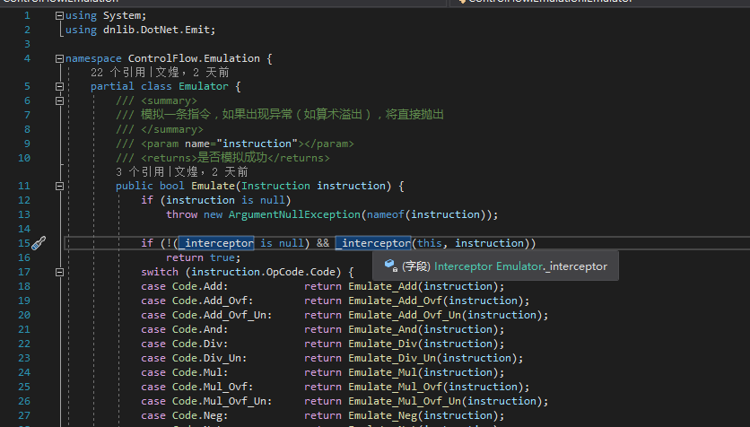

如果你们要用的话拿我之前放出的源码改改就行。

回到反混淆器里面实现的Interceptor。为了提高稳定性，不模拟无关代码，也为了提高速度，我过滤了很多指令，因为VMP.NET的Mutation只需要运算指令，比较指令，取值指令，分支指令这4类。

对于ldloc，也就是读取变量的指令，还要特殊处理一次，防止读取到无关Mutation的变量的值，防止模拟器计算不该计算的，导致分支模拟出现问题。

VMP.NET的Mutation会加密常量，还会添加混淆分支的代码，所以我们要在模拟结束的之后，全部还原。这部分在OnEnd中实现。

总的来说VMP.NET的Mutation一般般，不能被C#反编译结果吓到，因为那是故意唬你的，试都不试怎么知道到底能不能脱呢？

至于VMP.NET的Virtualization模式我还没搞定，不知道在研究反虚拟化的大佬愿不愿意分享一下经验，我对这块一直不太清楚，打算研究研究。

### 工具下载

[https://pan.baidu.com/s/1UpCYi25dBLlxoha9eVEfbQ](https://pan.baidu.com/s/1UpCYi25dBLlxoha9eVEfbQ) 提取码: 94u3

目前工具很稳定，测试了很多次，无BUG，偶尔会提示无效分支指令，那个不用管，对程序运行完全无影响。

清理前后对比

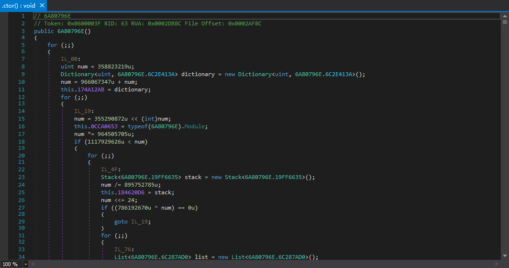

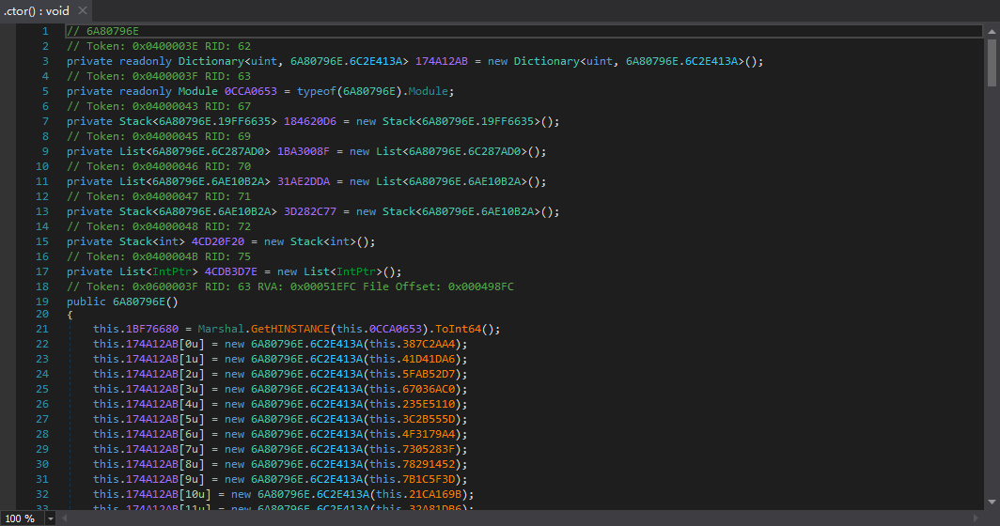

效果还是很不错的
