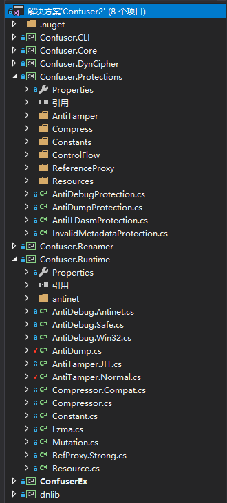
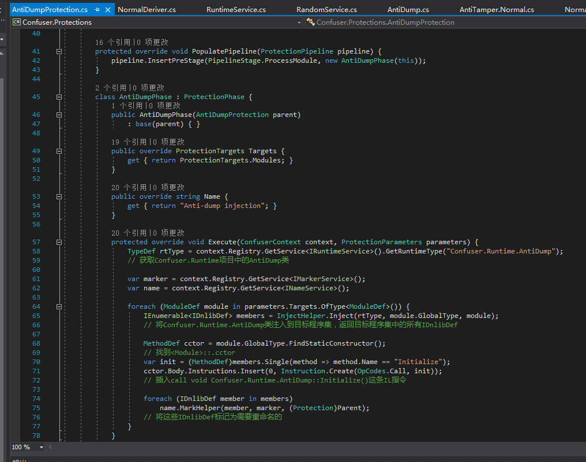
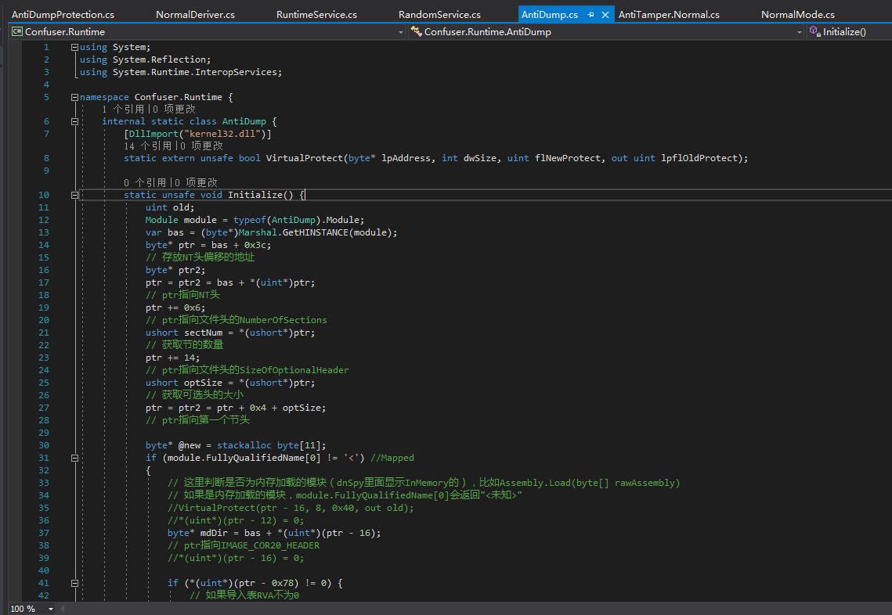
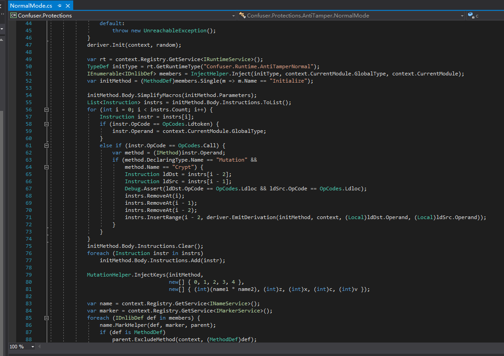
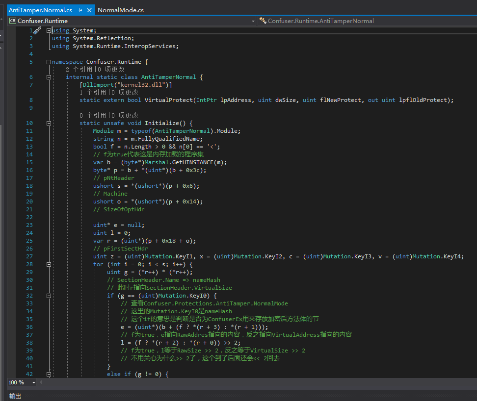
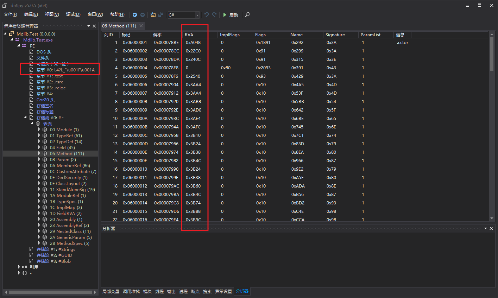

# [.NET]详解ConfuserEx的Anti Tamper与Anti Dump by Wwh / NCK

许多人都知道利用dnSpy单步调试+Dump+CodeCracker的一系列工具可以脱去ConfuserEx壳，这些在网上都有教程，但是并没有文章说明过背后的原理。本文讲尽可能详细解说ConfuserEx的Anti Tamper与Anti Dump。

**（有耐心并且了解一点点的PE结构完全可以看懂）**

## ConfuserEx整个项目结构

在开始讲解之前，我们大概了解一下ConfuserEx项目的结构。

我们用Visual Studio打开ConfuserEx，项目大概是这样的：



- Confuser.CLI的是命令行版本，类似de4dot的操作方式。
- Confuser.Core是核心，把所有部分Protection组合到一起。
- Confuser.DynCipher可以动态生成加密算法。
- Confuser.Protections里面包含了所有Protection，这是需要研究的部分。
- Confuser.Renamer可以对类名、方法名等重命名，包括多种重命名方式，比如可逆的重命名，这些没有在ConfuserEx的GUI里面显示就是了。
- Confuser.Runtime是运行时，比如Anti Dump的实现，其实就在这个项目里面。上面提到的Confuser.Protections会把Confuser.Runtime中的Anti Dump的实现注入到目标程序集。
- ConfuserEx是GUI，没必要多说。

**整个项目几乎没什么注释，下面的中文注释均为我添加的。**

## Anti Dump

Anti Dump比起Anti Tamper简单不少，所以我们先来了解一下Anti Dump。

Anti Dump的实现只有一个方法，非常简洁。

我们找到Confuser.Protections项目的AntiDumpProtection.cs。



``` csharp
protected override void Execute(ConfuserContext context, ProtectionParameters parameters) {
    TypeDef rtType = context.Registry.GetService<IRuntimeService>().GetRuntimeType("Confuser.Runtime.AntiDump");
    // 获取Confuser.Runtime项目中的AntiDump类

    var marker = context.Registry.GetService<IMarkerService>();
    var name = context.Registry.GetService<INameService>();

    foreach (ModuleDef module in parameters.Targets.OfType<ModuleDef>()) {
        IEnumerable<IDnlibDef> members = InjectHelper.Inject(rtType, module.GlobalType, module);
        // 将Confuser.Runtime.AntiDump类注入到目标程序集，返回目标程序集中的所有IDnlibDef

        MethodDef cctor = module.GlobalType.FindStaticConstructor();
        // 找到<Module>::.cctor
        var init = (MethodDef)members.Single(method => method.Name == "Initialize");
        cctor.Body.Instructions.Insert(0, Instruction.Create(OpCodes.Call, init));
        // 插入call void Confuser.Runtime.AntiDump::Initialize()这条IL指令

        foreach (IDnlibDef member in members)
            name.MarkHelper(member, marker, (Protection)Parent);
        // 将这些IDnlibDef标记为需要重命名的
    }
}
```

AntiDumpProtection做的只是注入，所以我们转到Confuser.Runtime中的AntiDump.cs



``` csharp
static unsafe void Initialize() {
    uint old;
    Module module = typeof(AntiDump).Module;
    var bas = (byte*)Marshal.GetHINSTANCE(module);
    byte* ptr = bas + 0x3c;
    // 存放NT头偏移的地址
    byte* ptr2;
    ptr = ptr2 = bas + *(uint*)ptr;
    // ptr指向NT头
    ptr += 0x6;
    // ptr指向文件头的NumberOfSections
    ushort sectNum = *(ushort*)ptr;
    // 获取节的数量
    ptr += 14;
    // ptr指向文件头的SizeOfOptionalHeader
    ushort optSize = *(ushort*)ptr;
    // 获取可选头的大小
    ptr = ptr2 = ptr + 0x4 + optSize;
    // ptr指向第一个节头

    byte* @new = stackalloc byte[11];
    if (module.FullyQualifiedName[0] != '<') //Mapped
    {
        // 这里判断是否为内存加载的模块（dnSpy里面显示InMemory的），比如Assembly.Load(byte[] rawAssembly)
        // 如果是内存加载的模块，module.FullyQualifiedName[0]会返回"<未知>"
        //VirtualProtect(ptr - 16, 8, 0x40, out old);
        //*(uint*)(ptr - 12) = 0;
        byte* mdDir = bas + *(uint*)(ptr - 16);
        // ptr指向IMAGE_COR20_HEADER
        //*(uint*)(ptr - 16) = 0;

        if (*(uint*)(ptr - 0x78) != 0) {
            // 如果导入表RVA不为0
            byte* importDir = bas + *(uint*)(ptr - 0x78);
            byte* oftMod = bas + *(uint*)importDir;
            // OriginalFirstThunk
            byte* modName = bas + *(uint*)(importDir + 12);
            // 导入DLL的名称
            byte* funcName = bas + *(uint*)oftMod + 2;
            // 导入函数的名称
            VirtualProtect(modName, 11, 0x40, out old);

            *(uint*)@new = 0x6c64746e;
            *((uint*)@new + 1) = 0x6c642e6c;
            *((ushort*)@new + 4) = 0x006c;
            *(@new + 10) = 0;
            // ntdll.dll

            for (int i = 0; i < 11; i++)
                *(modName + i) = *(@new + i);
            // 把mscoree.dll改成ntdll.dll

            VirtualProtect(funcName, 11, 0x40, out old);

            *(uint*)@new = 0x6f43744e;
            *((uint*)@new + 1) = 0x6e69746e;
            *((ushort*)@new + 4) = 0x6575;
            *(@new + 10) = 0;
            // NtContinue

            for (int i = 0; i < 11; i++)
                *(funcName + i) = *(@new + i);
            // 把_CorExeMain改成NtContinue
        }

        for (int i = 0; i < sectNum; i++) {
            VirtualProtect(ptr, 8, 0x40, out old);
            Marshal.Copy(new byte[8], 0, (IntPtr)ptr, 8);
            ptr += 0x28;
        }
        // 清零所有节的名称
        VirtualProtect(mdDir, 0x48, 0x40, out old);
        byte* mdHdr = bas + *(uint*)(mdDir + 8);
        // mdHdr指向STORAGESIGNATURE（开头是BSJB的那个）
        *(uint*)mdDir = 0;
        *((uint*)mdDir + 1) = 0;
        *((uint*)mdDir + 2) = 0;
        *((uint*)mdDir + 3) = 0;
        // 将IMAGE_COR20_HEADER的cb MajorRuntimeVersion MinorRuntimeVersion MetaData清零

        VirtualProtect(mdHdr, 4, 0x40, out old);
        *(uint*)mdHdr = 0;
        // 删除BSJB标志，这样就无法搜索到STORAGESIGNATURE了
        mdHdr += 12;
        // mdHdr指向iVersionString
        mdHdr += *(uint*)mdHdr;
        mdHdr = (byte*)(((ulong)mdHdr + 7) & ~3UL);
        mdHdr += 2;
        // mdHdr指向STORAGEHEADER的iStreams
        ushort numOfStream = *mdHdr;
        // 获取元数据流的数量
        mdHdr += 2;
        // mdHdr指向第一个元数据流头
        for (int i = 0; i < numOfStream; i++) {
            VirtualProtect(mdHdr, 8, 0x40, out old);
            //*(uint*)mdHdr = 0;
            mdHdr += 4;
            // mdHdr指向STORAGESTREAM.iSize
            //*(uint*)mdHdr = 0;
            mdHdr += 4;
            // mdHdr指向STORAGESTREAM.rcName
            for (int ii = 0; ii < 8; ii++) {
                VirtualProtect(mdHdr, 4, 0x40, out old);
                *mdHdr = 0;
                mdHdr++;
                if (*mdHdr == 0) {
                    mdHdr += 3;
                    break;
                }
                *mdHdr = 0;
                mdHdr++;
                if (*mdHdr == 0) {
                    mdHdr += 2;
                    break;
                }
                *mdHdr = 0;
                mdHdr++;
                if (*mdHdr == 0) {
                    mdHdr += 1;
                    break;
                }
                *mdHdr = 0;
                mdHdr++;
            }
            // 清零STORAGESTREAM.rcName，因为这个是4字节对齐的，所以代码长一些
        }
    }
    else //Flat
    {
        // 这里就是内存加载程序集的情况了，和上面是差不多的，我就不再具体分析了
        //VirtualProtect(ptr - 16, 8, 0x40, out old);
        //*(uint*)(ptr - 12) = 0;
        uint mdDir = *(uint*)(ptr - 16);
        //*(uint*)(ptr - 16) = 0;
        uint importDir = *(uint*)(ptr - 0x78);

        var vAdrs = new uint[sectNum];
        var vSizes = new uint[sectNum];
        var rAdrs = new uint[sectNum];
        for (int i = 0; i < sectNum; i++) {
            VirtualProtect(ptr, 8, 0x40, out old);
            Marshal.Copy(new byte[8], 0, (IntPtr)ptr, 8);
            vAdrs[i] = *(uint*)(ptr + 12);
            vSizes[i] = *(uint*)(ptr + 8);
            rAdrs[i] = *(uint*)(ptr + 20);
            ptr += 0x28;
        }


        if (importDir != 0) {
            for (int i = 0; i < sectNum; i++)
                if (vAdrs[i] <= importDir && importDir < vAdrs[i] + vSizes[i]) {
                    importDir = importDir - vAdrs[i] + rAdrs[i];
                    break;
                }
            byte* importDirPtr = bas + importDir;
            uint oftMod = *(uint*)importDirPtr;
            for (int i = 0; i < sectNum; i++)
                if (vAdrs[i] <= oftMod && oftMod < vAdrs[i] + vSizes[i]) {
                    oftMod = oftMod - vAdrs[i] + rAdrs[i];
                    break;
                }
            byte* oftModPtr = bas + oftMod;
            uint modName = *(uint*)(importDirPtr + 12);
            for (int i = 0; i < sectNum; i++)
                if (vAdrs[i] <= modName && modName < vAdrs[i] + vSizes[i]) {
                    modName = modName - vAdrs[i] + rAdrs[i];
                    break;
                }
            uint funcName = *(uint*)oftModPtr + 2;
            for (int i = 0; i < sectNum; i++)
                if (vAdrs[i] <= funcName && funcName < vAdrs[i] + vSizes[i]) {
                    funcName = funcName - vAdrs[i] + rAdrs[i];
                    break;
                }
            VirtualProtect(bas + modName, 11, 0x40, out old);

            *(uint*)@new = 0x6c64746e;
            *((uint*)@new + 1) = 0x6c642e6c;
            *((ushort*)@new + 4) = 0x006c;
            *(@new + 10) = 0;

            for (int i = 0; i < 11; i++)
                *(bas + modName + i) = *(@new + i);

            VirtualProtect(bas + funcName, 11, 0x40, out old);

            *(uint*)@new = 0x6f43744e;
            *((uint*)@new + 1) = 0x6e69746e;
            *((ushort*)@new + 4) = 0x6575;
            *(@new + 10) = 0;

            for (int i = 0; i < 11; i++)
                *(bas + funcName + i) = *(@new + i);
        }


        for (int i = 0; i < sectNum; i++)
            if (vAdrs[i] <= mdDir && mdDir < vAdrs[i] + vSizes[i]) {
                mdDir = mdDir - vAdrs[i] + rAdrs[i];
                break;
            }
        byte* mdDirPtr = bas + mdDir;
        VirtualProtect(mdDirPtr, 0x48, 0x40, out old);
        uint mdHdr = *(uint*)(mdDirPtr + 8);
        for (int i = 0; i < sectNum; i++)
            if (vAdrs[i] <= mdHdr && mdHdr < vAdrs[i] + vSizes[i]) {
                mdHdr = mdHdr - vAdrs[i] + rAdrs[i];
                break;
            }
        *(uint*)mdDirPtr = 0;
        *((uint*)mdDirPtr + 1) = 0;
        *((uint*)mdDirPtr + 2) = 0;
        *((uint*)mdDirPtr + 3) = 0;


        byte* mdHdrPtr = bas + mdHdr;
        VirtualProtect(mdHdrPtr, 4, 0x40, out old);
        *(uint*)mdHdrPtr = 0;
        mdHdrPtr += 12;
        mdHdrPtr += *(uint*)mdHdrPtr;
        mdHdrPtr = (byte*)(((ulong)mdHdrPtr + 7) & ~3UL);
        mdHdrPtr += 2;
        ushort numOfStream = *mdHdrPtr;
        mdHdrPtr += 2;
        for (int i = 0; i < numOfStream; i++) {
            VirtualProtect(mdHdrPtr, 8, 0x40, out old);
            //*(uint*)mdHdrPtr = 0;
            mdHdrPtr += 4;
            //*(uint*)mdHdrPtr = 0;
            mdHdrPtr += 4;
            for (int ii = 0; ii < 8; ii++) {
                VirtualProtect(mdHdrPtr, 4, 0x40, out old);
                *mdHdrPtr = 0;
                mdHdrPtr++;
                if (*mdHdrPtr == 0) {
                    mdHdrPtr += 3;
                    break;
                }
                *mdHdrPtr = 0;
                mdHdrPtr++;
                if (*mdHdrPtr == 0) {
                    mdHdrPtr += 2;
                    break;
                }
                *mdHdrPtr = 0;
                mdHdrPtr++;
                if (*mdHdrPtr == 0) {
                    mdHdrPtr += 1;
                    break;
                }
                *mdHdrPtr = 0;
                mdHdrPtr++;
            }
        }
    }
}
```

这里面修改导入表的部分其实是可有可无的，这个是可逆的
清空节名称也是是可选的。

其中非常重点的是将IMAGE_COR20_HEADER.MetaData清零，CLR已经完成了元数据的定位，并且保存了有关数据（可以使用CE搜索内存验证，搜索ImageBase+MetaData.VirtualAddress），不再需要这个字段，是可以清零的，但是我们读取元数据，是需要这个字段的。

接下来Anti Dump会删除BSJB标志，这样就无法搜索到STORAGESIGNATURE了。还有元数据流头的rcName字段，一并清零，这样也会让我们无法定位到元数据结构体，但是CLR不再需要这些了。

解决这个的办法很简单，把&lt;Module&gt;::.cctor()的call void Confuser.Runtime.AntiDump::Initialize()这条指令nop掉。我们要如何定位到这条指令呢？

这里有个投机取巧的办法，解决Anti Tamper之后，在dnSpy里面找出现了

``` csharp
Module module = typeof(AntiDump).Module;
byte* bas = (byte*)Marshal.GetHINSTANCE(module);
......
if (module.FullyQualifiedName[0] != '<'){
}
```

这样的方法，并且这个方法还多次调用了VirtualProtect，原版ConfuserEx是调用了14次。

把call 这个方法的地方nop掉，注意显示模式切换到IL，然后点一下IL所在的FileOffset，用十六进制编辑器改成0，不然容易出问题。

## Anti Tamper

**Anti Tamper稍微麻烦一些，看不懂的地方实际操作一下，到ConfuserEx项目里面调试一下！！！！！！**

### 分析

ConfuserEx里面有2种AntiTamper模式，一种的Hook JIT，另一种是原地解密。Hook JIT算是半成品，还没法正常使用，所以我们实际上看到的是原地解密模式，强度不是特别高。

我们转到Confuser.Protections项目的AntiTamper\NormalMode.cs



这里我就不注释了，因为这里也是一个注入器，和AntiDumpProtection.cs是差不多的，看不懂也没关系，看我后面分析实际实现就能明白了。

找到AntiTamper的实现AntiTamper.Normal.cs



``` csharp
static unsafe void Initialize() {
	Module m = typeof(AntiTamperNormal).Module;
	string n = m.FullyQualifiedName;
	bool f = n.Length > 0 && n[0] == '<';
          // f为true代表这是内存加载的程序集
	var b = (byte*)Marshal.GetHINSTANCE(m);
	byte* p = b + *(uint*)(b + 0x3c);
          // pNtHeader
	ushort s = *(ushort*)(p + 0x6);
          // Machine
	ushort o = *(ushort*)(p + 0x14);
          // SizeOfOptHdr

	uint* e = null;
	uint l = 0;
	var r = (uint*)(p + 0x18 + o);
          // pFirstSectHdr
	uint z = (uint)Mutation.KeyI1, x = (uint)Mutation.KeyI2, c = (uint)Mutation.KeyI3, v = (uint)Mutation.KeyI4;
	for (int i = 0; i < s; i++) {
		uint g = (*r++) * (*r++);
              // SectionHeader.Name => nameHash
              // 此时r指向SectionHeader.VirtualSize
		if (g == (uint)Mutation.KeyI0) {
                  // 查看Confuser.Protections.AntiTamper.NormalMode
                  // 这里的Mutation.KeyI0是nameHash
                  // 这个if的意思是判断是否为ConfuserEx用来存放加密后方法体的节
                  e = (uint*)(b + (f ? *(r + 3) : *(r + 1)));
                  // f为true，e指向RawAddres指向的内容，反之指向VirtualAddress指向的内容
			l = (f ? *(r + 2) : *(r + 0)) >> 2;
                  // f为true，l等于RawSize >> 2，反之等于VirtualSize >> 2
                  // 不用关心为什么>> 2了，这个到了后面还会<< 2回去
              }
              else if (g != 0) {
			var q = (uint*)(b + (f ? *(r + 3) : *(r + 1)));
                  // f为true，q指向RawAddres指向的内容，反之指向VirtualAddress指向的内容
                  uint j = *(r + 2) >> 2;
                  // l等于VirtualSize >> 2
                  for (uint k = 0; k < j; k++) {
                      // 比如VirtualSize=0x200，那这里就循环0x20次
                      uint t = (z ^ (*q++)) + x + c * v;
				z = x;
				x = c;
				x = v;
				v = t;
                      // 加密运算本身，不需要做分析
			}
		}
		r += 8;
              // 让下一次循环时r依然指向SectionHeader的开头
	}

	uint[] y = new uint[0x10], d = new uint[0x10];
	for (int i = 0; i < 0x10; i++) {
		y[i] = v;
		d[i] = x;
		z = (x >> 5) | (x << 27);
		x = (c >> 3) | (c << 29);
		c = (v >> 7) | (v << 25);
		v = (z >> 11) | (z << 21);
	}
          // 加密运算本身，不需要做分析
          Mutation.Crypt(y, d);
          // 这里会ConfuserEx替换成真正的加密算法，大概是这样：
          // data[0] = data[0] ^ key[0];
          // data[1] = data[1] * key[1];
          // data[2] = data[2] + key[2];
          // data[3] = data[3] ^ key[3];
          // data[4] = data[4] * key[4];
          // data[5] = data[5] + key[5];
          // 然后这样循环下去

          uint w = 0x40;
	VirtualProtect((IntPtr)e, l << 2, w, out w);

	if (w == 0x40)
              // 防止被重复调用，出现重复解密导致破坏数据
		return;

	uint h = 0;
	for (uint i = 0; i < l; i++) {
		*e ^= y[h & 0xf];
		y[h & 0xf] = (y[h & 0xf] ^ (*e++)) + 0x3dbb2819;
		h++;
	}
}
```
上面是我注释的，实际上的解密写在了最末尾"*e ^= y[h & 0xf];"，前面一大坨代码都是计算出key和要解密数据的位置。

为什么可以解密？因为xor 2次相同的值，等于xor 0，比如123 ^ 456 ^ 456 == 123。

那么这段代码究竟解密了什么呢？

我们先了解一下元数据表的Method表



我用红框标记的RVA指向了方法体的数据，方法体里面存放了ILHeader ILCode LocalVar EH。

ConfuserEx会修改RVA，让RVA指向另一个红框"章节 #0: 乱码"，这个Section专门存放了方法体（模块静态构造器和Anti Tamper本身的方法体不在这个节里面，否则都没法运行了）。

ConfuserEx会加密这一个节的内容。因为模块静态构造器是比程序集入口点更优先执行的，所以模块静态构造器的第一条IL指令就是call void AntiTamper::Initialize()。

在程序集运行时会首先执行这一条IL指令，其它方法都会被解密，程序就可以正常的运行下去了。

这种方法比Hook JIT的兼容性好非常多，几乎不可能出现无法运行的问题。但是这种方法的强度也是远不如Hook JIT的。

### AntiTamperKiller成品

刚才我们已经分析完了Anti Tamper，如果你看懂了，你也能写出一个Anti Tamper的静态脱壳机（dnSpy Dump法是有可能损坏数据的，静态脱壳仅仅解密了一个节的数据）

Anti Tamper脱壳机下载：
链接: [https://pan.baidu.com/s/1IMWk7BywjVX1O2AsJ2qIrA](https://pan.baidu.com/s/1IMWk7BywjVX1O2AsJ2qIrA)密码: 9ywx

de4dot怎么用的这个就怎么用，支持ConfuserEx最大保护。
