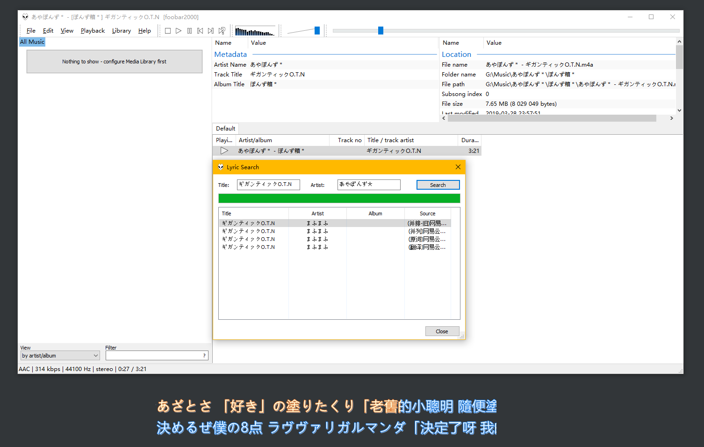

# foobar2000 歌词搜索脚本

**脚本原作者不是我！！！**

**脚本出处：[github.com/EHfive/Some-js-script-for-FB2K](https://github.com/EHfive/Some-js-script-for-FB2K)**

**我只是在此基础上进行了修改：[github.com/wwh1004/Some-js-script-for-FB2K](https://github.com/wwh1004/Some-js-script-for-FB2K)**

**我的修改版加强了对日语歌（主要是V家的）歌词的搜索能力，比如下面那个效果图的歌，可以匹配到其它歌手唱的**

**V家的歌除了remix过或者其它的，所有翻唱的歌词基本上是一样的，所以这样匹配没什么特别大的问题**

## 使用方式

1. 打开[github.com/wwh1004/Some-js-script-for-FB2K](https://github.com/wwh1004/Some-js-script-for-FB2K)，下载好"ncm.js"这个文件即可，其它2个不用管。
2. 按照 "[ESLyric 介绍与使用](https://github.com/elia-is-me/WSH-Script-Tutorials/blob/master/%E5%85%B6%E5%AE%83%E6%96%87%E7%AB%A0/ESLyric/ESLyric%20%E4%BB%8B%E7%BB%8D%E4%B8%8E%E4%BD%BF%E7%94%A8.md)" 这篇文章(好ESLyric和ncm.js

ESLyric下载地址：[https://pan.baidu.com/s/1nHsRuRzYyAjtmFT4lI4DAw](https://pan.baidu.com/s/1nHsRuRzYyAjtmFT4lI4DAw) 提取码: d8e2

## 整合包

如果懒得自己安装或者自己配置，这里有整合好的

效果图：

这里的桌面歌词是foobar2000插件ESLyric显示的，我把配色改成网易云音乐的天际蓝了

点击左边的"Nothing to show - configure Media Library first"可以选择你的音乐文件夹，foobar2000会自动添加到"All Music"，其它操作百度有，我就不啰嗦了

下载地址: [https://pan.baidu.com/s/1s-I1mRPgHb-W0ZDtbKoyUw](https://pan.baidu.com/s/1s-I1mRPgHb-W0ZDtbKoyUw) 提取码: w95p
